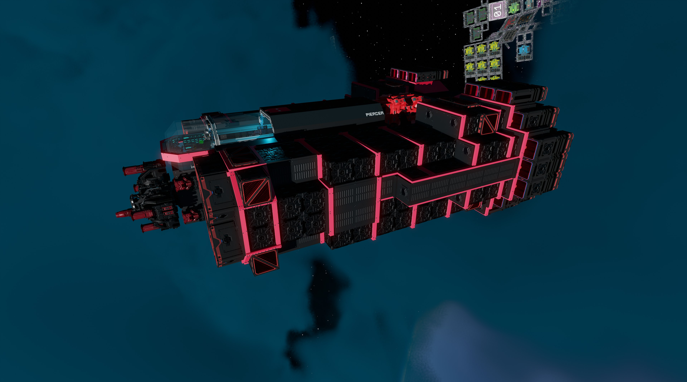
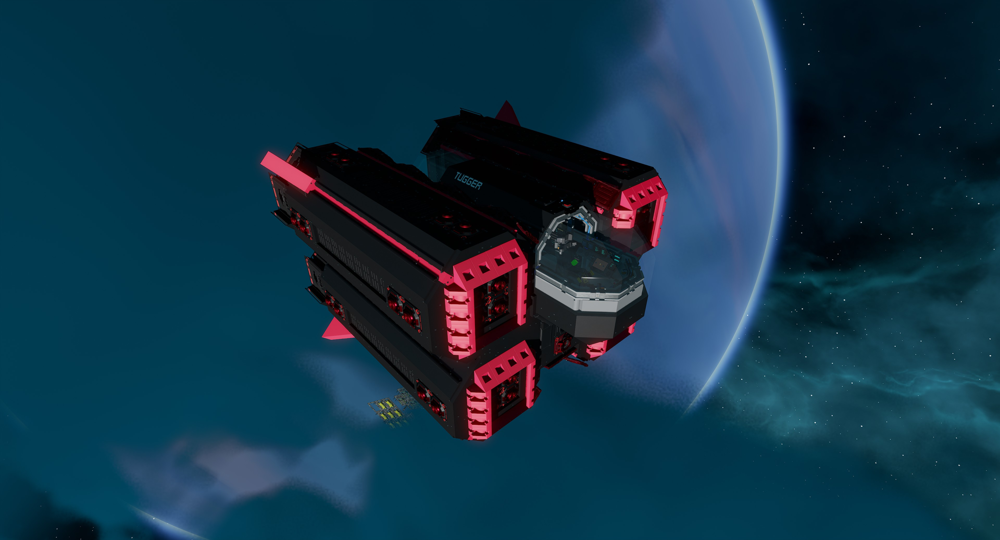
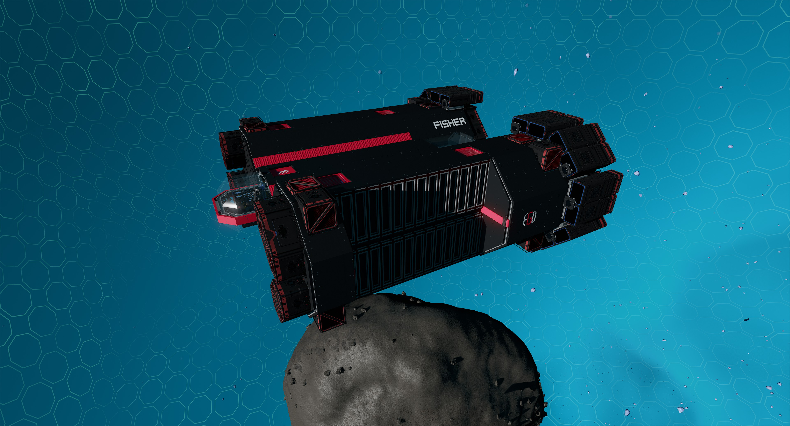
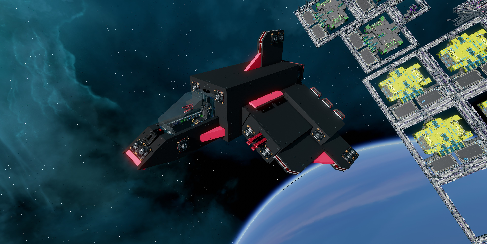
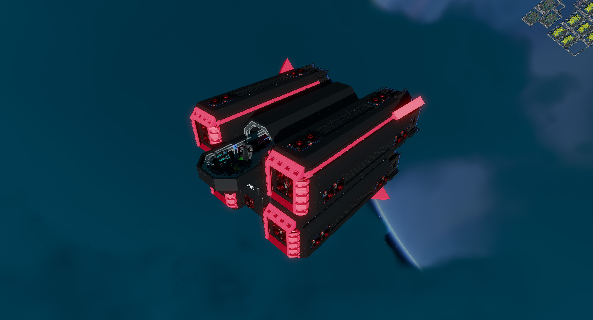
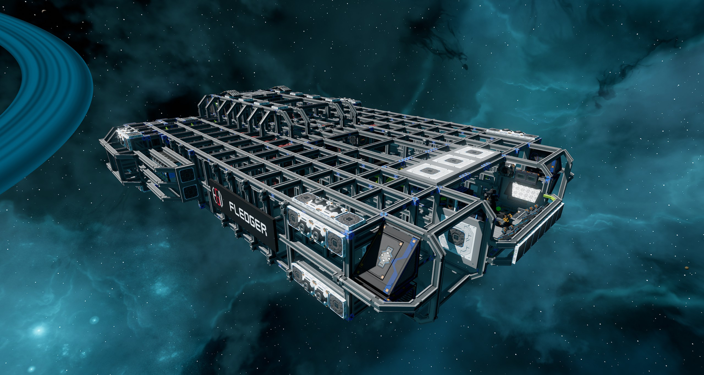
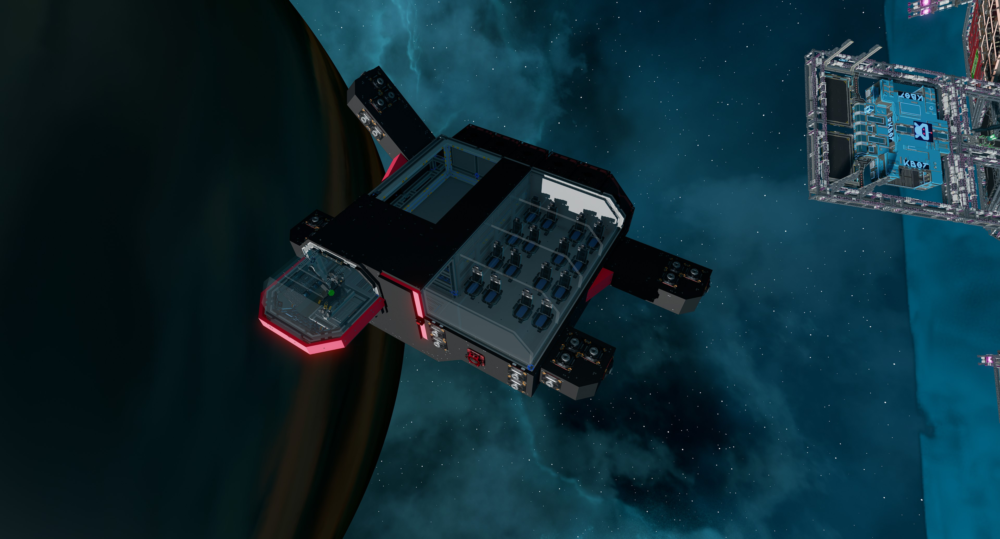
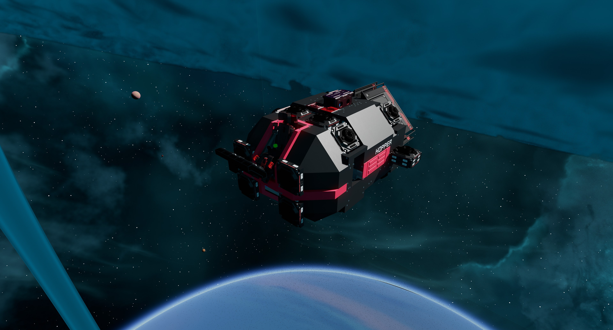

# Starbase Ships by EGOTech

[![CC BY-NC-SA 4.0][cc-by-nc-sa-shield]][cc-by-nc-sa]

Blueprints and manuals for some ships for the game Starbase by Frozenbyte. Designed by EGOTech.

Want to build your own ships? Try the [Welder Modular Ship Framework](https://vinteo.github.io/starbase-ship-welder/).

## Designed by EGOTech

## Miners

| Ship | Name | Description | Version | Ore Crates | Mining Lasers
|---|---|---|---|---|---|
|  | [Rigger](rigger) ![Free Blueprint][bp-free] | The Rigger is a fast medium sized mining ship. Although it has a limited autopilot and crash avoidance systems, it is mainly designed to be used in the safe zone. | v1.2.0 | 100 | 2 |
|  | [Stocker](stocker) ![Free Blueprint][bp-free] | The Stocker is a 232 ore crate capacity mining ship. It is designed as a direct upgrade for those who have outgrown the [Rigger](rigger). | v1.1.1 | 232 | 4 |
|  | [Shifter](shifter) ![Free Blueprint][bp-free] | The Shifter is a 450 ore crate capacity mining ship with a spacious interior allowing for multi crew operations. The controls, tools and features are similar to the [Stocker](stocker). | v1.1.1 | 450 | 4 |
|  | [Piercer](piercer) ![Free Blueprint][bp-free] | The Piercer is a 342 ore crate capacity mining ship with an automated rotating laser drill for mining operations.  | v1.1.1 | 342 | 4 |
|  | [Piercer X](piercer/premium/) ![Blueprint for Sale][bp-sale] | The premium version of the [Piercer X (Anorak Edition)](piercer). | v1.0.1 | 342 | 4 |

## Surface Miners

| Ship | Name | Description | Version | Ore Crates | Mining Lasers
|---|---|---|---|---|---|
|  | [Bugger](bugger) ![Free Blueprint][bp-free] | The Bugger is a 448 ore crate capacity mining ship with 10 sweeping mining lasers drill for surface mining operations. It is designed to work in conjunction with a moon base and a separate hauler as it is not the quickest ship. | v1.0.2 | 448 | 10 |
|  | [Bugger X](bugger/premium) ![Blueprint for Sale][bp-sale] | The premium version of the [Bugger](bugger). | v1.0.1 | 448 | 10 |

## Asteroid Haulers

| Ship | Name | Description | Version | Asteroid Capacity | Loading Speed |
|---|---|---|---|---|---|
|  | [Rocker](rocker) ![Free Blueprint][bp-free] | The Rocker is an asteroid hauling ship. It is designed to be used in the safe zone and haul small asteroids. It uses a tractor beam to position asteroids into five compartments of cargo lock beams in a circular pattern. It has load automation to approach and load asteroids in the right order as well as a material scanner that gives estimated credits for selling the asteroids.| v1.1.0 | 5 x T7 | Slow
|  | [Rocker Duo](rocker_duo) ![Free Blueprint][bp-free] | The Rocker Duo is a asteroid hauling ship that is bascially two [Rockers](rocker) mashed together. It is designed to be used in the safe zone and haul small asteroids. It uses two tractor beams to position asteroids into two sets of five compartments of cargo lock beams in a circular pattern so it can hold up to ten asteroids. | v1.1.0 | 10 x T7 | Very Slow |
|  | [Hexxer](hexxer) ![Free Blueprint][bp-free] | The Hexxer is a ship for hauling small asteroids, designed to be used in the safe zone. It uses six tractor beams to pull asteroids into six compartments of cargo lock beams in a hex pattern. It has load automation to approach and load asteroids in the right order to balance the ship as much as possible as well as a material scanner that gives estimated credits for selling the asteroids. It has similar functions to the [Rocker](../rocker) but loads a little quicker and has one more compartment. | v1.1.0 | 6 x T7 | Moderate |
|  | [Flipper](flipper) ![Free Blueprint][bp-free] | The Flipper is a ship for hauling a single T10 asteroid, designed to be used in the safe zone. It flies in one direction to easily load the asteroid and then you can flip around and fly load in the opposite direction, still with decent speed. | v1.1.0 | 1 x T10  | Fast |

## Haulers

| Ship | Name | Description | Version | Ore Crates |
|---|---|---|---|---|
|  | [Lugger](lugger) ![Free Blueprint][bp-free] | The Lugger is a 832 crate hauler with two 10 ring plasma thrusters serving as its main engines to provide decent speed. | v1.1.0 | 832 |

## Salvagers

| Ship | Name | Description | Version | Tow Capacity |
|---|---|---|---|---|
|  | [Tugger](tugger) ![Free Blueprint][bp-free] | The Tugger is a small tug ship with enough power generation to tow a ship of up to 7,500,000kg at up to 50m/s. The pilot seat can be spun to face the back, looking out the back window for ease of locking on ships using the back facing tow beam. | v2.0.0 | 7,500,000kg |
|  | [Fisher](fisher) ![Free Blueprint][bp-free] | The Fisher is a larger salvager ship with enough power generation to tow a ship of up to 20,000,000kg at up to 50m/s. The pilot seat can be spun to face the back, looking out the back window for ease of locking on ships using the back facing tow beam. It also has exposed frames to easily bolt on salvaged parts on each side. | v1.0.0 | 20,000,000kg |

## Fighters

| Ship | Name | Description | Version | Lasers | Autocannons |
|---|---|---|---|---|---|
|  | [Jabber](jabber) ![Free Blueprint][bp-free] | The Jabber is a fast light fighter with four lasers. Although it has very light armour, it is very fast and quite manoeuvrable. | v1.1.0 | 4 | 0 |

## Starter Ships

| Ship | Name | Description | Ore Crates | Version |
|---|---|---|---|---|
|  | [Sower](sower) ![Free Blueprint][bp-free] | The Sower is a starter ship designed to only require safe zone ore to build. It is quite fast and cheap, and with 36 crates, it makes a decent ship to use to help with the grind towards a more advanced ship. | 36 | v1.1.0 |
|  | [Fledger](fledger) ![Free Blueprint][bp-free] | The Fledger is a starter ship that is targeted towards aspiring mechanics that want to learn about how ships work. It starts with the basic machinery but has plenty of space for upgrades, allowing the ship to grow as the player progresses. With an exposed frame, upgrades and repairs should be easier than most ships. | 36 | v1.0.1 |

## Others

| Ship | Name | Description | Version |
|---|---|---|---|
|  | [Quester](quester) ![Free Blueprint][bp-free] | The Quester multi purpose command or explorer ship that is fitted with a medbay with a reconstruction machine and a workshop with all three crafting benches. It also has a large main hall that is designed to be large enough to fit the capital ship nav logger (not included in blueprint). However the owner is free to fit the hall for whatever purpose that is desired. | v1.1.1 |
|  | [Tourer](tourer) ![Free Blueprint][bp-free] | The Tourer is a ship that can be used to transport Endos in the style of a tour bus. It has seating for 16 passengers and a cargo lock frame for cargo. | v2.0.0 |
|  | [Hopper](hopper) ![Free Blueprint][bp-free] | The Hopper is small personal transport that can be used to quickly get around a station or taking short trips. | v1.1.0 |
|  | [Mapper](mapper) ![Free Blueprint][bp-free] | The Mapper is an explorer ship with an estimated range of 13,000km capable at travelling at close to maximum speed. It has a navigation logger for logging capital ship navigation chips. | v1.0.0 |

## License

This work is licensed under a
[Creative Commons Attribution-NonCommercial-ShareAlike 4.0 International License][cc-by-nc-sa].

[![CC BY-NC-SA 4.0][cc-by-nc-sa-image]][cc-by-nc-sa]

[cc-by-nc-sa]: http://creativecommons.org/licenses/by-nc-sa/4.0/
[cc-by-nc-sa-image]: https://licensebuttons.net/l/by-nc-sa/4.0/88x31.png
[cc-by-nc-sa-shield]: https://img.shields.io/badge/License-CC%20BY--NC--SA%204.0-lightgrey.svg

## End of Life

The following ships are considered end of life and will no longer be supported or getting updates.

| Ship | Name | Description | Version |
|---|---|---|---|
|  | [Pebbler](others/eol/pebbler) | The Pebbler is an **experimental** asteroid hauling ship. It is designed to be used in the safe zone and haul small asteroids. It uses two tractor beams to position asteroids into compartments of cargo lock beams. Although it is not very lucrative, the Pebbler is no frills and will pay itself back in about four or five quick trips to the belt.| v1.1.1 |

[bp-free]: https://img.shields.io/static/v1?label=BP&message=Free&color=brightgreen
[bp-sale]: https://img.shields.io/static/v1?label=BP&message=Sale&color=blue
