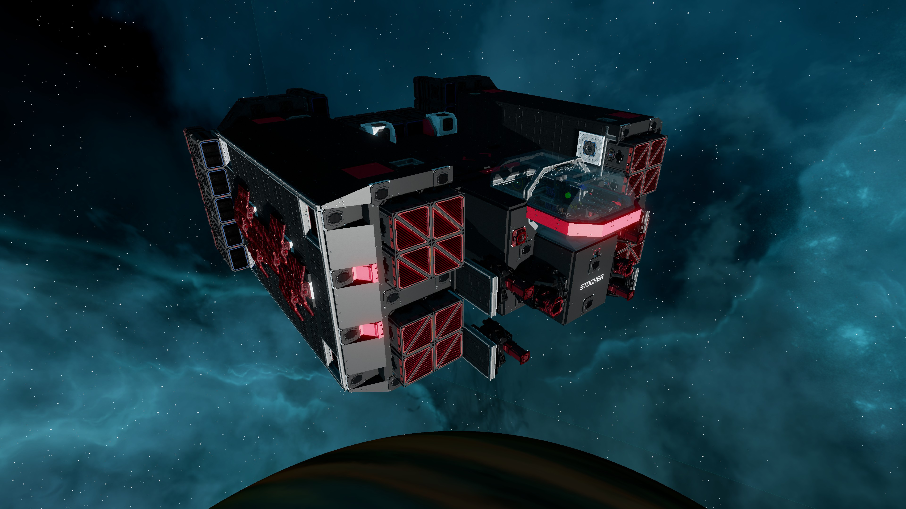
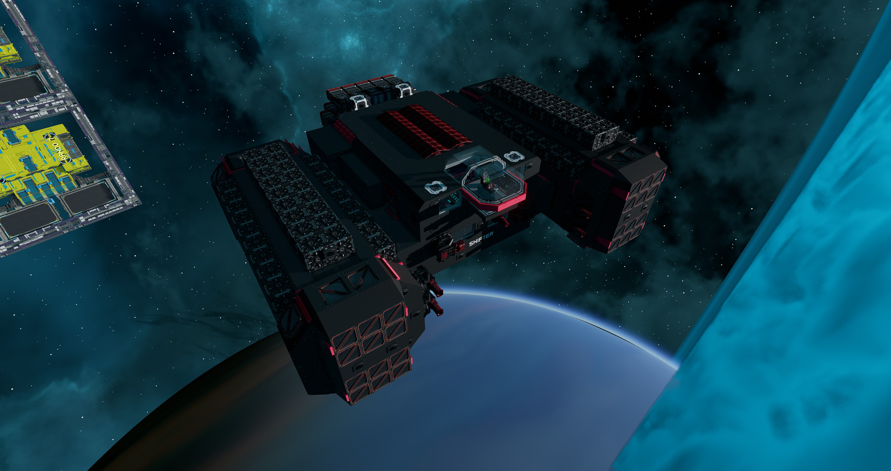
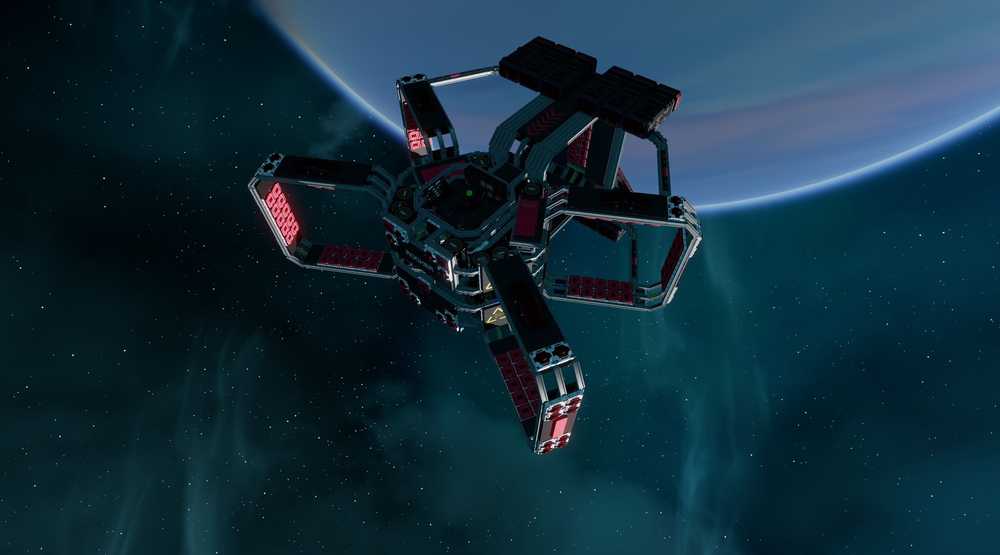
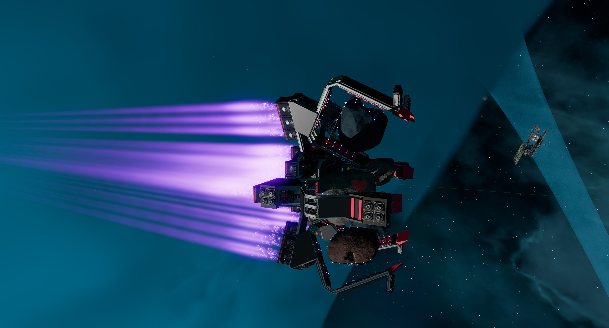
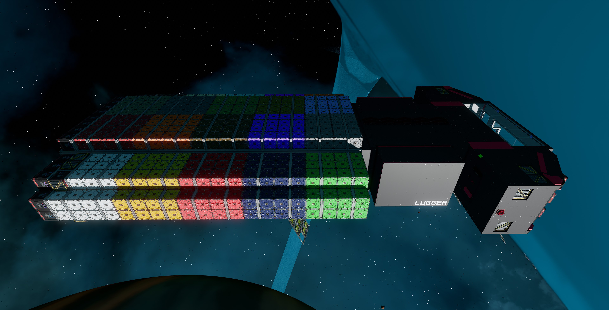
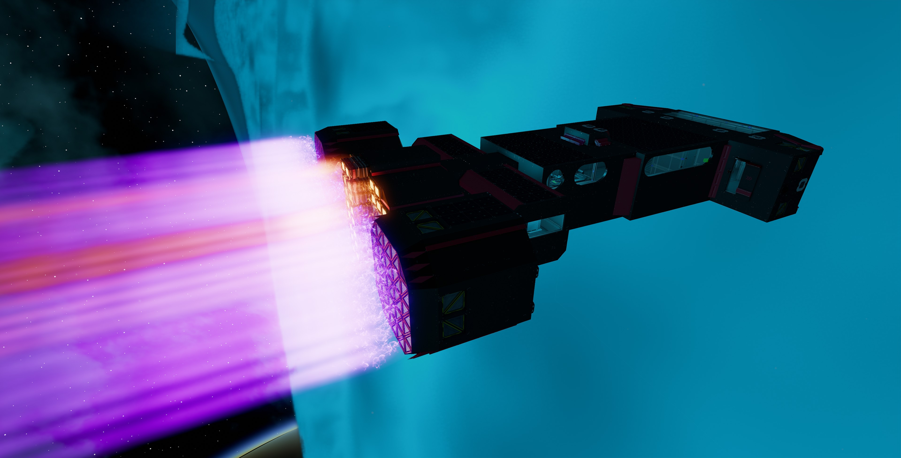

# Starbase Ships

[![CC BY-NC-SA 4.0][cc-by-nc-sa-shield]][cc-by-nc-sa]

Blueprints and manuals for some ships for the game Starbase by Frozenbyte

## Miners

| Ship | Name | Description | Version | Ore Crates | Mining Lasers | Fast Travel Core |
|---|---|---|---|---|---|---|
|  | [Rigger](rigger) | The Rigger is a fast medium sized mining ship. Although it has a limited autopilot and crash avoidance systems, it is mainly designed to be used in the safe zone. | v1.1.2 | 100 | 2 | No |
|  | [Stocker](stocker) | The Stocker is a 216 ore crate capacity fast travel capable mining ship. It is designed as a direct upgrade for those who have outgrown the [Rigger](rigger). | v1.0.3 | 216 | 4 | Yes |
|  | [Shifter](shifter) | The Shifter is a 450 ore crate capacity fast travel capable mining ship with a spacious interior allowing for multi crew operations. The controls, tools and features are similar to the [Stocker](stocker). | v1.0.2 | 450 | 4 | Yes |

## Asteroid Haulers

| Ship | Name | Description | Version | Asteroid Capacity | Loading Speed |
|---|---|---|---|---|---|
|  | [Pebbler](pebbler) | The Pebbler is an **experimental** asteroid hauling ship. It is designed to be used in the safe zone and haul small asteroids. It uses two tractor beams to position asteroids into compartments of cargo lock beams. Although it is not very lucrative, the Pebbler is no frills and will pay itself back in about four or five quick trips to the belt.| v1.1.1 | 4 | Slow |
|  | [Rocker](rocker) | The Rocker is an **experimental** asteroid hauling ship. It is designed to be used in the safe zone and haul small asteroids. It uses a tractor beam to position asteroids into five compartments of cargo lock beams in a circular pattern. It is a more polished and advanced version of the [Pebbler](pebbler) as it has load automation to approach and load asteroids in the right order as well as a material scanner that gives estimated credits for selling the asteroids.| v1.0.4 | 5 | Slow
|  | [Rocker Duo](rocker_duo) | The Rocker Duo is a asteroid hauling ship that is bascially two [Rockers](rocker) mashed together. It is designed to be used in the safe zone and haul small asteroids. It uses two tractor beams to position asteroids into two sets of five compartments of cargo lock beams in a circular pattern so it can hold up to ten asteroids. | v1.0.0 | 10 | Very Slow |
|  | [Hexxer](hexxer) | The Hexxer is a ship for hauling small asteroids, designed to be used in the safe zone. It uses six tractor beams to pull asteroids into six compartments of cargo lock beams in a hex pattern. It has load automation to approach and load asteroids in the right order to balance the ship as much as possible as well as a material scanner that gives estimated credits for selling the asteroids. It has similar functions to the [Rocker](../rocker) but loads a little quicker and has one more compartment.| v1.0.0 | 6 | Moderate |

## Haulers

| Ship | Name | Description | Version | Ore Crates | Fast Travel Core |
|---|---|---|---|---|---|
|  | [Lugger](lugger) | The Lugger is a 832 crate hauler with two 10 ring plasma thrusters serving as its main engines to provide decent speed. | v1.0.2 | 832 | Yes |

## Others

| Ship | Name | Description | Version | Fast Travel Core |
|---|---|---|---|---|
|  | [Quester](quester) | The Quester multi purpose command or explorer ship that is fitted with a medbay with a reconstruction machine and a workshop with all three crafting benches. It also has a large main hall that is designed to be large enough to fit the capital ship nav logger (not included in blueprint). However the owner is free to fit the hall for whatever purpose that is desired. | v1.0.2 | Yes |

## License

This work is licensed under a
[Creative Commons Attribution-NonCommercial-ShareAlike 4.0 International License][cc-by-nc-sa].

[![CC BY-NC-SA 4.0][cc-by-nc-sa-image]][cc-by-nc-sa]

[cc-by-nc-sa]: http://creativecommons.org/licenses/by-nc-sa/4.0/
[cc-by-nc-sa-image]: https://licensebuttons.net/l/by-nc-sa/4.0/88x31.png
[cc-by-nc-sa-shield]: https://img.shields.io/badge/License-CC%20BY--NC--SA%204.0-lightgrey.svg
