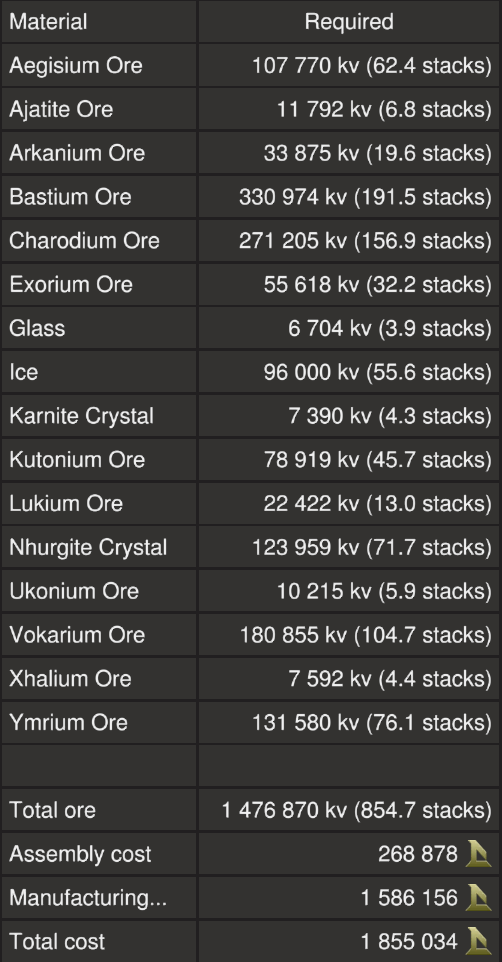

# Bugger X by EGOTech

The Bugger X is a premium version of the [Bugger](../) with [T3 enhancers and thrusters](#comparison).

The blueprint is available for [purchase](#purchase-blueprint).

[Starbase Ship Shop Page](https://sb-creators.org/makers/Egomaniac/ship/Bugger%20X)

More photos in the [`photos` folder](photos)

## Comparison

|   | Bugger | Bugger X |
|---|---|---|
| Thrusters | T2 | T3 |
| Top Speed (empty) | 100m/s | 120m/s |
| Generators | T3 | T3 |
| Fuel Chambers | T3 | T3 |
| Enhancers | T2 | T3 |
| Power Generation | 72,000eps | 81,000eps |
| Mining Time | 90mins | 100mins |

## Build Cost

> TIP: You can craft your own crates, generators (T3), box and triangle thruster components (T3) and ship tools to reduce assembly cost.

## Purchase Blueprint

The blueprint is available for purchase on the EGOTech Discord server.

## Changelog

View changelog [here](CHANGELOG.md)

## Usage

Please refer to the manual for the [Bugger](../).
