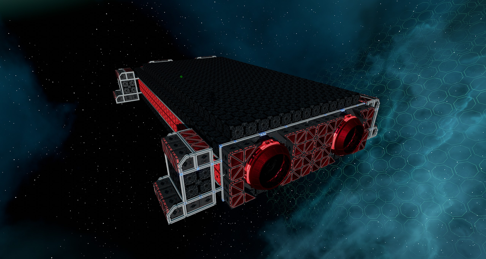
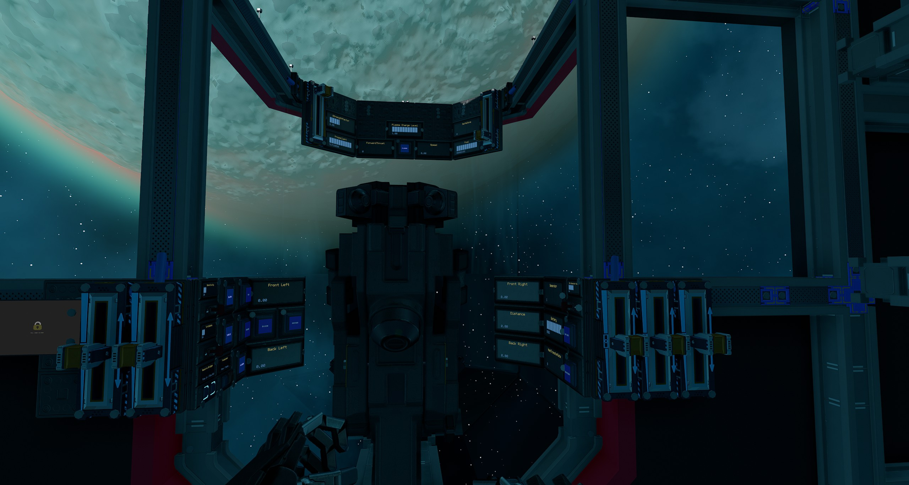
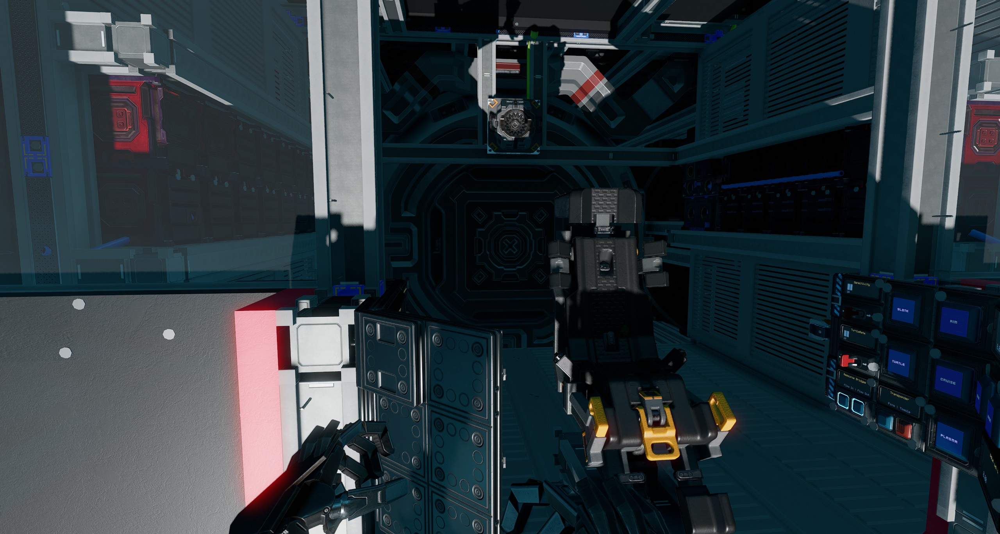
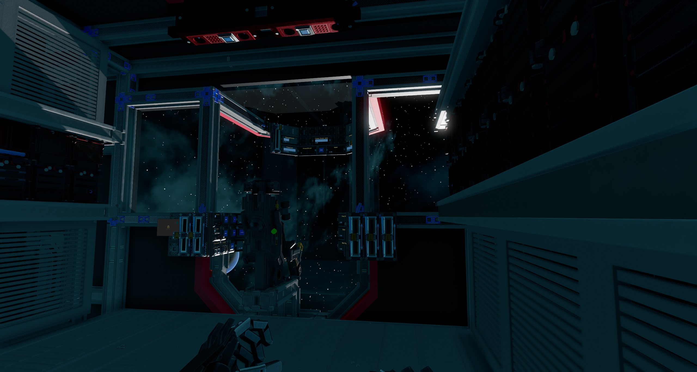
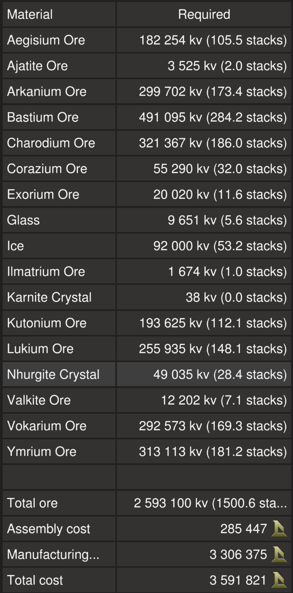
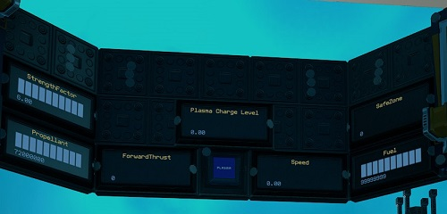
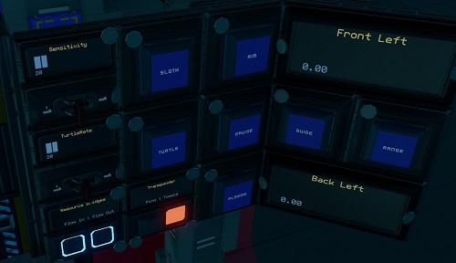
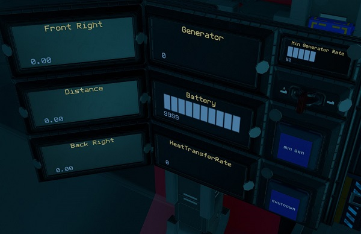

# Clunker by EGOTech

The Clunker is a 948 crate hauler with two 13 ring plasma thrusters serving as its main engines to provide decent speed. The ship is no frills and with double the upwards thrust, it is mainly designed to haul ore between a capital ship and the moon surface.
The blueprint is provided for [free](#download-blueprint). All [feedback](#providing-feedback) is welcome and in game tips (in-game name Egomaniac) are appreciated. However support will be limited but I will try my best.

[Starbase Ship Shop Page](https://sb-creators.org/makers/Egomaniac/ship/%5BFREE%5D%20Clunker)

  
  
 

More photos in the [`photos` folder](photos)

## Features

The ship has the following features:

- 948 crates
- Standard Cruise function
- Turtle and Sloth functions with adjustable rates
- Hover rangefinder guides point down on each corner of the ship
- Transponder system with ping function
- Auto generator rate script with adjustable minimum rate
- One large generator with one large fuel tank and one large processing unit
- Radiators that provide more than adequate cooling
- Six large propellant tanks with 72,000,000 units of propellant
- 72 batteries
- Two 13 ring plasma thrusters and 56 T2 triangle thrusters providing forward thrust
- 56 T2 triangle thrusters providing braking thrust
- 120 T2 triangle thrusters for maneuvers
- Speedometer
- Many extra slots for YOLOL or memory chips
- Top speed of 145m/s empty

## Changelog

### v1.0.0 (Current) - 09/12/2022

- Initial release

## Build Cost

TIP: You can craft your own crates, generators (T2), box and triangle thruster components (T2) and plasma thrusters to reduce assembly cost.

## Download Blueprint

The blueprint file is available in the `blueprints` folder [here](https://github.com/vinteo/starbase-ships/raw/main/clunker/blueprints/clunker.fbe).

## Known Issues

- The ship is pretty much at its voxel limit so any additions or changes may be difficult without sacrificing crates.

## Usage

To enter the ship, there is a button on top the ship that will open `Hatch`.

### Flying the Ship

The left lever on the center console controls backwards thrust (braking) and the right lever controls forward thrust.

| Interface | Function |
|---|---|
| `Speed` | Current speed in metres per second. |
| `ForwardThrust` | Current forward thrust, maximum of 10,000 units |
| `Plasma` & `Plasma Charge Level` | Activates the plasma thrusters and intitiate charging. Plasma thrusters has to be activated and charge level at 1.0 for it to fire. |
| `Cruise` | Activates cruise control, forward thrust will not reset to zero unless turned down. |
| `Turtle` | Activates turtle mode which sets forward thrust to a maximum limit of `TurtleRate` of full thrust. |
| `Sloth` | Activates the low sensitvity mode of pitch and yaw by limiting thrust. Use the `Sensitivity` switch to set the maximum thrust rate of sloth mode.|
| `Aim` | Reduces the response time of key presses for pitch and yaw. |
| `Range` & `Distance` | Activates forward rangefinders, with `Distance` showing distance to object detected by center rangefinder. |
| `Guide`, `FrontRight`, `FrontLeft`, `BackRight` & `BackLeft` | `Guide` activates rangefinders at each corner of the base of the ship. Each repsective corner shows distance to the ground. |
| `SafeZone` | Whether current location is in the safe zone. |
| `StrengthFactor` | Current strength of ship. May fluctuate as ore crates are filled. Anything below 1.0 means ship is damaged. |
| Transponder `Toggle` & `Ping` | Transponder controls, `Toggle` turns on and off ship transponder while `Ping` will activate transponder for three seconds |

### Managing Power and Fuel

| Interface | Function |
|---|---|
| `Propellant` | Total propellant remaining in propellant tanks, maximum of 72,000,000 units. |
| `Fuel` | Fuel remaining on fuel tank, maximum of 10,000,000 units. |
| `Generator` | Current generator rate, maximum of `Generator Limit`. |
| `Min Gen` & `Min Generator Limit` | Toggle and sets minimum generator rate. See [Managing Power](#managing-power). |
| `Shutdown` | Will turn off all fuel chambers thus shutting down generators. |
| `Battery` | Shows current battery charge of the batteries, maximum of 10,000 units. |
| `HeatTransferRate` | Current heat transfer rate of the heat sinks, maximum of 100%. |
| `Flow In` & `Flow Out` | Toggle flow modes of resource bridges. See [Refueling Propellant](#refueling-propellant). |

#### Managing Power

By default the generator will only run and ramp up when the batteries need charging so there is minimum management needed. But you can set a minimum generate rate by setting the `Min Generator Limit` value using the switch for the minimum rate and turning on `Min Gen`.

#### Refueling Propellant

All five resource bridges can be used for refuelling propellant. To refuel from another ship, turn off `Flow Out` on the pilot right side console and leave `Flow In` turned on. Then connect a resource bridge to the other ship. To refuel another ship, do the opposite, `Flow Out` turned on and `Flow In` turned off.

Remember to turn `Flow In` and `Flow Out` back on if you are using the Endo to collect ore via any of the ship's resource bridges.

The propellant tanks are also easily accessible for swapping or crafting refills.

## Providing Feedback

I can be found in-game as Egomaniac and on discord as vinteo#4211. Feel free to contact me and provide feedback or if you need help. Pull requests are also welcomed for scripts changes/fixes.

I would also love to see any modifications or improvements you have made, so feel free to share! I hope to learn from the community and may also incorporate your changes into future versions.

Of course in-game tips are greatly appreciated.

## Frequently Asked Questions

### Can I sell ships based on this blueprint?

No.

## Designed by EGOTech

