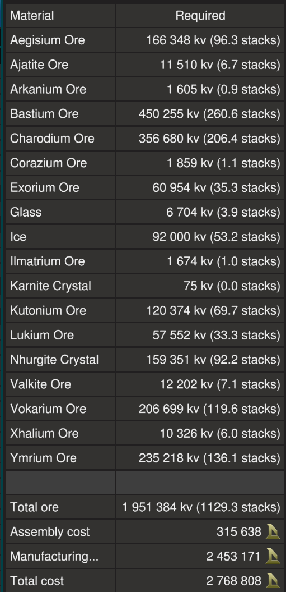

# Crawler by EGOTech

The Crawler is a 704 ore crate capacity mining ship with 10 sweeping mining lasers drill for surface mining operations. It is a larger version of the [Bugger X](../bugger/premium) but uses a large generator system. It is designed to work in conjunction with a moon base and a separate hauler as it is not the quickest ship.

The blueprint is available for [purchase](#purchase-blueprint).

[Starbase Ship Shop Page](https://sb-creators.org/makers/Egomaniac/ship/Crawler)

  
  
  
  

More photos in the [`photos` folder](photos)

## Features

The ship has the following features:

- 704 ore crates
- Standard Cruise function
- Turtle and Sloth functions with adjustable rates
- Transponder system with ping function
- Separate mining seat for mining operations with view of lasers and ground
- Row of 10 mining lasers that sweep from side to side
- Auto mine function that auto advances (with adjustable thrust and speed) ship for easy mining
- "Feelers" to keep ship in hover mode while mining
- Four ore collectors
- Two external and three internal resource bridges
- Auto generator rate script with adjustable minimum rate
- One large generator with processing unit and one large fuel tank
- Radiators and heat sinks that provide more than adequate cooling
- Six large propellant tanks with 72,000,000 units of propellant
- Propellant time and fuel time panels
- 234 batteries
- 21 T3 box and 128 T3 triangle thrusters providing forward thrust
- 52 T3 triangle thrusters providing braking thrust
- 120 T3 triangle thrusters for maneuvers, with extra thrust upwards
- Basic crafting bench to craft refills plus the tools and advanced bench
- Speedometer
- Timer panel
- Odometer panel
- Many extra slots for YOLOL or memory chips
- Top speed of 125m/s when empty

## Changelog

### v1.0.1 (Current) - 28/12/2022

- Added cruise safety chip
- Added lasers safety chip

### v1.0.0 - 23/11/2022

- Initial release

## Build Cost

> TIP: You can craft your own crates, generators, box and triangle thruster components (T3) and ship tools to reduce assembly cost.

## Purchase Blueprint

The blueprint is available for purchase on the EGOTech Discord server.

## Usage

To enter the ship, there is a button on bottom of the ship that will open `Hatch`. Once inside you can also open and close the cockpit glass `Canopy`. Buttons for these are available in the pilot left side consoles.

### Flying the Ship

The left lever on the center console controls backwards thrust (braking) and the right lever controls forward thrust.

| Interface | Function |
|---|---|
| `Speed` | Current speed in metres per second. |
| `ForwardThrust` | Current forward thrust, maximum of 10,000 units |
| `Throttle` | Current throttle level, maximum of 100 percent |
| `Cruise` | Activates cruise control, forward thrust will not reset to zero unless turned down. |
| `Turtle` | Activates turtle mode which sets forward thrust to a maximum limit of `TurtleRate` of full thrust. |
| `Sloth` | Activates the low sensitvity mode of pitch and yaw by limiting thrust. Use the `Sensitivity` switch to set the maximum thrust rate of sloth mode.|
| `Aim` | Reduces the response time of key presses for pitch and yaw. |
| `Guide`, `Hover Distance`, `FrontRight`, `FrontLeft`, `BackRight` & `BackLeft` | `Guide` activates rangefinders at each corner of the base of the ship. Each repsective corner shows distance to the ground. `Red` warning lights flash when ground is less that `Hover Distance`. |
| `Range` & `Distance` | Activates forward rangefinders, with `Distance` showing distance to object detected by center rangefinder. |
| `Mine`, `Advance`, `Advance Thrust` & `Advance Time` | Mining controls. See [Mining](#mining). |
| `SafeZone` | Whether current location is in the safe zone. |
| `StrengthFactor` | Current strength of ship. May fluctuate as ore crates are filled. Anything below 1.0 means ship is damaged. |
| Transponder `Toggle` & `Ping` | Transponder controls, `Toggle` turns on and off ship transponder while `Ping` will activate transponder for three seconds |
| `Timer` | See [Timer](#timer). |
| `Odometer` | See [Odometer](#odometer). |

**NOTE:** For safety, firing full braking thrust will deactivate `Cruise`.

### Managing Power and Fuel

| Interface | Function |
|---|---|
| `Propellant` | Total propellant remaining in propellant tanks, maximum of 72,000,000 units. |
| `PropTime` | Time and distance remaining of propellant based on current usage. Distance is calculated from speed. |
| `FuelTime` | Time and distance remaining of fuel based on current usage. Distance is calculated from speed. |
| `Fuel` | Fuel remaining on fuel tank, maximum of 10,000,000 units. |
| `Generator` | Current generator rate. |
| `Min Gen` & `Min Generator Limit` | Toggle and sets minimum generator rate. See [Managing Power](#managing-power). |
| `Shutdown` | Will turn off all fuel chambers thus shutting down generators. |
| `Battery` | Shows current battery charge of the batteries, maximum of 10,000 units. |
| `HeatTransferRate` | Current heat transfer rate of the heat sinks, maximum of 100%. |
| `Flow In` & `Flow Out` | Toggle flow modes of resource bridges. See [Refueling Propellant](#refueling-propellant). |
| `Lights` | Turns on and off internal lights. |
| `Canopy` | Opens or closes glass canopy. |
| `Hatch` | Opens or closes ship entry hatch. |

#### Managing Power

By default the generator will only run and ramp up when the batteries need charging so there is minimum management needed. But you can set a minimum generate rate by setting the `Min Generator Limit` value using the switch for the minimum rate and turning on `Min Gen`.

#### Refueling Propellant

All four resource bridges can be used for refuelling propellant. To refuel from another ship, turn off `Flow Out` on the pilot right side console and leave `Flow In` turned on. Then connect a resource bridge to the other ship. To refuel another ship, do the opposite, `Flow Out` turned on and `Flow In` turned off.

Remember to turn `Flow In` and `Flow Out` back on if you are using the Endo to collect ore via any of the ship's resource bridges.

### Mining

Activate `Lasers` to turn on the mining lasers which will automatically sweep from side to side. Activating `Advance` will slowly move the ship forward based on `Advance Time` and `Advance Thrust`. Adjust `Advance Time` (period to wait before each advance in seconds) and `Advance Thrust` (amount of forward thrust when advancing) if needed.

> TIP: Increase `Advance Thrust` if needed as the ship gains more mass from filling up.

`Collect` turns on the four ore collectors.

`Mine` will activate automated mining, which will activate `Lasers`, `Advance` and `Collect`.

> TIP: Turn on `Min Gen` and allow the generators to ramp up before starting to mine. Continous use of the lasers and collectors at the same time requires a `Min Generator Limit` of around 85%.

**NOTE:** For safety, lasers will turn off if the total fuel is less that 2,000 units.

### Other Stuff

#### Timer

On the pilot center console there is a `Timer` panel which acts as a timer. It will run when the ship is active and show total time in years, weeks, days, hours, minutes and seconds. To reset the timer, hold down the `Reset Timer` button on the pilot left console.

#### Odometer

On the pilot right console there is a `Odometer` panel which will keep track of the ship's estimated flight distance based on speed. To reset the trip odometer, hold down the `Odometer` `Reset Trips` button on the pilot left console.

## Providing Feedback

I can be found in-game as Egomaniac and on discord as vinteo#4211. Feel free to contact me and provide feedback or if you need help. Pull requests are also welcomed for scripts changes/fixes.

I would also love to see any modifications or improvements you have made, so feel free to share! I hope to learn from the community and may also incorporate your changes into future versions.

Of course in-game tips are greatly appreciated.

## Frequently Asked Questions

### Can I sell ships based on this blueprint?

No.

## Designed by EGOTech

