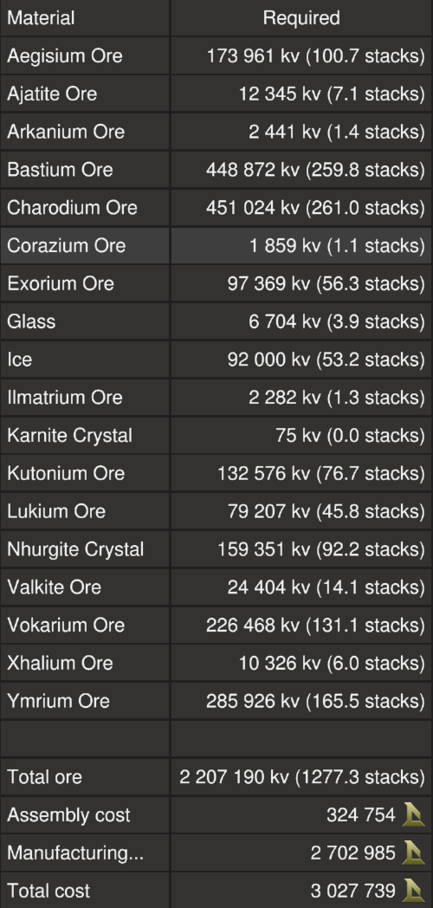

# Crawler X by EGOTech

The Crawler X is a premium version of the [Crawler](../) with [two large generators and 19 mining lasers](#comparison).

The blueprint is available for [purchase](#purchase-blueprint).

[Starbase Ship Shop Page](https://sb-creators.org/makers/Egomaniac/ship/Crawler%20X)

 

More photos in the [`photos` folder](photos)

## Comparison

|   | Crawler | Crawler X |
|---|---|---|
| Ore Crates | 704 | 640 |
| Large Generators | 1 | 2 |
| Power Generation | 70,000eps | 140,000eps |
| Mining Lasers | 10 | 19 |
| Ore Collectors | 4 | 7 |
| Mining Speed | Moderate | Fast |

## Build Cost

> TIP: You can craft your own crates, generators, box and triangle thruster components (T3) and ship tools to reduce assembly cost.

## Purchase Blueprint

The blueprint is available for purchase on the EGOTech Discord server.

## Changelog

### v1.0.1 (Current) - 28/12/2022

- Added cruise safety chip
- Added lasers safety chip

### v1.0.0 - 26/11/2022

- Initial release

## Usage

Please refer to the manual for the [Crawler](../).

## Frequently Asked Questions

### Can I sell ships based on this blueprint?

No.

### Can I share this blueprint or its derivatives?

No.
