# Fisher

The Fisher is a larger salvager ship with enough power generation to tow a ship of up to 20,000,000kg at up to 50m/s. The pilot seat can be spun to face the back, looking out the back window for ease of locking on ships using the back facing tow beam. It also has exposed frames to easily bolt on salvaged parts on each side.
The blueprint is provided for [free](#download-blueprint). All [feedback](#providing-feedback) is welcome and in game tips (in-game name Egomaniac) are appreciated. However support will be limited but I will try my best.

[Starbase Ship Shop Page](https://sb-creators.org/makers/Egomaniac/ship/%5BFREE%5D%20Fisher)

 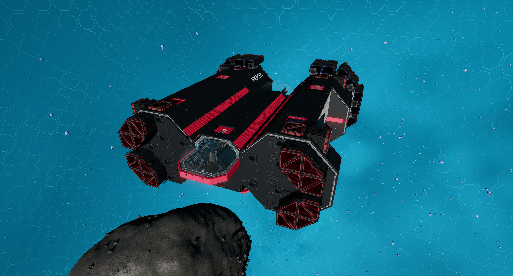 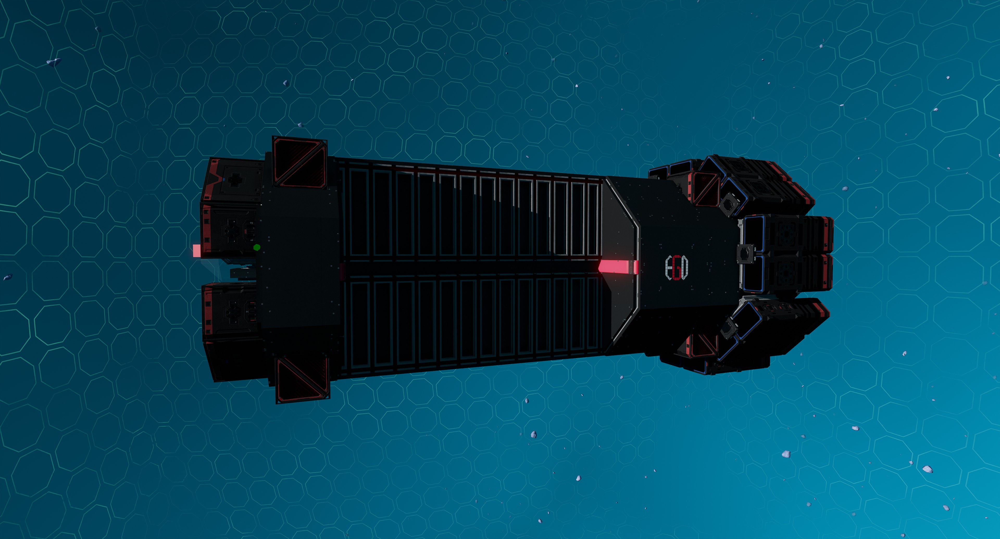
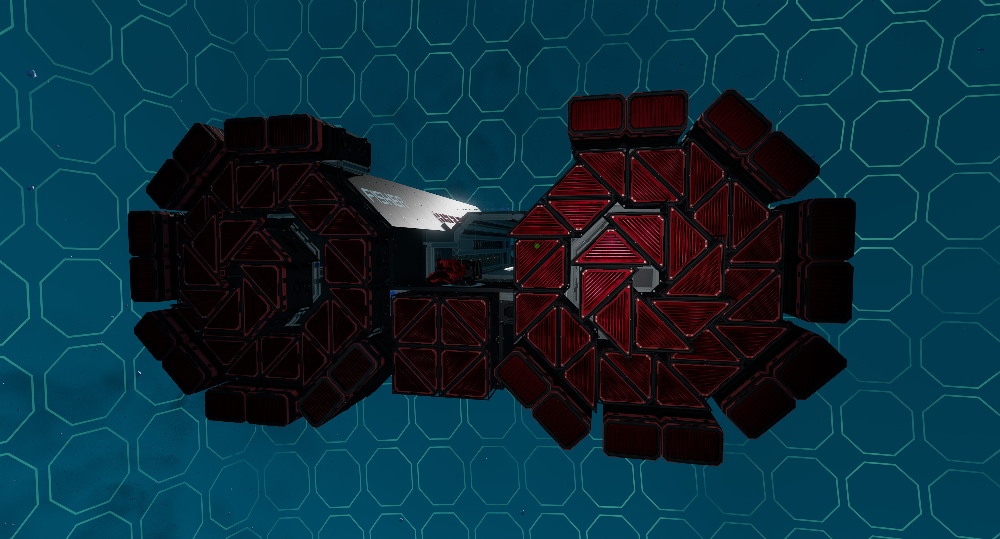 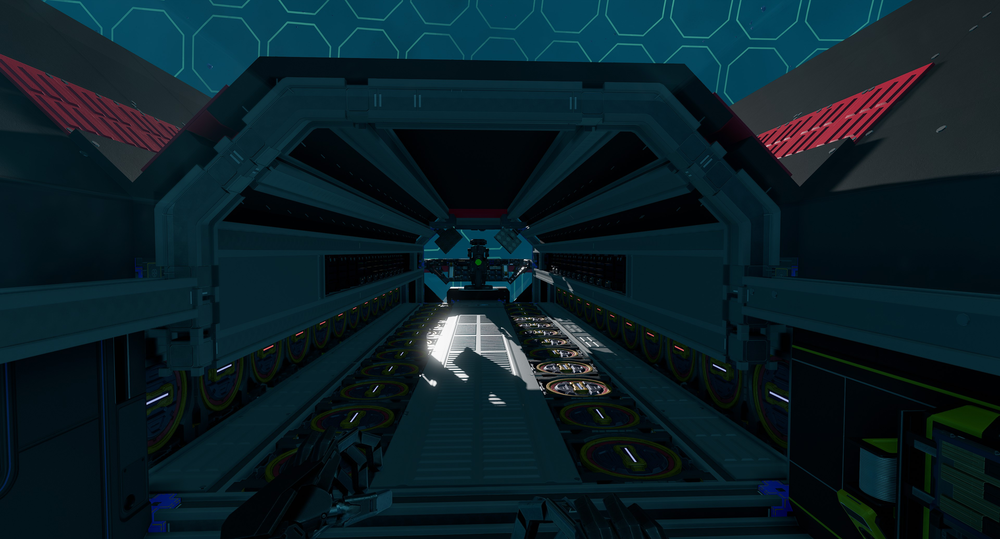 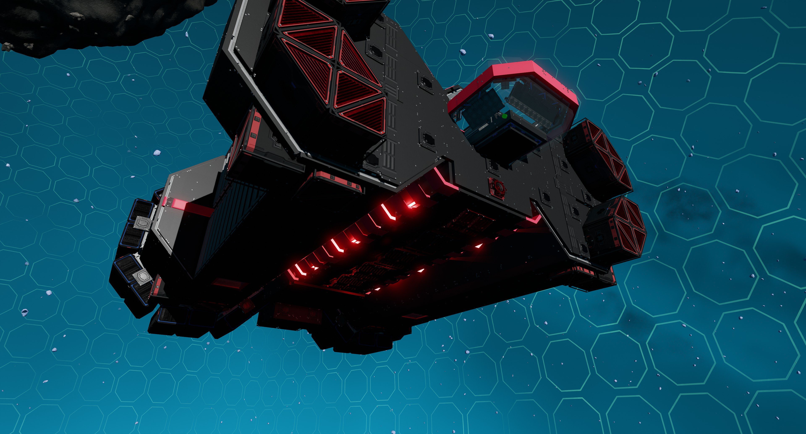
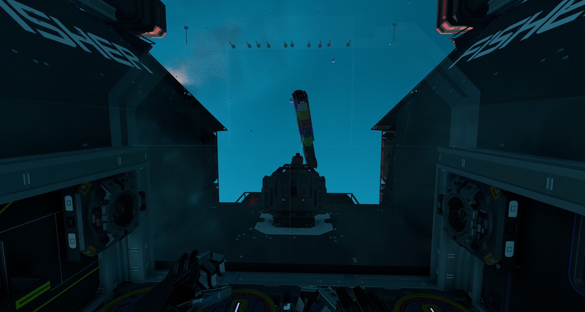  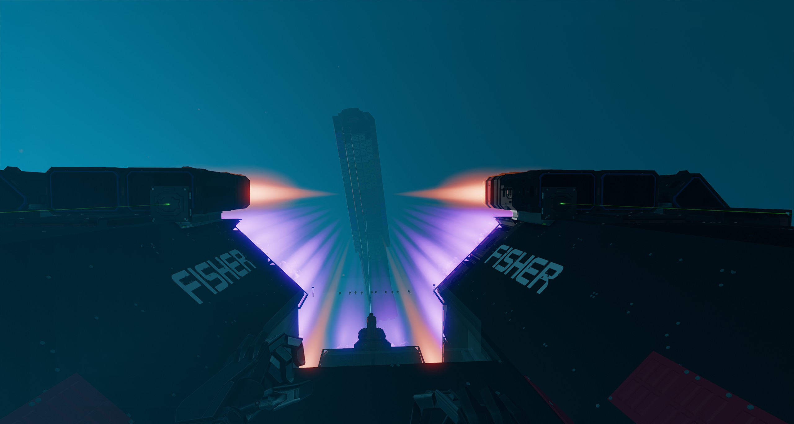
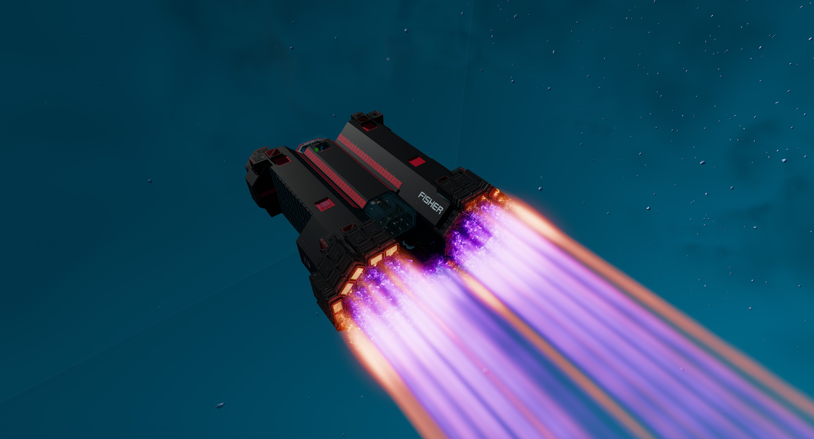 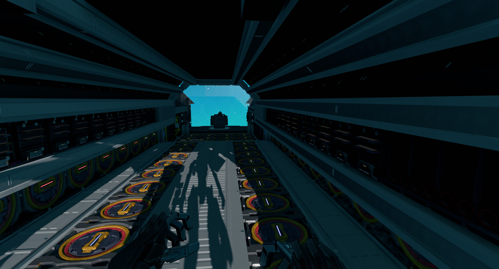 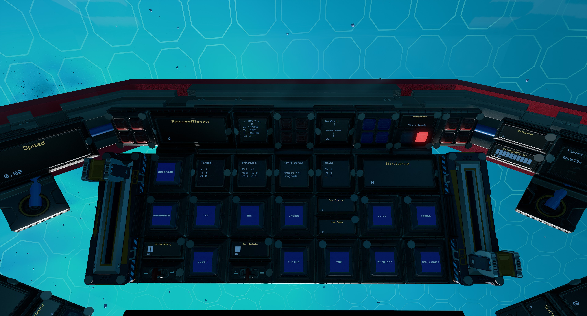
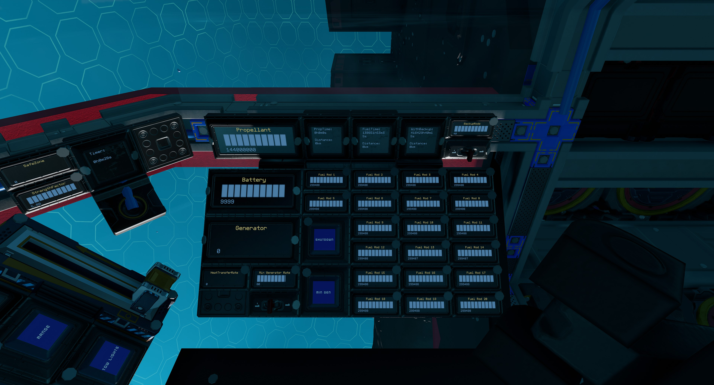 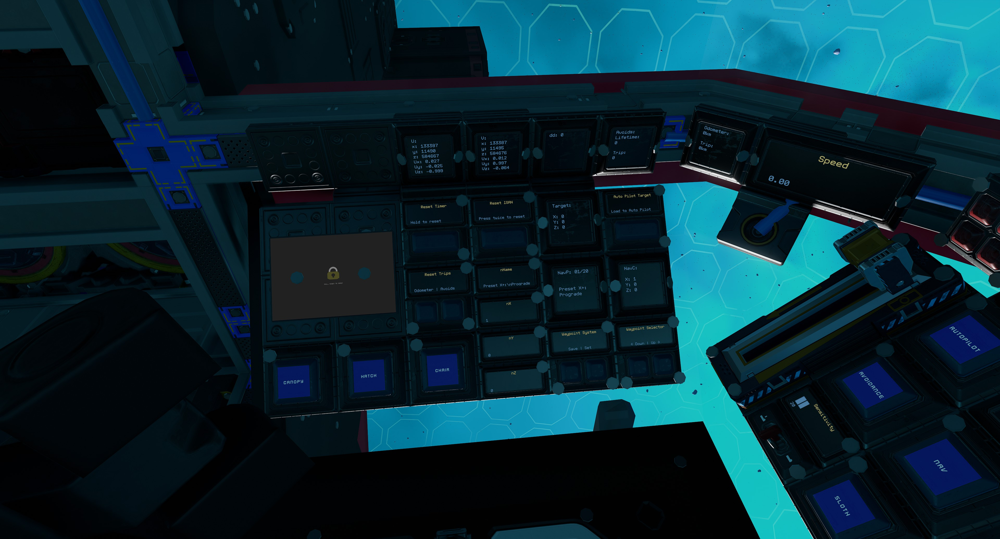 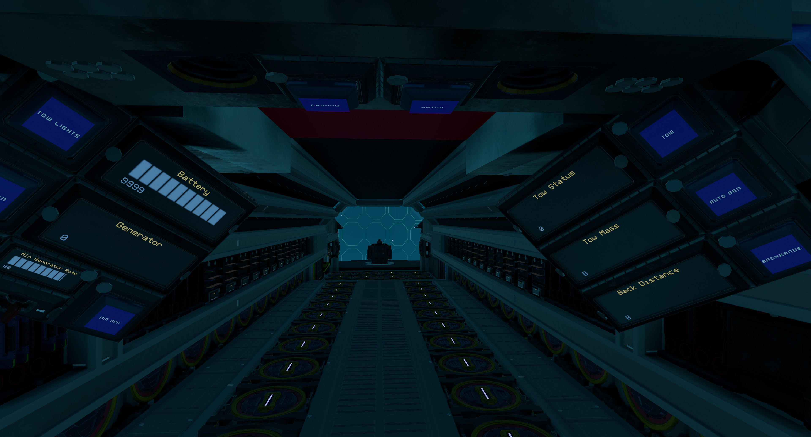

More photos in the [`photos` folder](photos)

## Features

The ship has the following features:

- Back facing tow beam for towing ships, with a towing capacity of 20,000,000kg
- Spinning pilot chair to view out the back of the ship through generous sized back window
- Standard Cruise function
- Turtle and Sloth functions with adjustable rates
- Transponder system with ping function
- One external and two internal resource bridges
- Auto generator rate script with adjustable minimum rate
- Button to automatically adjust the minimum generator rate acoording to towed mass
- Frames on either side of the ship to bolt on salvages parts
- 23 ore crates
- 60 T3 generators (with 60 T2 enhancers) with 20 T3 fuel chambers and 40 spare rods on racks
- Radiators and heat sink that provide more than adequate cooling
- 12 large tanks with 144,000,000 units of propellant
- Propellant time and fuel time panels
- 196 batteries
- 72 T2 triangle thrusters and 24 T2 box thrusters providing forward thrust
- 24 T2 manuever thrusters providing braking thrust
- 32 T2 manuever thrusters
- Basic crafting bench to craft refills plus the tools bench
- [NavGrid by StandPeter](https://github.com/pcbennion/starbase-navgrid)
- [NavCas by fixerid](https://github.com/fixerid/sb-projects/tree/main/NavCas), using custom avoidance system and ISAN 3 in 1 from [Compass by Firestar99](https://gitlab.com/Firestar99/yolol/-/blob/master/src/compass/README.md), with ability to load target from NavGrid
- Warning lights and alarm for obstacle detection and avoidance, powered by 27 rangefinders
- Speedometer
- Timer panel
- Odometer panel
- Top speed of 140 m/s while not towing

## Changelog

### v1.0.0 - 10/08/2022

- Initial release

## Build Cost

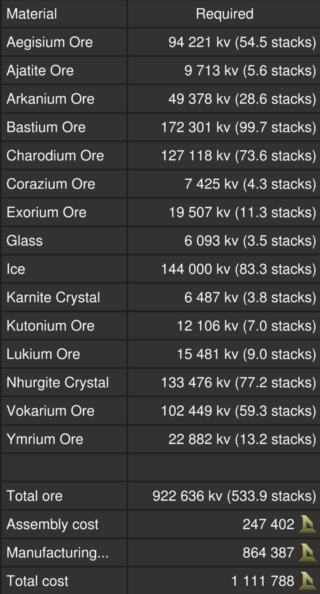

TIP: You can craft your own crates, generators (T3) and triangle thruster components (T2) to reduce assembly cost.

## Download Blueprint

The blueprint file is available in the `blueprints` folder [here](https://github.com/vinteo/starbase-ships/raw/main/fisher/blueprints/fisher.fbe).

## Usage

To enter the ship, there is a button on top of the ship that will open `Hatch`. Once inside you can also open and close the cockpit glass `Canopy`. Buttons for these are available in the pilot left side console.

### Flying the Ship

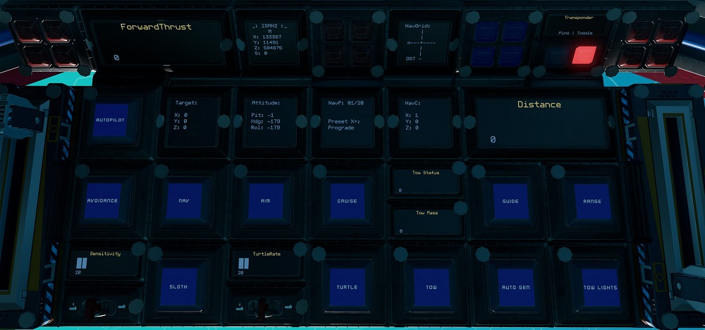

The left lever on the center console controls backwards thrust (braking) and the right lever controls forward thrust.

| Interface | Function |
|---|---|
| `ForwardThrust` | Current forward thrust, maximum of 10,000 units |
| `Speed` | Current speed in metres per second. |
| `Range` & `Distance` | Activates center rangefinder, with `Distance` showing distance to object. |
| `Cruise` | Activates cruise control, forward thrust will not reset to zero unless turned down. |
| `Aim` | Reduces the response time of key presses for pitch and yaw. |
| `Turtle` | Activates turtle mode which sets forward thrust to a maximum limit of `TurtleRate` of full thrust. |
| `Sloth` | (Right Console) Activates the low sensitvity mode of pitch and yaw by limiting thrust. Use the `Sensitivity` switch to set the maximum thrust rate of sloth mode.|
| Transponder `Toggle` & `Ping` | Transponder controls, `Toggle` turns on and off ship transponder while `Ping` will activate transponder for three seconds |
| `Nav`, `Autopilot`, `Avoidance` & `Target` | Autopilot controls. See [Autopilot and Crash Avoidance](#auto-pilot-and-crash-avoidance). |
| `ISAN2` | Current ISAN coordinates of ship. |
| `NavGrid`, `NavP`, `NavC` & `Attitude` | [NavGrid](https://github.com/pcbennion/starbase-navgrid) system, see [Using the Waypoint System](#using-the-waypoint-system). |
| `Tow Status`, `Tow Mass`, `Tow` & `Auto Gen` | Towing controls, see [Towing ships](#towing-ships). |
| `Timer` | See [Timer](#timer). |
| `Odometer` | See [Odometer](#odometer). |
| `SafeZone` | Whether current location is in the safe zone. |
| `StrengthFactor` | Current strength of ship. May fluctuate as ore crates are filled. Anything below 1.0 means ship is damaged. |
| `Canopy` | Open and closes the cockpit glass canopy. |
| `Hatch` | Open and closes the hatch on top of the ship. |
| `Chair` | Spins the pilot chair between forward facing and backwards facing. |

### Using the Waypoint System

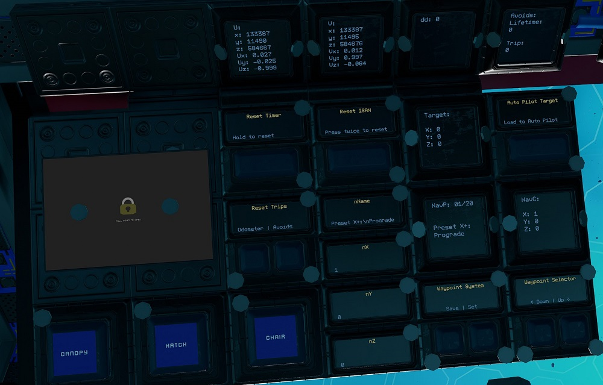

#### Viewing and Selecting Waypoints

This uses the [NavGrid](https://github.com/pcbennion/starbase-navgrid) system. Use the `Down` and `Up` waypoints selectors to select waypoint. The selected waypoint information is shown on `NavP` and `NavC` panels.

On the pilot center console, `NavGrid` will show the compass towards the selected waypoint while `Attitude` will show the ship's pitch, heading and roll directions. `NavGrid` is best used while not moving.

#### Editing and Saving Waypoints

Use `Set` to save waypoint of current location to the current selected waypoint position.

To edit currently selected waypoint, use your `U` tool to add name, X, Y and Z values to `nName`, `nX`, `nY` and `nZ` respectively. Then use the `Save` button to save.

**NOTE:** Waypoint 1 to 6 are presets and can not be over written.

#### Loading Waypoint to Auto Pilot

Use `Load to Auto Pilot` to load curretnly selected waypoint to `Target` to be used with the auto pilot system.

### Auto Pilot and Crash Avoidance

The ship uses a modified version of [NavCas](https://github.com/fixerid/sb-projects/tree/main/NavCas) which uses the 3 in 1 ISAN from Compass. Waypoints are loaded from NavGrid waypoint system.

Use while the ship is stationary. Activating `Nav` will start point the ship towards `Target` waypoint and deactivate itself when done. `Autopilot` will activate `Nav` and fly to within 5km of `Target` waypoint with `Avoidance` activated.

**NOTE:** `Nav` may not be very accurate. I recommend using it in conjunction with the NavGrid compass. The `dd` panel on the pilot left console shows debugging information for NavCas.

`Avoidance` will activate `Guides`. If the guides detect objects it will cut thrust and strafe up or down (will flash either the top or bottom `Blue` warning lights on the pilot center console according to the direction) while sounding an alarm (check game settings if you do not hear the alarm).
It will also flash `Red` warning lights on the pilot center console according to the position of obstacle detected. If `Autopilot` is activated, it will readjust and continue its flight.

**NOTE:** For safety, `Avoidance` will not activate if the mining lasers are turned on. Do not turn on `Avoidance`, `Autopilot` and `Nav` while lasers are turned on.

`Avoids` will show the counters for number of avoidances. The `Trip` counter can be reset by holding down the `Avoids` `Reset Trips` button.

**NOTE:** There is very limited coverage of range finders for the crash avoidance system. **Use at your own risk!**

### Resetting Navigation

If ISAN or NavGrid is not working, it can be reset using the `Reset ISAN` button. Press once to take ISAN offline, then press again to reset.

#### Managing Power

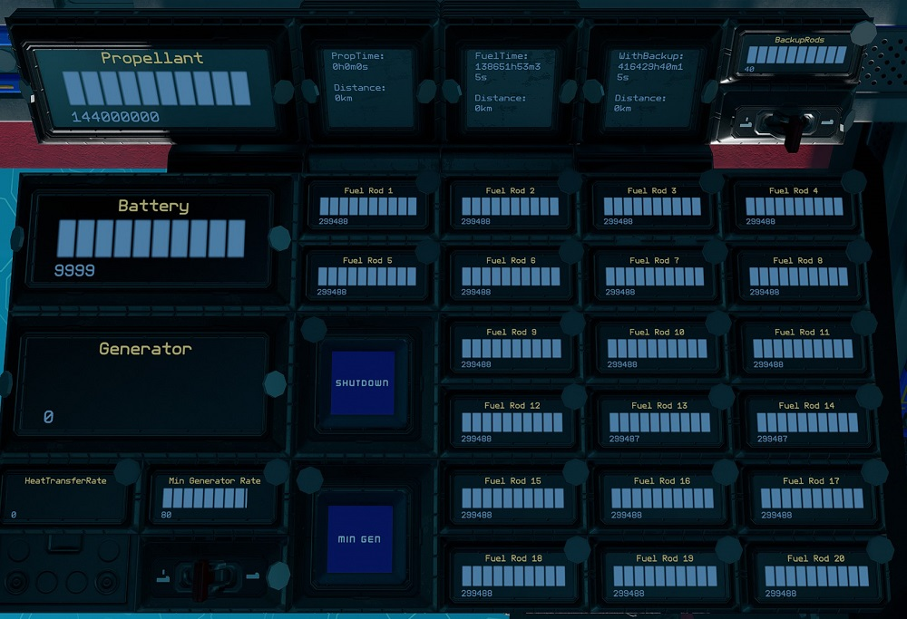

| Interface | Function |
|---|---|
| `Battery` | Shows current battery charge of the 136 batteries, maximum of 10,000 units. |
| `Generator` | Current generator rate, maximum of 100%. |
| `Min Generator Limit` & `Min Gen` | Toggle and sets minimum generator rate. |
| `Fuel Rod 1` to `Fuel Rod 20` | Fuel remaining on fuel rods in individual fuel chambers, maximum of 300,000 units for each. |
| `Shutdown` | Turns off fuel chambers. |
| `HeatTransferRate` | Current heat transfer rate of the heat sinks, maximum of 100%. |
| `Propellant` | Total propellant remaining in propellant tanks, maximum of 144,000,000 units. |
| `PropTime` | Time and distance remaining of propellant based on current usage. Distance is calculated from speed. |
| `FuelTime` | Time and distance remaining of fuel based on current usage. Distance is calculated from speed. |
| `WithBackup` | Same as FuelTime but takes into account backup rods available. Use the switch for `Backup Rods` to set the number of backup rods available. As standard there are 12 extra rods. |

By default the generator will only run and ramp up when the batteries need charging so there is minimum management needed. But you can set a minimum generate rate by setting the `Min Generator Limit` value using the switch for the minimum rate and turning on `Min Gen`.

`Shutdown` will turn off the fuel chambers.

#### Towing Ships

| Interface | Function |
|---|---|
| `Tow Status` | Status of tow beam, `0` is off, `1` is on and `2` is locked on. |
| `Tow Mass` | Mass of locked on ship, in kilograms. |
| `Tow` | Activates the tow beam. |
| `Tow Lights` | Activates the red flashing lights at the bottom of the ship. |
| `Auto Gen` | Activates `Min Gen` with `Min Generator Rate` according to `Tow Mass`. |
| `BackRange` & `Back Distance` | Activates the back facing rangefinders and displays the distance. |

The tow beam faces out the back of the ship so position the Fisher in front of, with the back facing the ship you wish to tow. Spin the `Chair` around to look out the back window and activate `Tow` to turn on the tow beam. Once the tow beam is locked on the ship, the `Tow Status` will be `2` and the mass of the locked ship will be shown as `Tow Mass` in kilograms.
Activate `Auto Gen` which will then turn on `Min Gen` with a `Min Generator Rate` based off the `Tow Mass`. Wait till the generators reach the targeted rate before flying off.

The Fisher has enough power generation to tow a ship of a mass of up to 20ktons or 20,000,000 kilograms. For large ships, it is recommended to turn on `Min Gen` to ramp up the generator before locking on and then activating `Auto Gen` once locked on to adjust the `Min Generator Rate` accordingly.

**NOTE:** Remember to turn off `Min Gen` after towing to save on fuel.

### Other Stuff

#### Timer

On the pilot left console there is a `Timer` panel which acts as a timer. It will run when the ship is active and show total time in years, weeks, days, hours, minutes and seconds. To reset the timer, use your universal tool (`U` key) and clear the value of the `Timer` field.

#### Odometer

On the pilot left console there is a `Odometer` panel which will keep track of the ship's estimated flight distance based on speed. To reset the trip odometer, use your universal tool (`U` key) and clear the value of the `Odometer` field.

## Providing Feedback

I can be found in-game as Egomaniac and on discord as vinteo#4211. Feel free to contact me and provide feedback or if you need help. Pull requests are also welcomed for scripts changes/fixes.

I would also love to see any modifications or improvements you have made, so feel free to share! I hope to learn from the community and may also incorporate your changes into future versions.

Of course in-game tips are greatly appreciated.

## Frequently Asked Questions

### Can I sell ships based on this blueprint?

No.

## Designed by EGOTech

