# Fledger by EGOTech

The Fledger is a starter ship that is targeted towards aspiring mechanics that want to learn about how ships work. It starts with the basic machinery but has plenty of space for upgrades, allowing the ship to grow as the player progresses. With an exposed frame, upgrades and repairs should be easier than most ships.
The blueprint is provided for [free](#download-blueprint). All [feedback](#providing-feedback) is welcome and in game tips (in-game name Egomaniac) are appreciated. However support will be limited but I will try my best.

[Starbase Ship Shop Page](https://sb-creators.org/makers/Egomaniac/ship/%5BFREE%5D%20Fledger)

  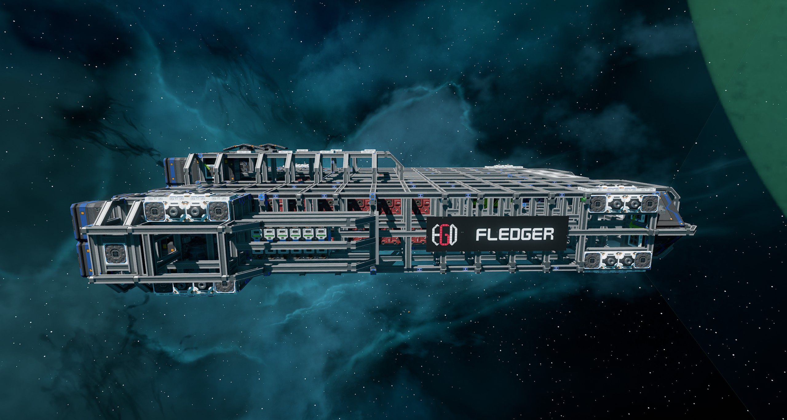
  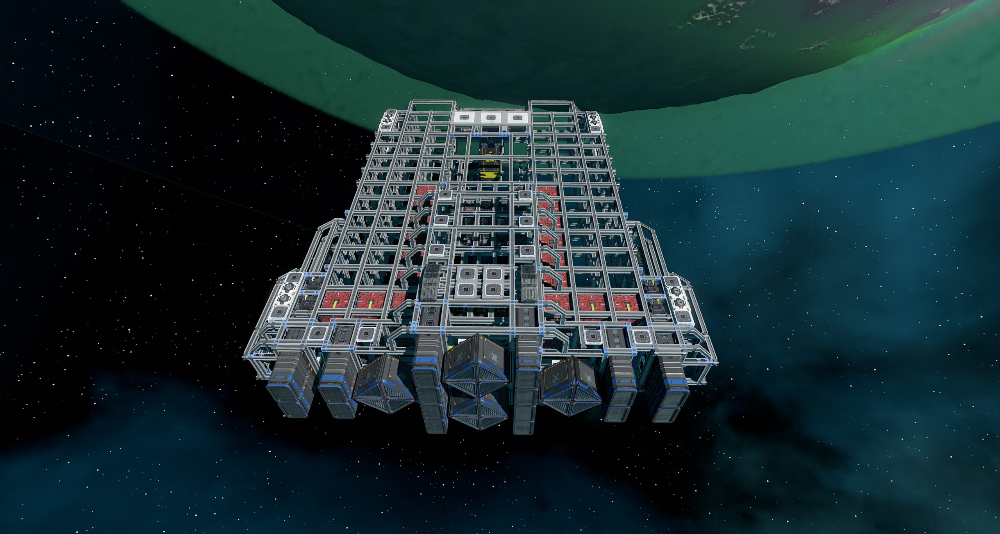
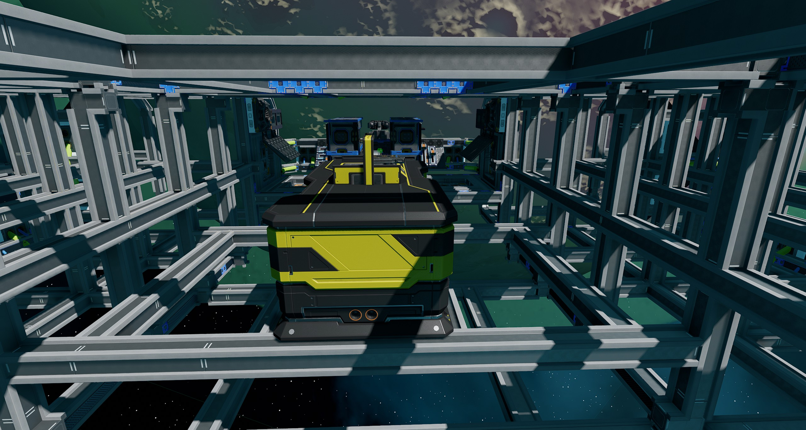 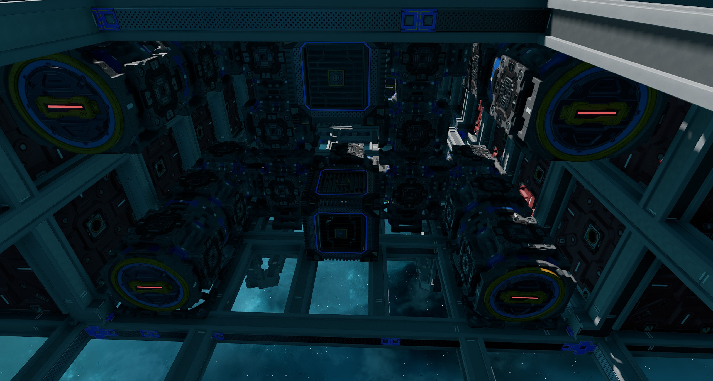 

More photos in the [`photos` folder](photos)

## Videos

| Channel | Video |
| --- | --- |
| [FarPointe](https://www.youtube.com/@FarPointe) | [Starbase 1-50 (Playlist of live streams)](https://www.youtube.com/playlist?list=PL4vREYUd0Y3G-39Cus-3uXTXr4AF7dc2-) |

## Features

The ship has the following features:

- 36 ore crates with designated space for up to 148 crates
- Standard Cruise and Turtle function
- Two resource bridge
- Auto generator rate script
- 12 T1 generators with four T1 fuel chambers and nine spare rods on racks
- Radiators and heat sink that provide more than adequate cooling
- Eight small tanks with 8,000,000 units of propellant
- 24 batteries
- 16 T1 triangle and 16 T1 box thrusters providing forward thrust
- Four T1 triangle thrusters providing braking thrust
- 32 T1 maneuver thrusters
- Basic crafting bench with space for other benches
- Exposed frame for easy repairs
- Lots of extra hardpoints for tools and upgrades
- Plenty of space for extra machinery and devices
- Top speed of 140 m/s empty

## Changelog

### v1.0.1 (Current) - 22/10/2022

- Fixed `Transponder` button on and off values
- Added missing beam at the back of the ship

### v1.0.0 - 19/10/2022

- Initial release

## Build Cost

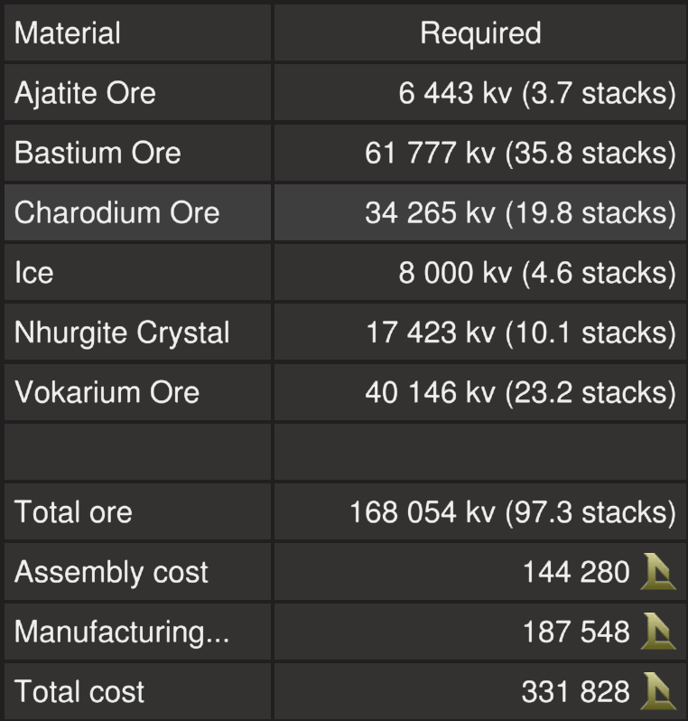

> TIP: You can craft your own crates, generators (T1) and triangle thruster components (T1) reduce assembly cost.

## Download Blueprint

The blueprint file is available in the `blueprints` folder [here](https://github.com/EGO-Tech/starbase-ships/raw/main/fledger/blueprints/fledger.fbe).

## Usage

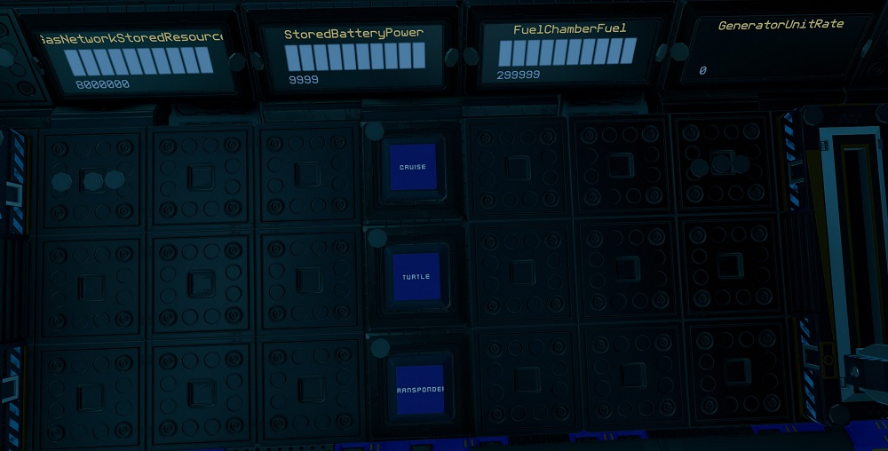

| Interface | Function |
|---|---|
| `Cruise` | Activates cruise control, forward thrust will not reset to zero unless turned down. |
| `Turtle` | Activates turtle mode which sets forward thrust to a maximum limit of 20%. |
| `Transponder` | Turns on and off ship transponder |
| `StoredBatteryPower` | Shows current battery charge of the batteries, maximum of 10,000 units. |
| `GeneratorUnitRate` | Current generator rate, maximum of 100%. |
| `FuelChamberFuel` | Fuel remaining on fuel rods in fuel chambers, maximum of 300,000 units for each. |
| `GasNetworkStoredResource` | Total propellant remaining in propellant tanks, maximum of 8,000,000 units. |

Almost all devices are kept with default names and controls kept to a minimum intentionally.

## Upgrading the Ship

The following are recommendations on how to add upgrades to the ship. However it is up to the owner how they want to do it, so be creative!

### Cabling, Piping and Ducts

The ship is connected throughout on one network using ducts, with many redundant ducts. So running cable or pipe to any duct will connect the hardpoint or device to the the ship's network.

### Adding More Crates

The beam structure of the ship allows for three rows of ore crates (two crates high) on each side of the ship. Snap the new crates to the piped and cabled ones at the back of the ship, bolt them in and you are good to go. There should be designated space for 148 crates but additional crates can be bolted to the frame. These additional crates will have to be cabled and piped separately.

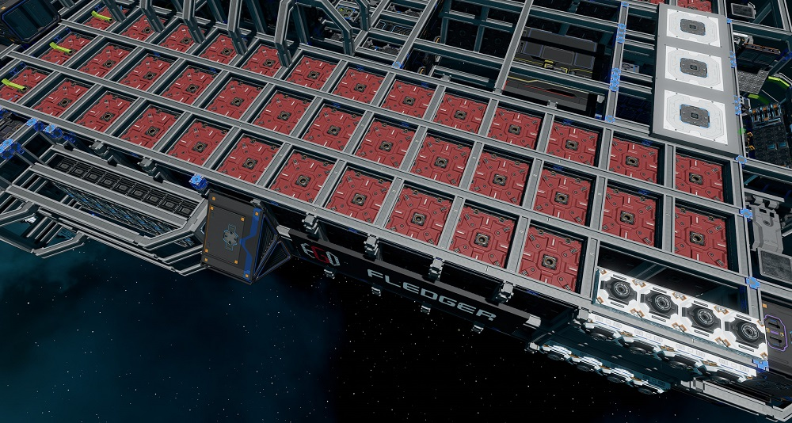

> TIP: Make sure to add crates equally on both sides of the ship to maintain its balance.

### Adding More Thrusters

As you add more crates you will need to add more thrust to keep up with the ship's mass. This can be done by either adding more thrusters or if you can afford it, replacing existing thrusters with higher tier thrusters. If adding new thrusters, make sure to name the thrusters by using the universal tool (`U` key) on the thruster body and giving it a unique name.

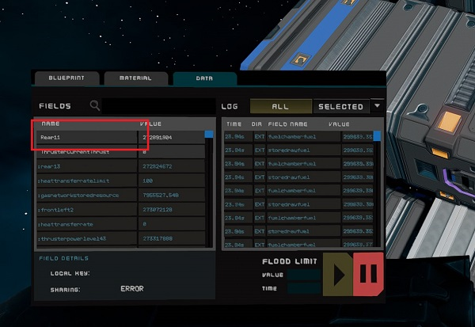

Then add the thruster name to the main flight computer (located behind the pilot seat) with the universal tool.

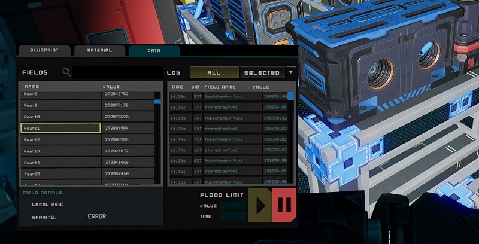

If replacing existing thrusters, you can use the same name of the old ones and their names should already be in the main flight computer.

You can also group thrusters together by giving it the same name, thruster should only be grouped if they are close together and firing in the same direction.

Triangle thrusters are automatically grouped together if they are snapped together and only need to be connected by one hardpoint. Only the thruster connected to the hardpoint needs to be named.

#### Forward Thrusters

The easiest way to add more forward thrust is to bolt on additional triangle thrusters to existing ones. These should just work once bolted on.

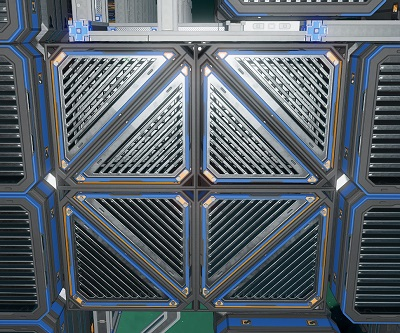

Additonally there are extra hardpoints available to bolt on box thrusters. Of course you can add your own hardpoints (remember to cable and pipe them) and thrusters as well. A fully upgraded rear thruster wall would look like below.

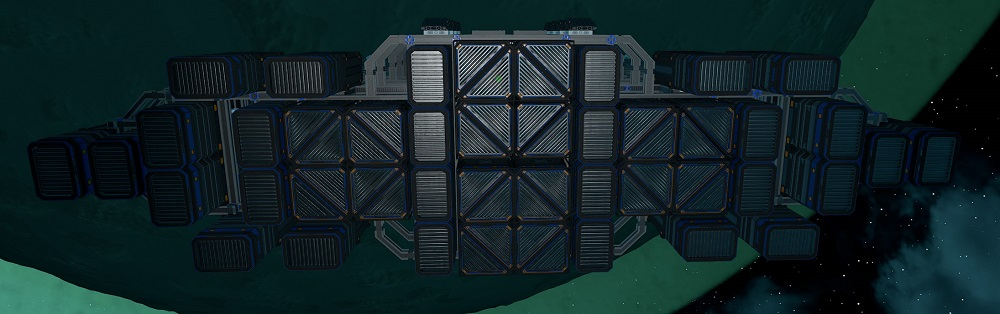

#### Braking/Backwards Thrusters

Again, the easiest way to upgrade is to bolt on additional triangle thrusters to existing ones.

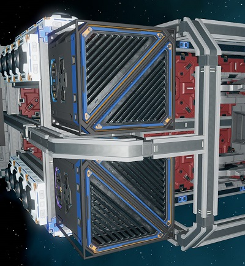

Additional triangle thrusters can also be added to hardpoints on each side of the ship. These need to be named the same as they are connected together.

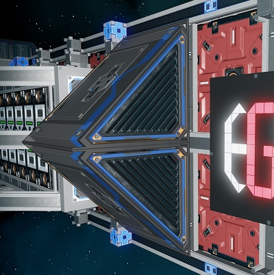

Instead of triangle thrusters, maneuver thursters can also be used on the side hardpoints. These can be named separately if you wish.

#### Maneuver Thrusters

On each of the eight corners of the ships, there are additional hardpoints to add maneuver thrusters. These thrusters should be grouped together so name them the same as the existing ones.

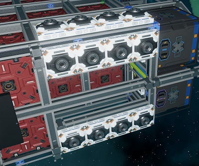

### Adding More Propellant

There is designated space on both sides of the ship to add either add two small tanks or one medium tank. At least one support of each tank needs to be piped. Cables are optional.

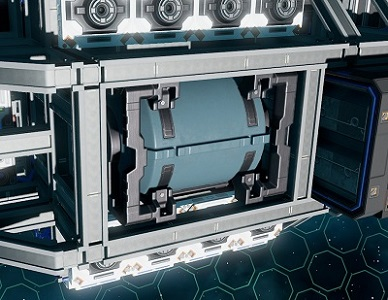

You can also always add tanks to any other space of the ship, just need to pipe the supports.

### Adding More Power

The core of the ship is designed for the ship's generator block. There is plenty of space to add more generators and fuel chambers to the exisiting block. There is also enough space to  duplicate and mirror the generator block on the other side facing the back of the ship.
If connected to the existing block, they should work as the block is already piped and cabled with sockets. Just remember to add enough heat sinks.

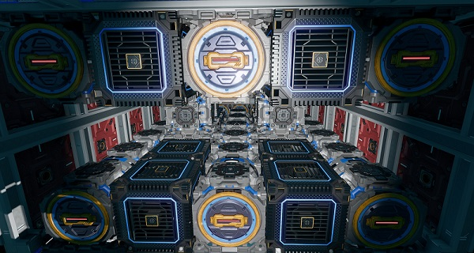

If really needed additional generator blocks can be added to the top and bottom of the ship as well, under the radiators. These need to be cabled and piped separately. Additional power can also be done by replacing existing generators with tier three ones or enhanced using enhancers, however keep heat generation and coolling in mind.

### Adding More Backup Fuel Rods

The designated space of fuel rods can hold up to 15 racks and rods. Feel free to add extra racks and rods to any other space you deem suitable.

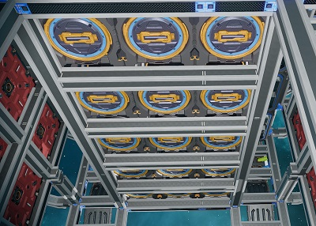

### Adding More Radiators

There are hardpoints designated for more radiators on the top and bottom of the ship.

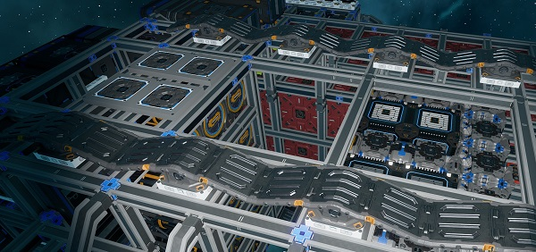

### Adding More Batteries

Additonal batteries can be added to the existing battery blocks on each side of the ship. Batteries connect when snapped together so it should just work. Again, you can add batteries to any where you can find space, just remember to cable them.

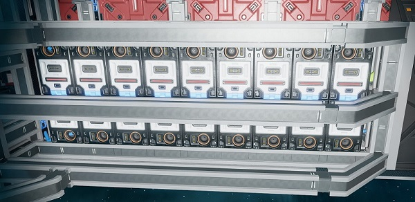

### Adding Other Benches

There is space designated for the two other benches next to the basic crafting bench.

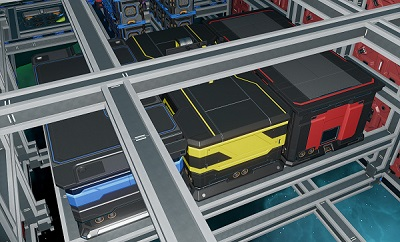

### Adding Ship Tools

There are plenty of hardpoints on the front as well as top and bottom of the ship to add any ship tools you need like mining lasers, ore collectors, material scanners, navigation receivers and others. All these hardpoints are already cabled and piped. Additionally the two hardpoints on either side of the cockpit has space for advanced turrets.

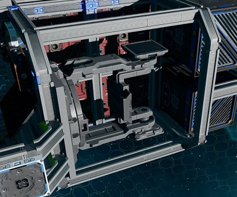

### Adding Ship Controls and YOLOL

The cockpit has control tables in the centre and either side of the pilot seat. Feel free to add any other displays or controls you need. YOLOL and memory racks behind the pilot seat have plenty of space to add chips.

There is only a single YOLOL chip on the ships which will only ramp up the generators when needed.

### Plating

The ship is intentionally left bare, but feel free to spruce up your ship with plates and decorative pieces. Have fun with it!

## Providing Feedback

I can be found in-game as Egomaniac and on discord as @vinteo81 (vinteo#4211). Feel free to contact me and provide feedback or if you need help. Pull requests are also welcomed for scripts changes/fixes.

I would also love to see any modifications or improvements you have made, so feel free to share! I hope to learn from the community and may also incorporate your changes into future versions.

Of course in-game tips are greatly appreciated.

## Frequently Asked Questions

### Can I sell ships based on this blueprint?

No.

## Designed by EGOTech

