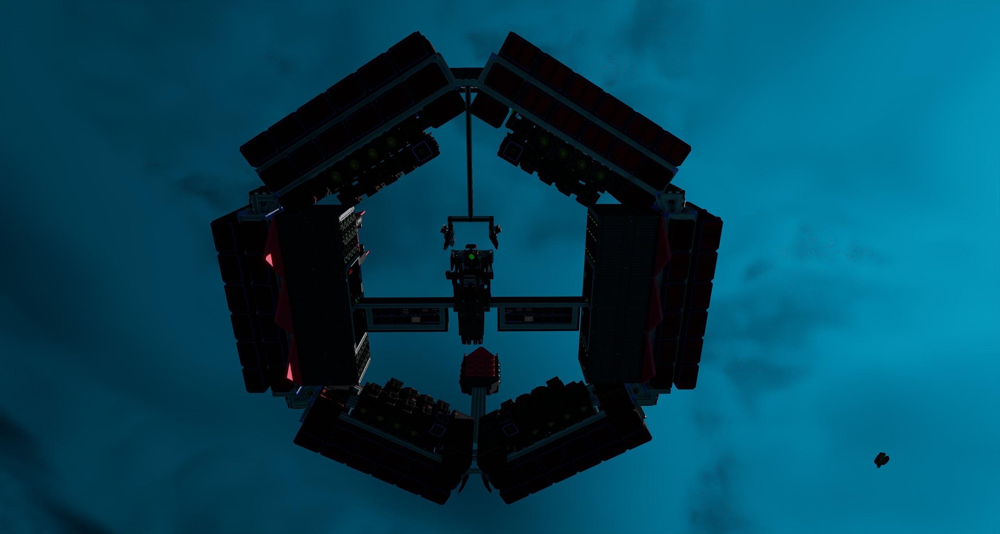
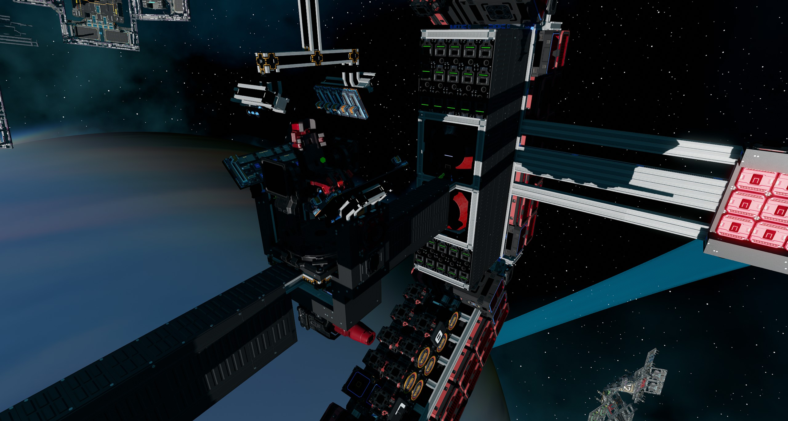
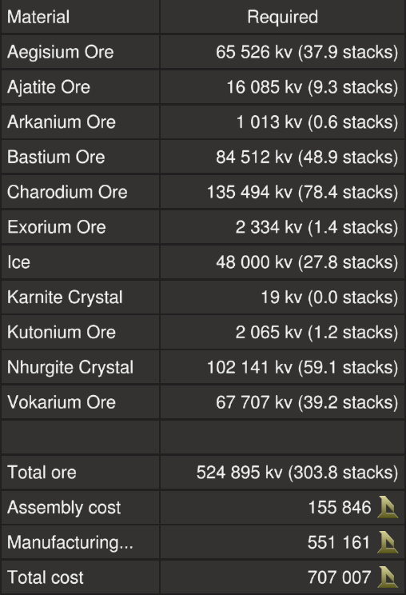
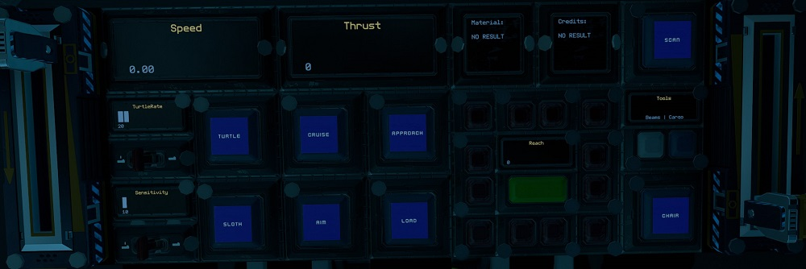
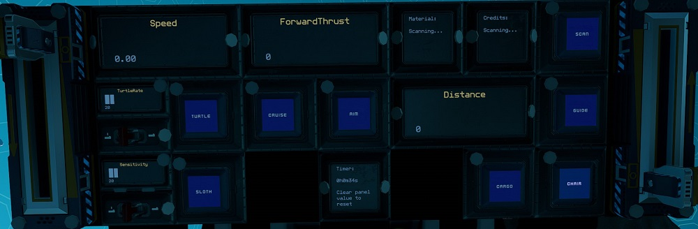
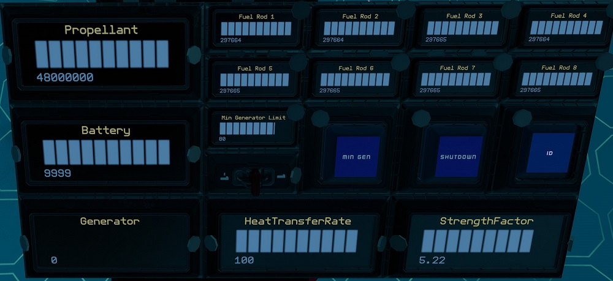
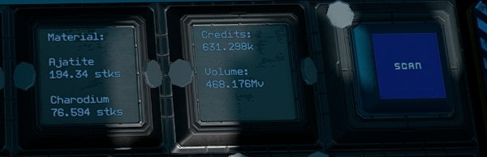

# Flipper by EGOTech

The Flipper is a ship for hauling a single T10 asteroid, designed to be used in the safe zone. It flies in one direction to easily load the asteroid and then you can flip around and fly load in the opposite direction, still with decent speed.
It has load automation to approach and load the asteroid as well as a material scanner that gives estimated credits for selling the asteroids.

If you like safe zone asteroid hauling, please consider the [Hexxer](../Hexxer), the [Rocker](../rocker) or the [Rocker Duo](../rocker_duo) as well.

The blueprint is provided for [free](#download-blueprint). All [feedback](#providing-feedback) is welcome and in game tips (in-game name Egomaniac) are appreciated. However support will be limited but I will try my best.

[Starbase Ship Shop Page](https://sb-creators.org/makers/Egomaniac/ship/%5BFREE%5D%20Flipper)

  
  
  

More photos in the [`photos` folder](photos)

## Features

The ship has the following features:

- Standard Cruise function
- Turtle and Sloth function with adjustable rates
- 24 T2 generators with eight T2 fuel chambers and 16 spare rods on racks
- Four large propellant tanks with 48,000,000 units of propellant
- 150 batteries
- 20 T2 box thrusters providing thrust in one direction when not loaded (110m/s top speed)
- 60 T2 box thrusters providing thrust in other direction when loaded (120m/s top speed, max speed when unloaded)
- 48 T2 manuever thrusters
- Material scanner that will output the materials in stacks as well as the estimated credits you will get for dropping the asteroid off at Origin stations
- Rangefinder guides to help judge forward distance and for approach
- Load automation that will approach and load a single T10 asteroid
- Resource bridge for refueling

## Changelog

### v1.1.0 (Current) - 27/07/2022

- Replaced rotating FCU system with new FCU switching system with a second FCU and a slider to switch between the two units
- Moved maneuver levers to above pilot seat
- Added help chip with ship manual URL to pilot left console
- Moved back maneuver thrusters to be further behind center of mass
- Regrouped rear thrusters into more separate groups

### v1.0.0 - 23/07/2022

- Initial release

## Build Cost

TIP: You can craft your own generators (T2), box thruster components (T2) and ship tools to reduce assembly cost.

## Download Blueprint

The blueprint file is available in the `blueprints` folder [here](https://github.com/vinteo/starbase-ships/raw/main/flipper/blueprints/flipper.fbe).

## Known Issues

- The ship sometimes twists and turns at full throttle
- Currently there are no navigation features but will possibly add ISAN and Compass in the future if this ship becomes useful to Endos

## Usage

### Flying the Ship

The left lever on the center console controls backwards thrust (braking) and the right lever controls forward thrust.

| Interface | Function |
|---|---|
| `ForwardThrust`, `Thrust` | Current forward thrust, maximum of 10,000 units |
| `Cruise` | Activates cruise control, forward thrust will not reset to zero unless turned down. |
| `Turtle`, `TurtleRate` | Activates turtle mode which sets forward thrust to a maximum limit of `TurtleRate` (percent) of full thrust. |
| `Sloth`, `Sensitivity` | Activates sloth mode which sets yaw and pitch thrust to a maximum limit of `Sensitivity` (percent) of full thrust. |
| `Aim` | Reduces the response time of key presses for pitch and yaw. |
| `Distance`, `Reach` & `Range` | `Distance` & `Reach` are distances for center rangefinders. `Guide` or the green button toggles the rangefinders. The warning lights blink red when the surronding guide lasers detect an object. |
| `Scan`, `Material`, & `Credits` | Material scanning controls. See [Scanning Asteroids](#scanning-asteroids). |
| `Approach`, `Load` & `Cargo` | Cargo loading controls. See [Loading Asteroids](#loading-asteroids). |
| `Timer` | See [Timer](#timer). |

### Managing Power and Fuel

| Interface | Function |
|---|---|
| `Propellant` | Total propellant remaining in propellant tanks, maximum of 10,000,000 units. |
| `Battery` | Shows current battery charge of the 40 batteries, maximum of 10,000 units. |
| `Generator` | Current generator rate, maximum of 100%. |
| `Min Generator Limit` & `Min Gen` | Toggle and sets minimum generator rate. See [Managing Power](#managing-power). |
| `HeatTransferRate` | Current heat transfer rate of the heat sinks, maximum of 100%. |
| `Fuel Rod 1`, `Fuel Rod 2`, `Fuel Rod 3`, `Fuel Rod 4`, `Fuel Rod 5`, `Fuel Rod 6` , `Fuel Rod 7` , `Fuel Rod 8` | Total fuel remaining on fuel rods, maximum of 300,000 units each. |
| `Shutdown` | Will turn off all fuel chambers thus shutting down generators. |
| `StrengthFactor` | Current strength of ship. May fluctuate as asteroid is loaded. Anything below 1.0 means ship is damaged. |
| `ID` | Toggle for the transponder. |

#### Managing Power

By default the generator will only run and ramp up when the batteries need charging so there is minimum management needed. But you can set a minimum generate rate by setting the `Min Generator Limit` value using the switch for the minimum rate and turning on `Min Gen`.

### Scanning Asteroids

`Scan` turns on the material scanner. The beam has a range of 100m.
Point the beam at an asteroid and `Material` will show the materials in the asteroid along with the volume of each in stacks.
`Credits` will show the _estimated_ amount of credits you will get for the asteroid if you drop it off at Origin stations.
The calculation is 158.8% (worked out this with testing) of the cost of ore of the vendor price. **This only has data for safe zone materials.** The total volume of the asteroid in Mv is also shown.

### Loading Asteroids

Approach an asteroid by pointing the center rangefinder at an asteroid and activating `Approach`. This will guide the ship to around 2m of the asteroid. `Cargo` will activate the cargo lock beams.

All these can be done the automated `Load` function on **the pilot center console**. Point the rangefinder at the asteroid you wish to load and activate `Load`. This is activate `Approach` and `Scan` as well as smartly activating the `Cargo` when the asteroid is in place.

### Other Stuff

#### Timer

On the pilot left console there is a `Timer` panel which acts as a timer. It will run when the ship is active and show total time in years, weeks, days, hours, minutes and seconds. To reset the timer, use your universal tool (`U` key) and clear the value of the `Timer` field.

## Providing Feedback

I can be found in-game as Egomaniac and on discord as vinteo#4211. Feel free to contact me and provide feedback or if you need help. Pull requests are also welcomed for scripts changes/fixes.

I would also love to see any modifications or improvements you have made, so feel free to share! I hope to learn from the community and may also incorporate your changes into future versions.

Of course in-game tips are greatly appreciated.

## Frequently Asked Questions

### Can I sell ships based on this blueprint?

No.

### How much can I make from hauling safe zone asteroids?

Here is an estimated breakdown of 468Mv (T10) asteroids from the safe zone I got during testing.

| Material | Volume | Credits |
| --- | --- | --- |
| Ice/Vokarium | 486Mv | 371k |
| Ajatite/Charodium | 486Mv | 631k |
| Valkite/Bastium | 486Mv | 272k |
| Ice/Nhurgite | 486Mv | 581k |

## Designed by EGOTech

