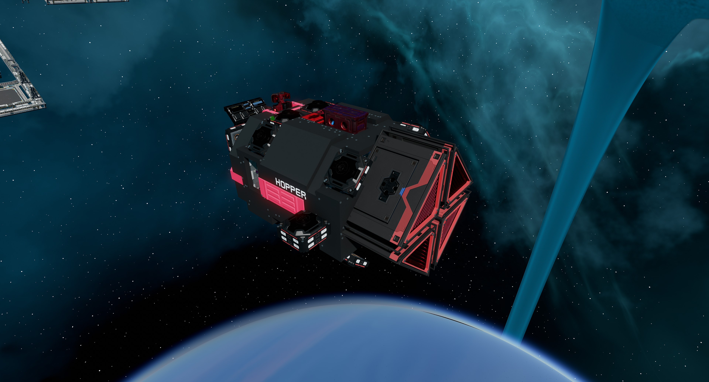
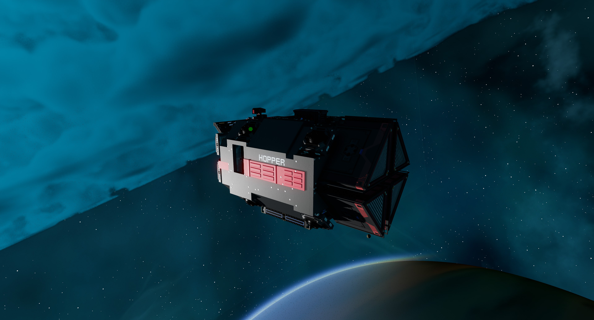
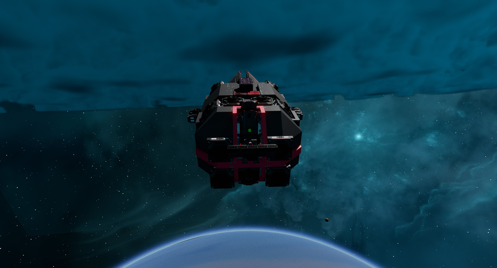
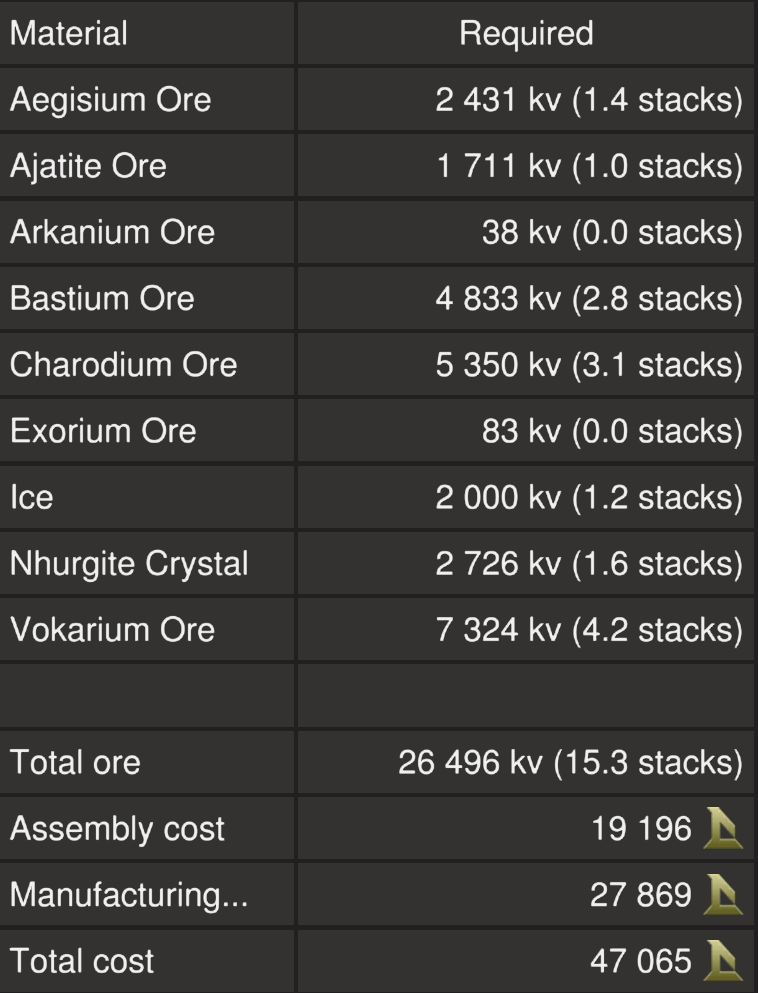
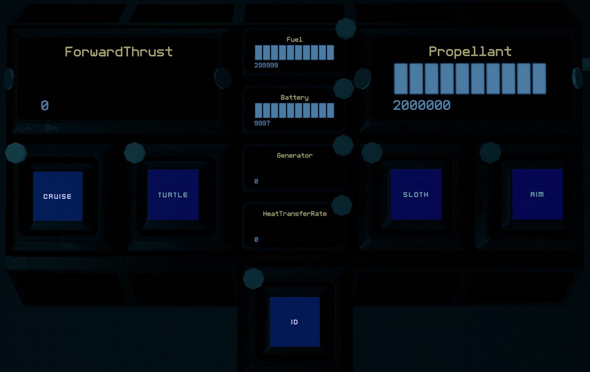

# Hopper by EGOTech

The Hopper is small personal transport that can be used to quickly get around a station or taking short trips.
The blueprint is provided for [free](#download-blueprint). All [feedback](#providing-feedback) is welcome and in game tips (in-game name Egomaniac) are appreciated. However support will be limited but I will try my best.

[Starbase Ship Shop Page](https://sb-creators.org/makers/Egomaniac/ship/%5BFREE%5D%20Hopper)

  

More photos in the [`photos` folder](photos)

## Features

The ship has the following features:

- Standard Cruise function
- Turtle and Sloth functions
- One resource bridge
- Auto generator rate script with adjustable minimum rate
- Three T2 generators with one T2 fuel chamber
- Radiator and heat sink that provide more than adequate cooling
- Two small tanks with 2,000,000 units of propellant
- Four batteries
- Four T2 triangle thrusters providing forward thrust
- Four T2 maneuver thrusters providing braking thrust
- 14 T2 maneuver thrusters

## Changelog

### v1.1.0 (Current) - 24/07/2022

- Added roll thrusters

### v1.0.1 - 24/07/2022

- Fixed centering speed of `FcuBackwards` lever

### v1.0.0 - 24/07/2022

- Initial release

## Build Cost

TIP: You can craft your own crates, generators (T2) and triangle thruster components (T2) reduce assembly cost.

## Download Blueprint

The blueprint file is available in the `blueprints` folder [here](https://github.com/vinteo/starbase-ships/raw/main/hopper/blueprints/hopper.fbe).

## Usage

### Flying the Ship

| Interface | Function |
|---|---|
| `ForwardThrust` | Current forward thrust, maximum of 10,000 units |
| `Cruise` | Activates cruise control, forward thrust will not reset to zero unless turned down. |
| `Aim` | Reduces the response time of key presses for pitch and yaw. |
| `Turtle` | Activates turtle mode which sets forward thrust to a maximum limit of 20% of full thrust. |
| `Sloth` | Activates the low sensitvity mode by limiting all thrust to 20%. Using together with `Turtle` will result in even slower forward thrust. |
| `Fuel` | Fuel remaining on fuel rod, maximum of 300,000 units. |
| `Propellant` | Total propellant remaining in propellant tanks, maximum of 2,000,000 units. |
| `Battery` | Shows current battery charge of the 20 batteries, maximum of 10,000 units. |
| `Generator` | Current generator rate, maximum of 100%. |
| `HeatTransferRate` | Current heat transfer rate of the heat sinks, maximum of 100%. |
| `ID` | Activates transponder |

## Providing Feedback

I can be found in-game as Egomaniac and on discord as vinteo#4211. Feel free to contact me and provide feedback or if you need help. Pull requests are also welcomed for scripts changes/fixes.

I would also love to see any modifications or improvements you have made, so feel free to share! I hope to learn from the community and may also incorporate your changes into future versions.

Of course in-game tips are greatly appreciated.

## Frequently Asked Questions

### Can I sell ships based on this blueprint?

No.

## Designed by EGOTech

