# Lugger by EGOTech

The Lugger is a 832 crate hauler with two 10 ring plasma thrusters serving as its main engines to provide decent speed. However it is pretty much at its voxel limit so any additions or changes may be difficult without sacrificing crates.
The blueprint is provided for [free](#download-blueprint). All [feedback](#providing-feedback) is welcome and in game tips (in-game name Egomaniac) are appreciated. However support will be limited but I will try my best.

[Starbase Ship Shop Page](https://sb-creators.org/makers/Egomaniac/ship/%5BFREE%5D%20Lugger)

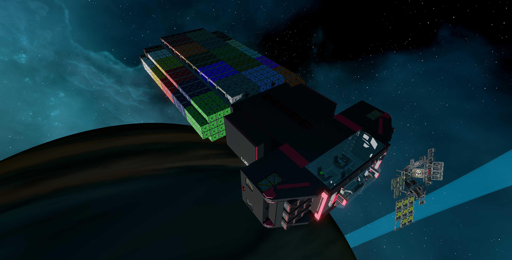 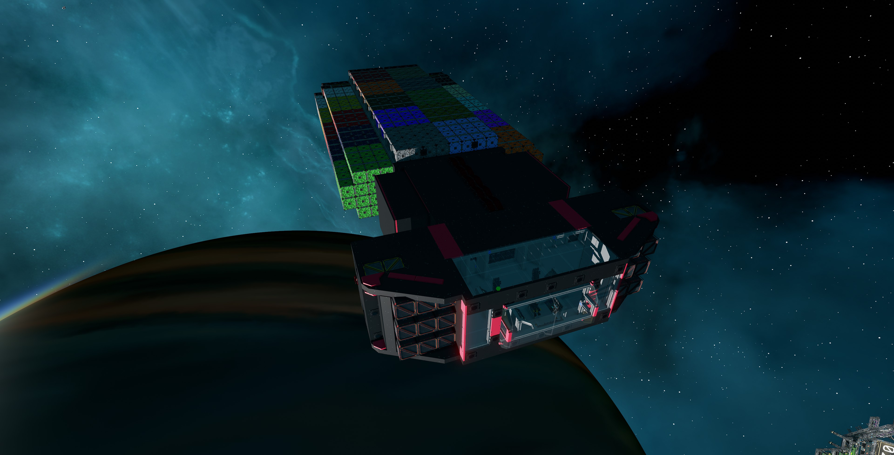 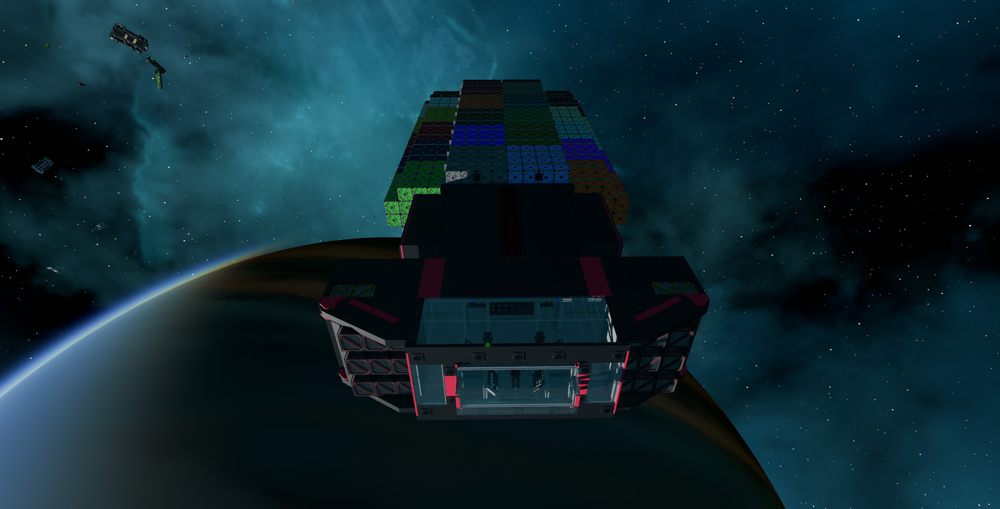
 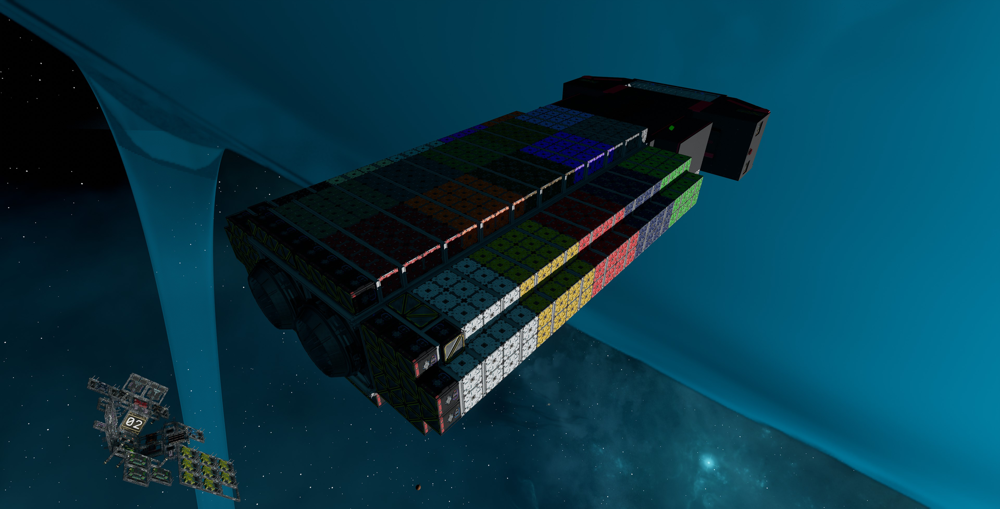 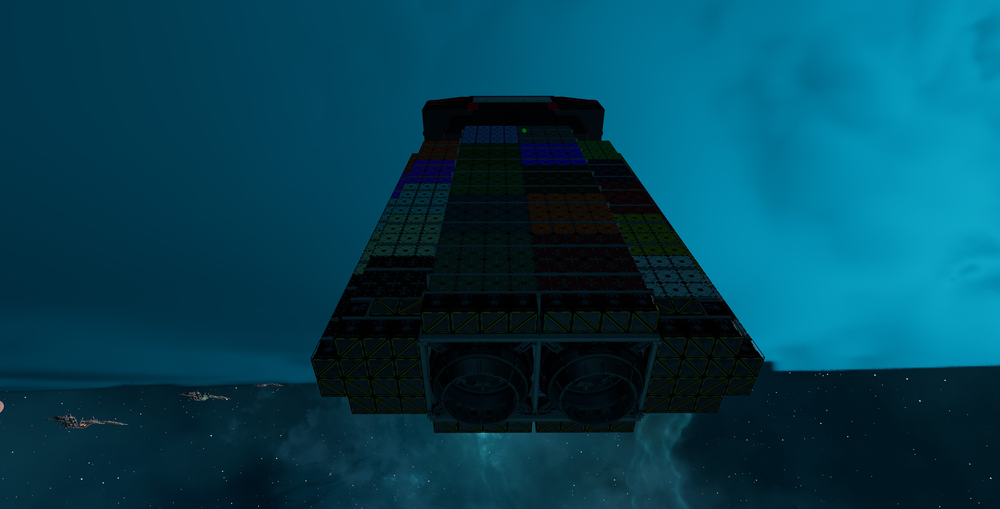
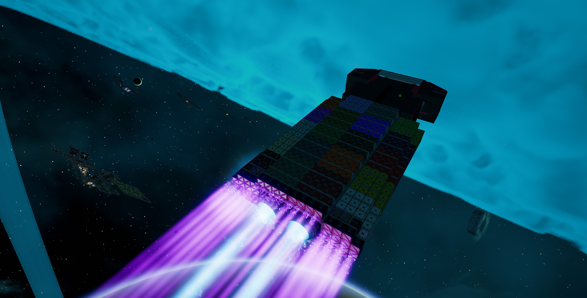 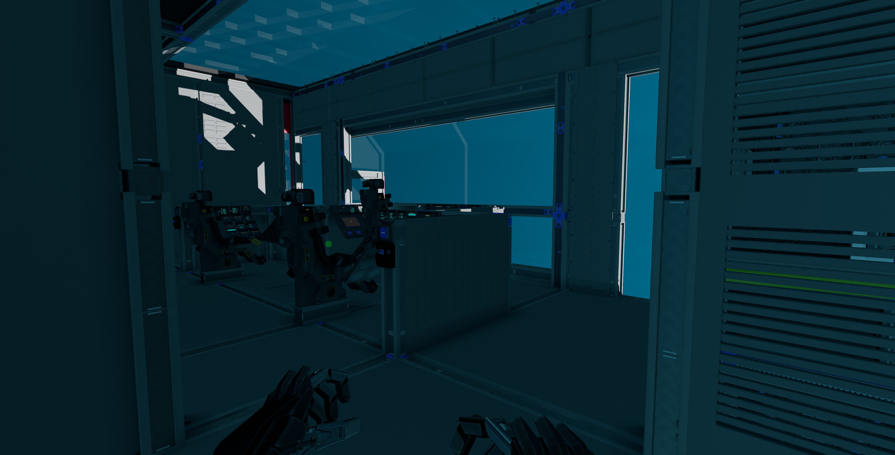 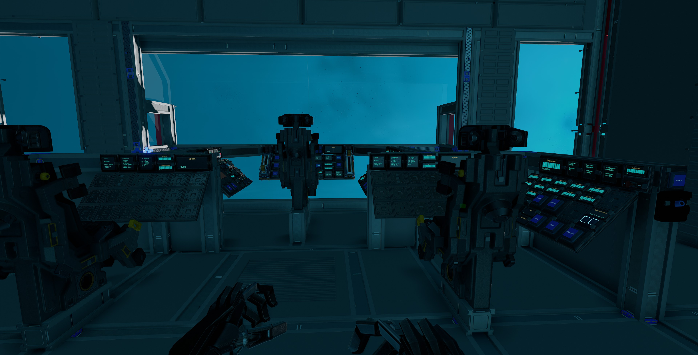
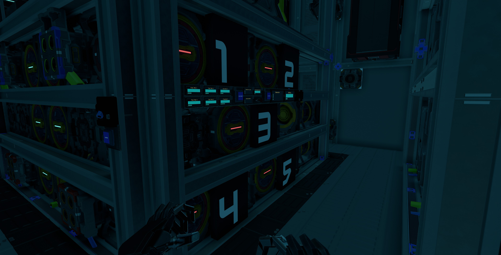 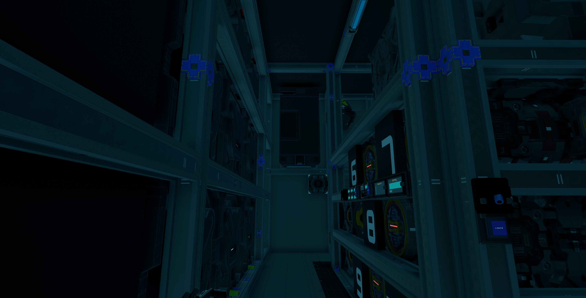 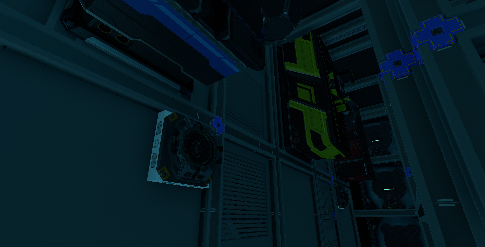
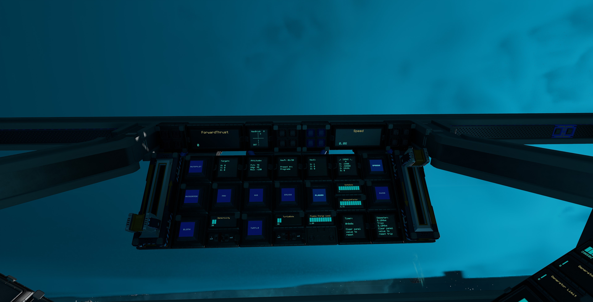 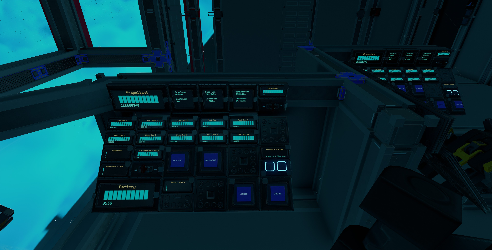 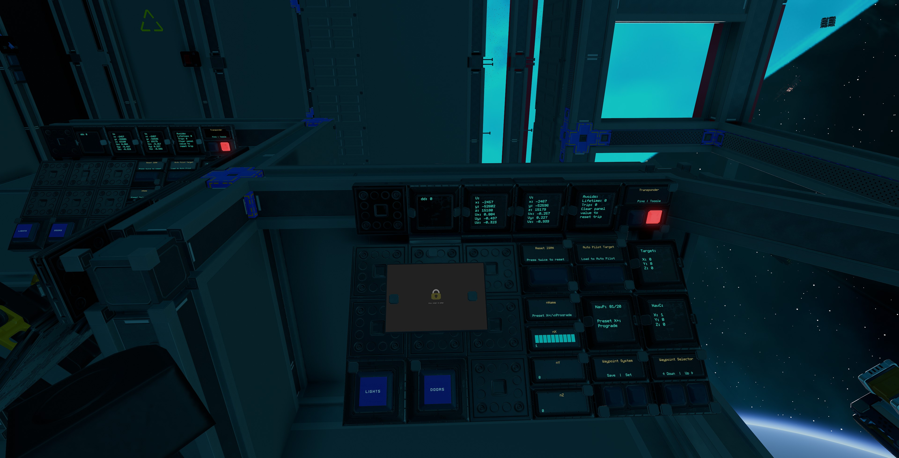

More photos in the [`photos` folder](photos)

## Features

The ship has the following features:

- 832 crates
- Two additional seats for co-pilots in a large open bridge
- All three crafting benches
- Standard Cruise function
- Turtle and Sloth functions with adjustable rates
- Transponder system with ping function
- Two external and three internal resource bridges
- Auto generator rate script with adjustable minimum rate
- 30 T2 generators with 10 T2 fuel chambers and 20 spare rods on racks
- Radiators that provide more than adequate cooling
- 24 large propellant tanks with 288,000,000 units of propellant
- Estimated propellant time of 7 hours and range of 3,500km
- Propellant time and fuel time panels
- 144 batteries
- Two 10 ring plasma thrusters and 88 T2 triangle thrusters, all with T3 nozzles providing forward thrust
- 36 T2 triangle thrusters with T3 nozzles providing braking thrust
- 48 T2 triangle thrusters with T3 nozzles for maneuvers
- [NavGrid by StandPeter](https://github.com/pcbennion/starbase-navgrid)
- [NavCas by fixerid](https://github.com/fixerid/sb-projects/tree/main/NavCas), using custom avoidance system and ISAN 3 in 1 from [Compass by Firestar99](https://gitlab.com/Firestar99/yolol/-/blob/master/src/compass/README.md), with ability to load target from NavGrid
- Warning lights and alarm for obstacle detection and avoidance, powered by 44 rangefinders
- Speedometer
- Timer panel
- Odometer panel
- Many extra slots for YOLOL or memory chips
- Top speed of 145m/s empty, 125m/s full of lukium ore

## Changelog

### v1.1.0 (Current) - 26/05/2022

- Painted thrusters black and nozzles red
- Removed useless `BackDoor` button and `Solar` panel from engineering console
- Added 10 heat sinks
- Reduced radiators to four bases and eight extensions
- Replaced all `RadiationRate` panels with `HeatTransferRate`
- Added `StoredHeat` panels
- Replaced cargo lock frame speedometer with new speedometer
- Increased max propellant to 288,000,000
- Removed fast travel core

### v1.0.5 - 21/01/2022

- Fixed propellant progress value max values
- Removed floating crates left in blueprint by mistake

### v1.0.4 - 04/01/2022

- Fixed obstacle detection warning lights and avoidance system

### v1.0.3 - 04/01/2022

- Added reset buttons for timer, odometer and avoids as current method does not work with duplicate panels

### v1.0.2 - 31/12/2021

- Replaced braking thrusters' nozzles with T3 nozzles as originally intended
- Removed `nName`, `nX`, `nY` and `nZ` panels from navigation co-pilot console as duplicates interfere with operation

### v1.0.1 - 27/12/2021

- Added grates at the back and bottom of the ships that can be removed to access rear thrusters' hardpoints for easy repair

### v1.0.0 - 25/12/2021

- Initial release

## Build Cost

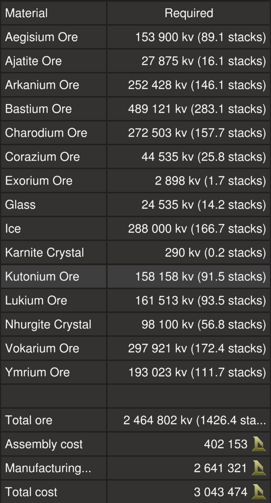

> TIP: You can craft your own crates, generators (T2), box and triangle thruster components (T2 with T3 nozzles) and ship tools to reduce assembly cost.

## Download Blueprint

The blueprint file is available in the `blueprints` folder [here](https://github.com/vinteo/starbase-ships/raw/main/lugger/blueprints/lugger.fbe).

## Known Issues

- There is limited coverage of range finders for the crash avoidance system. **Use at your own risk!**
- Autopilot doesn't seem to point ship directly to destination (a bit off), use in conjunction with NavGrid.
- The ship is pretty much at its voxel limit so any additions or changes may be difficult without sacrificing crates.

## Usage

To enter the ship, there are buttons on either sides of the ship just behind the cockpit that will open `Doors`.

### Flying the Ship

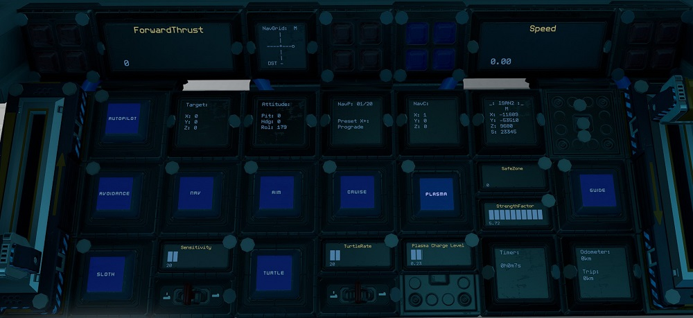

The left lever on the center console controls backwards thrust (braking) and the right lever controls forward thrust.

| Interface | Function |
|---|---|
| `Speed` | Current speed in metres per second. |
| `ForwardThrust` | Current forward thrust, maximum of 10,000 units |
| `Plasma` & `Plasma Charge Level` | Activates the plasma thrusters and intitiate charging. Plasma thrusters has to be activated and charge level at 1.0 for it to fire. |
| `Cruise` | Activates cruise control, forward thrust will not reset to zero unless turned down. |
| `Turtle` | Activates turtle mode which sets forward thrust to a maximum limit of `TurtleRate` of full thrust. |
| `Sloth` | Activates the low sensitvity mode of pitch and yaw by limiting thrust. Use the `Sensitivity` switch to set the maximum thrust rate of sloth mode.|
| `Aim` | Reduces the response time of key presses for pitch and yaw. |
| `Guides` | Activates rangefinders (except center one which can be activated separately). Can be used as guide lasers. `Red` warning lights show location of obstacles (left, right and centre). |
| `Nav`, `Autopilot`, `Avoidance` & `Target` | Autopilot controls. See [Autopilot and Crash Avoidance](#auto-pilot-and-crash-avoidance). |
| `ISAN2` | Current ISAN coordinates of ship. |
| `NavGrid`, `NavP`, `NavC` & `Attitude` | [NavGrid](https://github.com/pcbennion/starbase-navgrid) system, see [Using the Waypoint System](#using-the-waypoint-system). |
| `SafeZone` | Whether current location is in the safe zone. |
| `StrengthFactor` | Current strength of ship. May fluctuate as ore crates are filled. Anything below 1.0 means ship is damaged. |
| Transponder `Toggle` & `Ping` | Transponder controls, `Toggle` turns on and off ship transponder while `Ping` will activate transponder for three seconds |
| `Timer` | See [Timer](#timer). |
| `Odometer` | See [Odometer](#odometer). |

### Using the Waypoint System

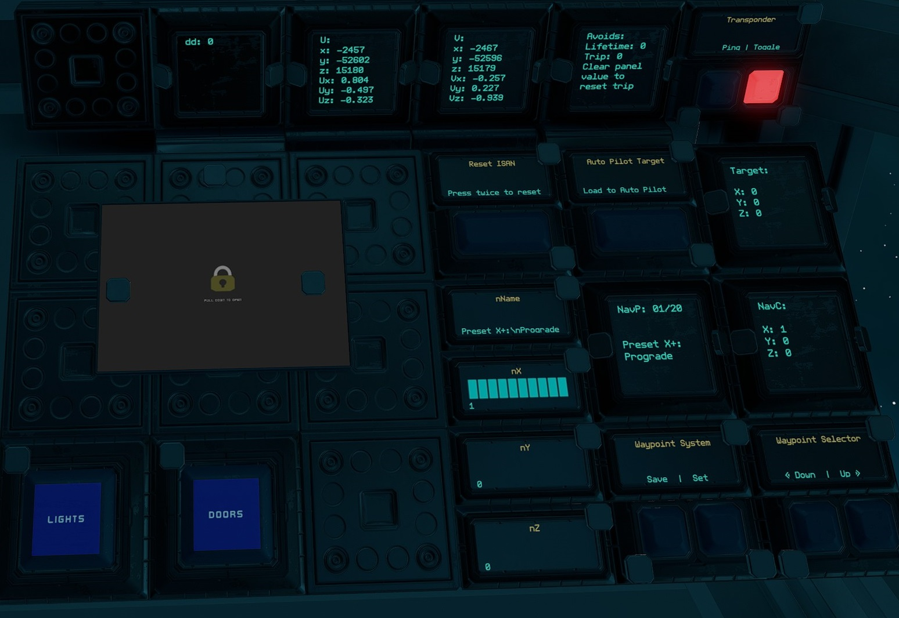

#### Viewing and Selecting Waypoints

This uses the [NavGrid](https://github.com/pcbennion/starbase-navgrid) system. Use the `Down` and `Up` waypoints selectors to select waypoint. The selected waypoint information is shown on `NavP` and `NavC` panels.

On the pilot center console, `NavGrid` will show the compass towards the selected waypoint while `Attitude` will show the ship's pitch, heading and roll directions. `NavGrid` is best used while not moving.

#### Editing and Saving Waypoints

Use `Set` to save waypoint of current location to the current selected waypoint position.

To edit currently selected waypoint, use your `U` tool to add name, X, Y and Z values to `nName`, `nX`, `nY` and `nZ` respectively. Then use the `Save` button to save.

**NOTE:** Waypoint 1 to 6 are presets and can not be over written.

#### Loading Waypoint to Auto Pilot

Use `Load to Auto Pilot` to load curretnly selected waypoint to `Target` to be used with the auto pilot system.

### Auto Pilot and Crash Avoidance

The ship uses a modified version of [NavCas](https://github.com/fixerid/sb-projects/tree/main/NavCas) which uses the 3 in 1 ISAN from Compass. Waypoints are loaded from NavGrid waypoint system.

Use while the ship is stationary. Activating `Nav` will start point the ship towards `Target` waypoint and deactivate itself when done. `Autopilot` will activate `Nav` and fly to within 5km of `Target` waypoint with `Avoidance` activated.

**NOTE:** `Nav` may not be very accurate. I recommend using it in conjunction with the NavGrid compass. The `dd` panel on the pilot left console shows debugging information for NavCas.

`Avoidance` will activate `Guides`. If the guides detect objects it will cut thrust and strafe up or down (will flash either the top or bottom `Blue` warning lights on the pilot center console according to the direction) while sounding an alarm (check game settings if you do not hear the alarm).
It will also flash `Red` warning lights on the pilot center console according to the position of obstacle detected. If `Autopilot` is activated, it will readjust and continue its flight.

`Avoids` will show the counters for number of avoidances. The `Trip` counter can be reset by holding down the `Avoids` `Reset Trips` button.

**NOTE:** There is very limited coverage of range finders for the crash avoidance system. **Use at your own risk!**

### Resetting Navigation

If ISAN or NavGrid is not working, it can be reset using the `Reset ISAN` button. Press once to take ISAN offline, then press again to reset.

### Managing Power and Fuel

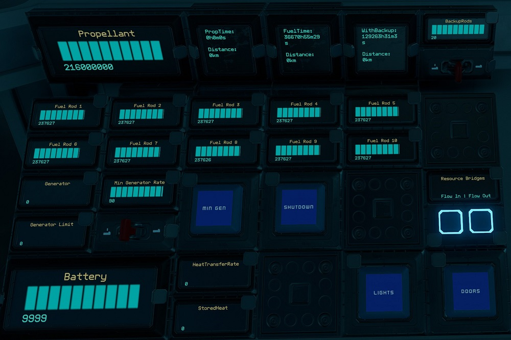

| Interface | Function |
|---|---|
| `Propellant` | Total propellant remaining in propellant tanks, maximum of 288,000,000 units. |
| `PropTime` | Time and distance remaining of propellant based on current usage. |
| `FuelTime` | Time and distance remaining of fuel based on current usage. |
| `WithBackup` | Same as FuelTime but takes into account backup rods available. Use the switch for `Backup Rods` to set the number of backup rods available. As standard there are 20 extra rods. |
| `Fuel Rod 1` to `Fuel Rod 10` | Fuel remaining on fuel rods in individual fuel chambers, maximum of 300,000 units for each. |
| `Generator` | Current generator rate, maximum of `Generator Limit`. |
| `Min Gen` & `Min Generator Limit` | Toggle and sets minimum generator rate. See [Managing Power](#managing-power). |
| `Shutdown` | Will turn off all fuel chambers thus shutting down generators. |
| `Battery` | Shows current battery charge of the batteries, maximum of 10,000 units. |
| `HeatTransferRate` | Current heat transfer rate of the heat sinks, maximum of 100%. |
| `StoredHeat` | Current stored heat in the heat sinks, maximum of 15,000 units. |
| `Flow In` & `Flow Out` | Toggle flow modes of resource bridges. See [Refueling Propellant](#refueling-propellant). |
| `Lights` | Turns on and off internal lights. |
| `Doors` | Opens or closes ship entry doors. |

#### Managing Power

By default the generator will only run and ramp up when the batteries need charging so there is minimum management needed. But you can set a minimum generate rate by setting the `Min Generator Limit` value using the switch for the minimum rate and turning on `Min Gen`.

#### Refueling Propellant

All five resource bridges can be used for refuelling propellant. To refuel from another ship, turn off `Flow Out` on the pilot right side console and leave `Flow In` turned on. Then connect a resource bridge to the other ship. To refuel another ship, do the opposite, `Flow Out` turned on and `Flow In` turned off.

Remember to turn `Flow In` and `Flow Out` back on if you are using the Endo to collect ore via any of the ship's resource bridges.

The propellant tanks are also easily accessible for swapping or crafting refills.

### Other Stuff

#### Timer

On the pilot center console there is a `Timer` panel which acts as a timer. It will run when the ship is active and show total time in years, weeks, days, hours, minutes and seconds. To reset the timer, hold down the `Reset Timer` button on the pilot left console.

#### Odometer

On the pilot center console there is a `Odometer` panel which will keep track of the ship's estimated flight distance based on speed. To reset the trip odometer, hold down the `Odometer` `Reset Trips` button on the pilot left console.

## Providing Feedback

I can be found in-game as Egomaniac and on discord as vinteo#4211. Feel free to contact me and provide feedback or if you need help. Pull requests are also welcomed for scripts changes/fixes.

I would also love to see any modifications or improvements you have made, so feel free to share! I hope to learn from the community and may also incorporate your changes into future versions.

Of course in-game tips are greatly appreciated.

## Frequently Asked Questions

### Can I sell ships based on this blueprint?

No.

### Why can't the crafting bench craft T2 refills?

You need to bolt a meter upgrade to the bench. The ship designer doesn't provide it so I couldn't add it to the blueprint.

### Why does NavGrid show an error?

This usually happens after travelling to the moon via the warp gate where ISAN is not available. After returning, this can be fixed by reseting ISAN. See [Resetting Navigation](#resetting-navigation).

## Designed by EGOTech

