# Mapper by EGOTech

The Mapper is an explorer ship with an estimated range of 13,000km capable at travelling at close to maximum speed. It has a navigation logger for logging capital ship navigation chips.
The blueprint is provided for [free](#download-blueprint). All [feedback](#providing-feedback) is welcome and in game tips (in-game name Egomaniac) are appreciated. However support will be limited but I will try my best.

[Starbase Ship Shop Page](https://sb-creators.org/makers/Egomaniac/ship/%5BFREE%5D%20Mapper)

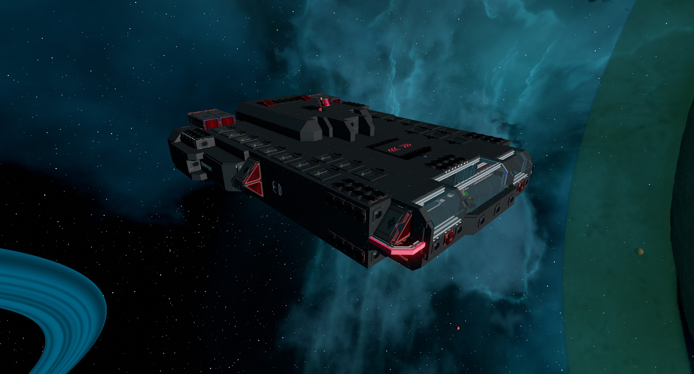 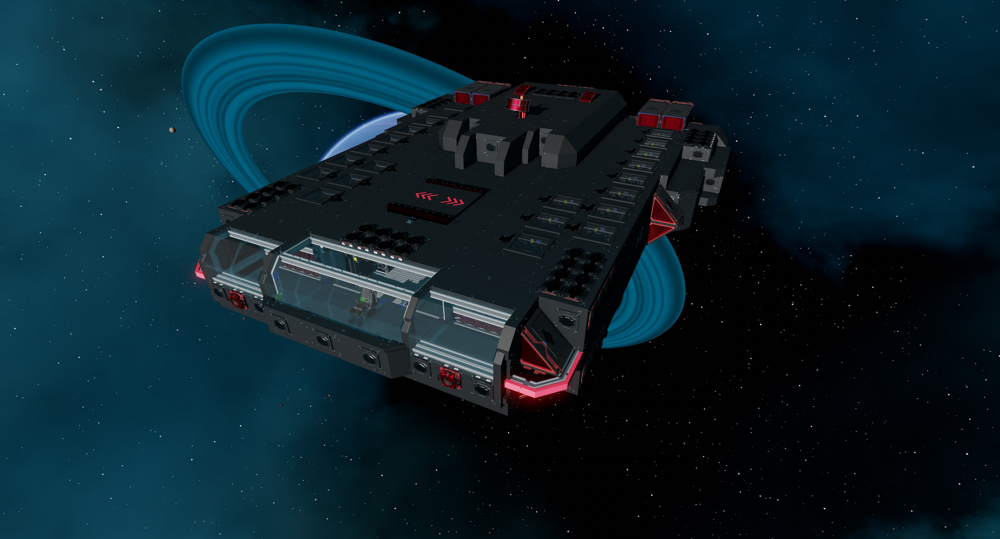 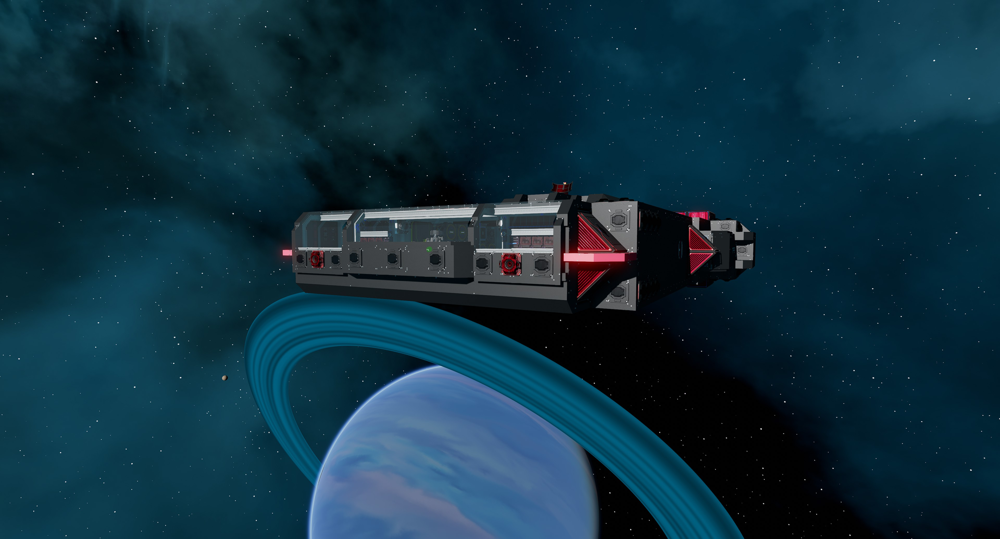
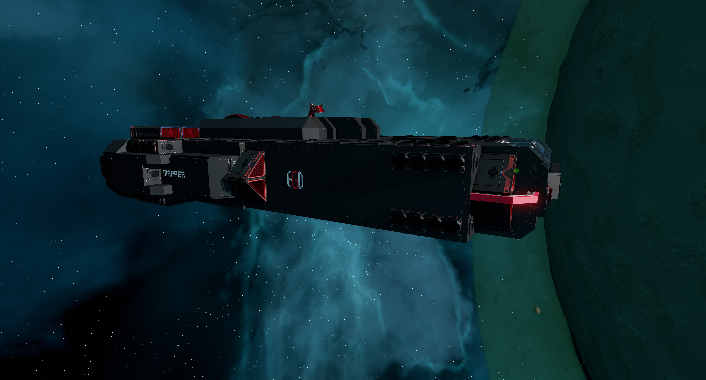 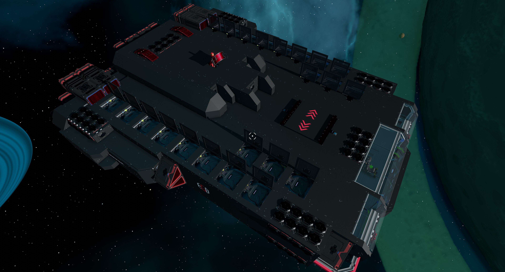 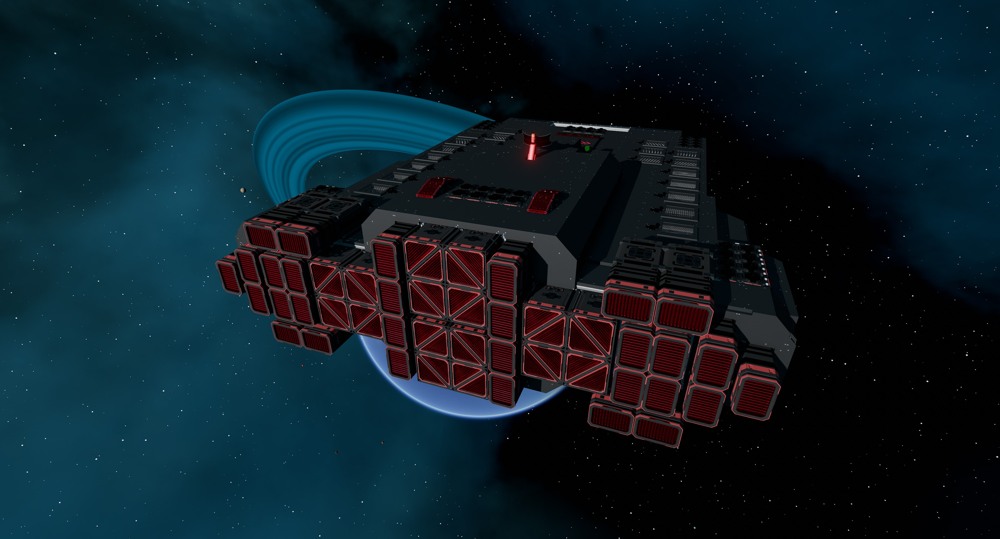
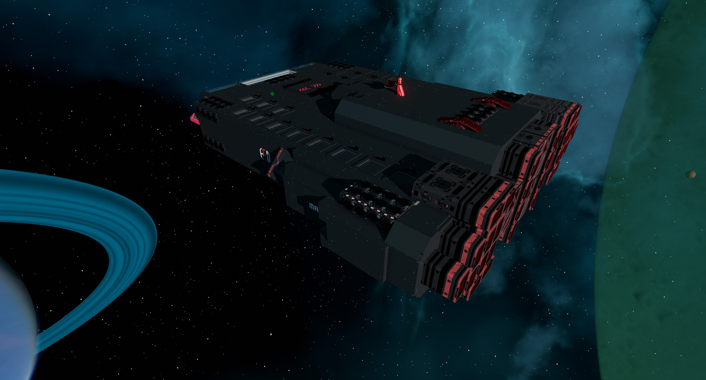 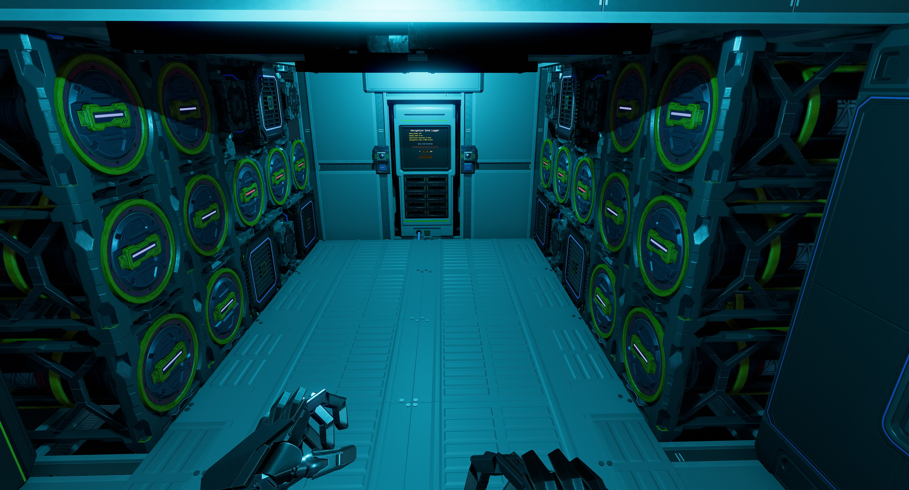 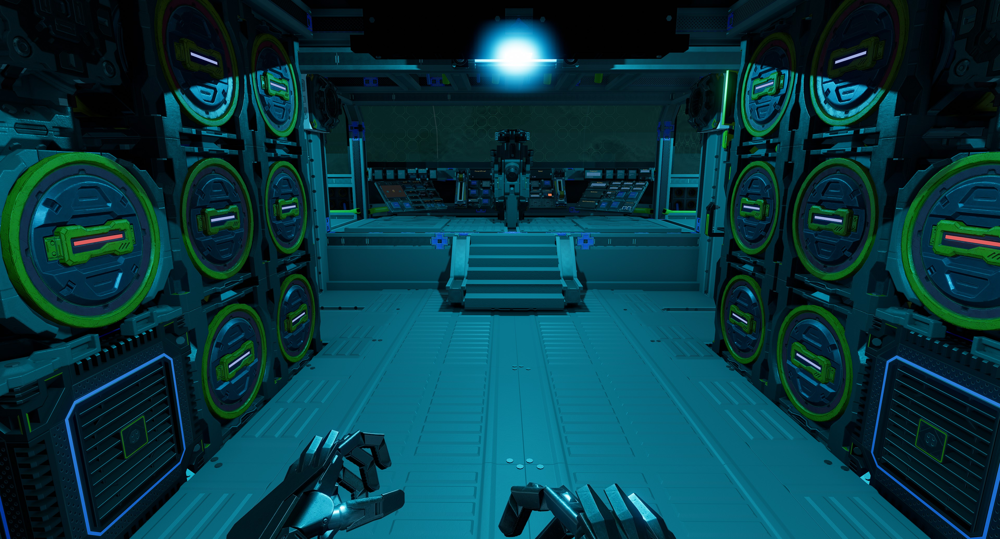
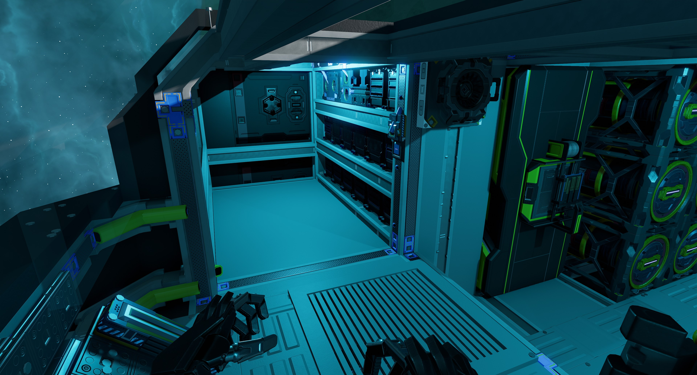 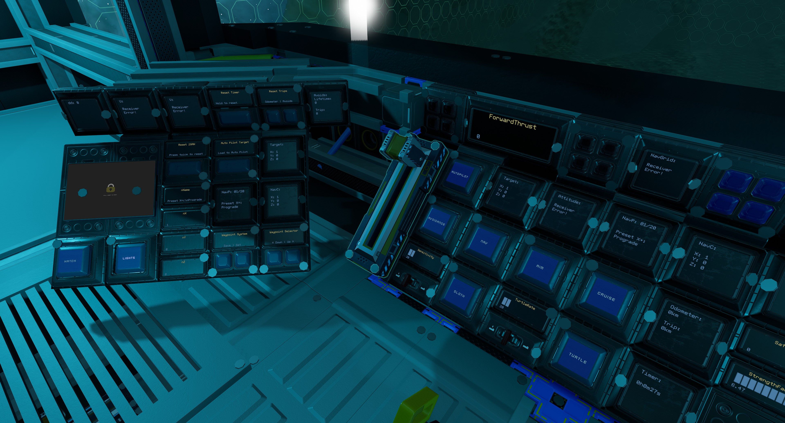 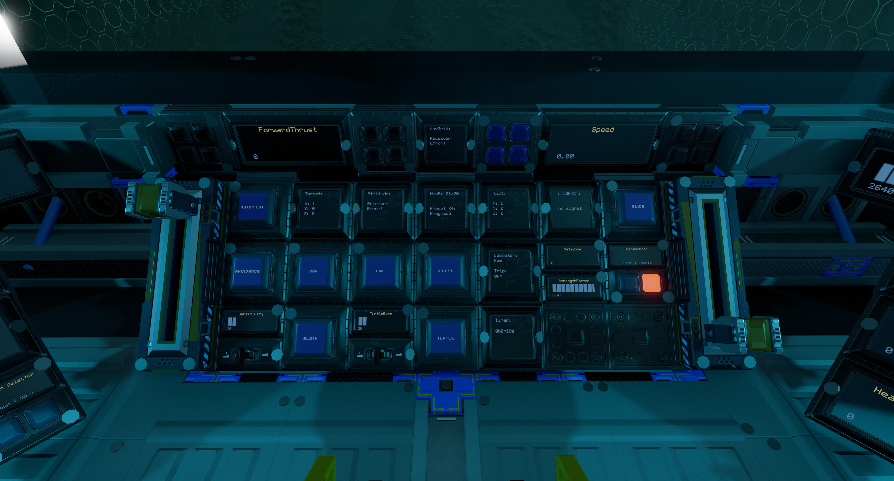
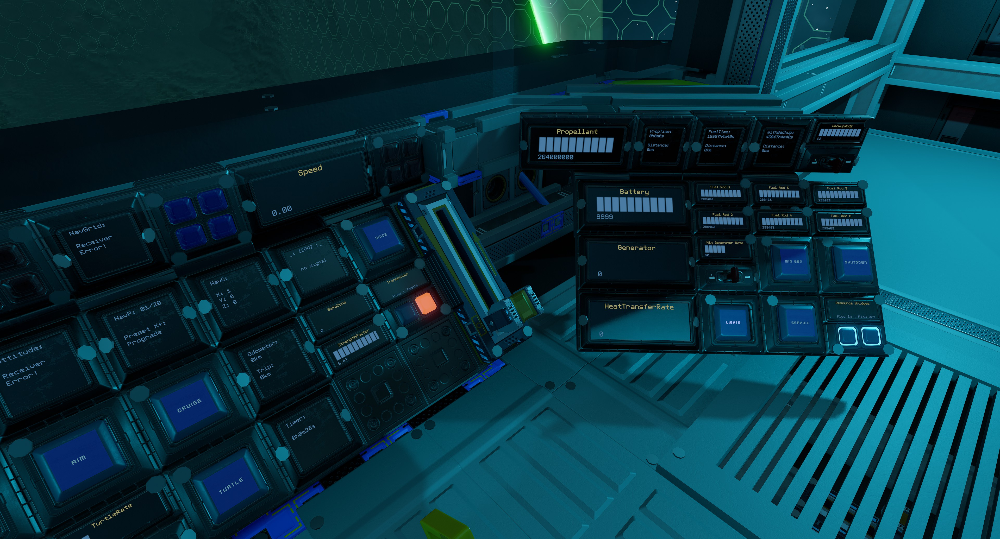

More photos in the [`photos` folder](photos)

## Features

The ship has the following features:

- Basic crafting bench with meter and monitor upgrade as well as tools bench
- 20 ore crates to store ore for refills
- Standard Cruise function
- Turtle and Sloth functions with adjustable rates
- Transponder system with ping function
- Two external and two internal resource bridges
- Auto generator rate script with adjustable minimum rate
- 18 T2 generators with six T2 fuel chambers and 12 spare rods on racks
- 22 large propellant tanks with 264,000,000 units of propellant
- Estimated propellant time of 26 hours and range of 13,000km
- Propellant time and fuel time panels
- 32 batteries
- 30 T2 box and 16 T2 triangle thrusters providing forward thrust
- Eight T2 triangle thrusters providing braking thrust
- 48 T2 triangle thrusters for maneuvers
- [NavGrid by StandPeter](https://github.com/pcbennion/starbase-navgrid)
- [NavCas by fixerid](https://github.com/fixerid/sb-projects/tree/main/NavCas), using custom avoidance system and ISAN 3 in 1 from [Compass by Firestar99](https://gitlab.com/Firestar99/yolol/-/blob/master/src/compass/README.md), with ability to load target from NavGrid
- Warning lights and alarm for obstacle detection and avoidance, powered by 44 rangefinders
- Speedometer
- Timer panel
- Odometer panel
- Top speed of 145m/s

## Changelog

View changelog [here](CHANGELOG.md)

## Build Cost

> TIP: You can craft your own crates, generators (T2), box and triangle thruster components (T2) and ship tools to reduce assembly cost.

## Download Blueprint

The blueprint file is available in the `blueprints` folder [here](https://github.com/EGO-Tech/starbase-ships/raw/main/mapper/blueprints/mapper.fbe).

## Usage

To enter the ship, there are buttons on top of the ship that will open `Hatch`.

### Flying the Ship

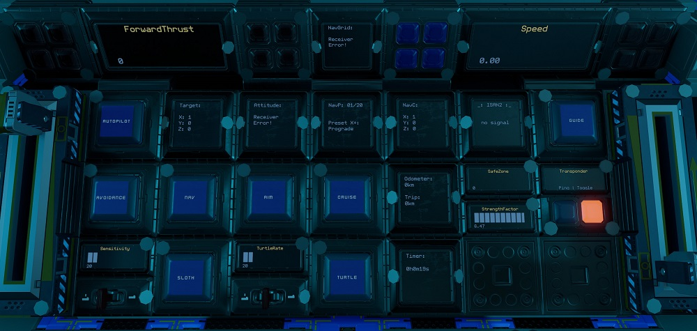

The left lever on the center console controls backwards thrust (braking) and the right lever controls forward thrust.

| Interface | Function |
|---|---|
| `Speed` | Current speed in metres per second.|
| `ForwardThrust` | Current forward thrust, maximum of 10,000 units |
| `Cruise` | Activates cruise control, forward thrust will not reset to zero unless turned down. |
| `Turtle` | Activates turtle mode which sets forward thrust to a maximum limit of `TurtleRate` of full thrust. |
| `Sloth` | Activates the low sensitvity mode of pitch and yaw by limiting thrust. Use the `Sensitivity` switch to set the maximum thrust rate of sloth mode.|
| `Aim` | Reduces the response time of key presses for pitch and yaw. |
| `Guides` | Activates rangefinders (except center one which can be activated separately). Can be used as guide lasers. `Red` warning lights show location of obstacles (left, right and centre). |
| `Nav`, `Autopilot`, `Avoidance` & `Target` | Autopilot controls. See [Autopilot and Crash Avoidance](#auto-pilot-and-crash-avoidance). |
| `ISAN2` | Current ISAN coordinates of ship. |
| `NavGrid`, `NavP`, `NavC` & `Attitude` | [NavGrid](https://github.com/pcbennion/starbase-navgrid) system, see [Using the Waypoint System](#using-the-waypoint-system). |
| `SafeZone` | Whether current location is in the safe zone. |
| `StrengthFactor` | Current strength of ship. May fluctuate as ore crates are filled. Anything below 1.0 means ship is damaged. |
| Transponder `Toggle` & `Ping` | Transponder controls, `Toggle` turns on and off ship transponder while `Ping` will activate transponder for three seconds |
| `Lights` | Turns on and off internal lights. |
| `Hatch` | Opens or closes ship entry hatch on top of the ship. |
| `Timer` | See [Timer](#timer). |
| `Odometer` | See [Odometer](#odometer). |

**NOTE:** For safety, firing full braking thrust will deactivate `Cruise`.

### Using the Waypoint System

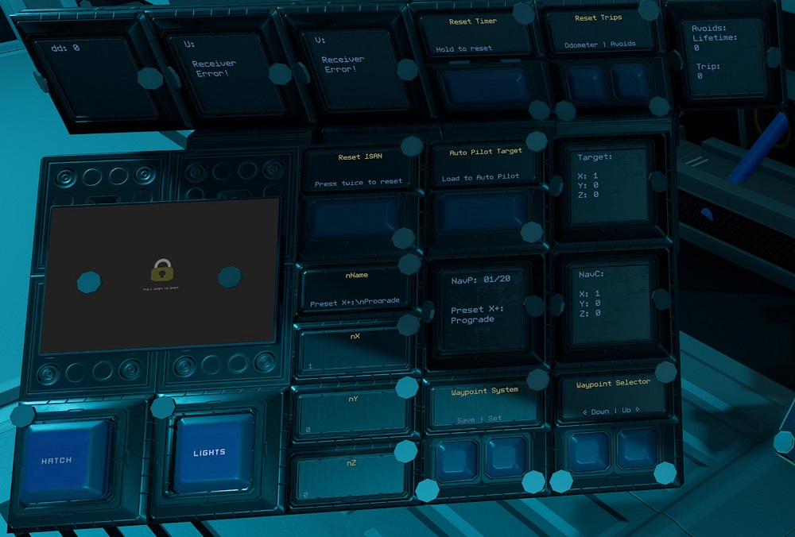

#### Viewing and Selecting Waypoints

This uses the [NavGrid](https://github.com/pcbennion/starbase-navgrid) system. Use the `Down` and `Up` waypoints selectors to select waypoint. The selected waypoint information is shown on `NavP` and `NavC` panels.

On the pilot center console, `NavGrid` will show the compass towards the selected waypoint while `Attitude` will show the ship's pitch, heading and roll directions. `NavGrid` is best used while not moving.

#### Editing and Saving Waypoints

Use `Set` to save waypoint of current location to the current selected waypoint position.

To edit currently selected waypoint, use your `U` tool to add name, X, Y and Z values to `nName`, `nX`, `nY` and `nZ` respectively. Then use the `Save` button to save.

**NOTE:** Waypoint 1 to 6 are presets and can not be over written.

#### Loading Waypoint to Auto Pilot

Use `Load to Auto Pilot` to load curretnly selected waypoint to `Target` to be used with the auto pilot system.

### Auto Pilot and Crash Avoidance

The ship uses a modified version of [NavCas](https://github.com/fixerid/sb-projects/tree/main/NavCas) which uses the 3 in 1 ISAN from Compass. Waypoints are loaded from NavGrid waypoint system.

Use while the ship is stationary. Activating `Nav` will start point the ship towards `Target` waypoint and deactivate itself when done. `Autopilot` will activate `Nav` and fly to within 5km of `Target` waypoint with `Avoidance` activated.

**NOTE:** `Nav` may not be very accurate. I recommend using it in conjunction with the NavGrid compass. The `dd` panel on the pilot left console shows debugging information for NavCas.

`Avoidance` will activate `Guides`. If the guides detect objects it will cut thrust and strafe up or down (will flash either the top or bottom `Blue` warning lights on the pilot center console according to the direction) while sounding an alarm (check game settings if you do not hear the alarm).
It will also flash `Red` warning lights on the pilot center console according to the position of obstacle detected. If `Autopilot` is activated, it will readjust and continue its flight.

`Avoids` will show the counters for number of avoidances. The `Trip` counter can be reset by holding down the `Avoids` `Reset Trips` button.

**NOTE:** There is very limited coverage of range finders for the crash avoidance system. **Use at your own risk!**

### Resetting Navigation

If ISAN or NavGrid is not working, it can be reset using the `Reset ISAN` button. Press once to take ISAN offline, then press again to reset.

### Managing Power and Fuel

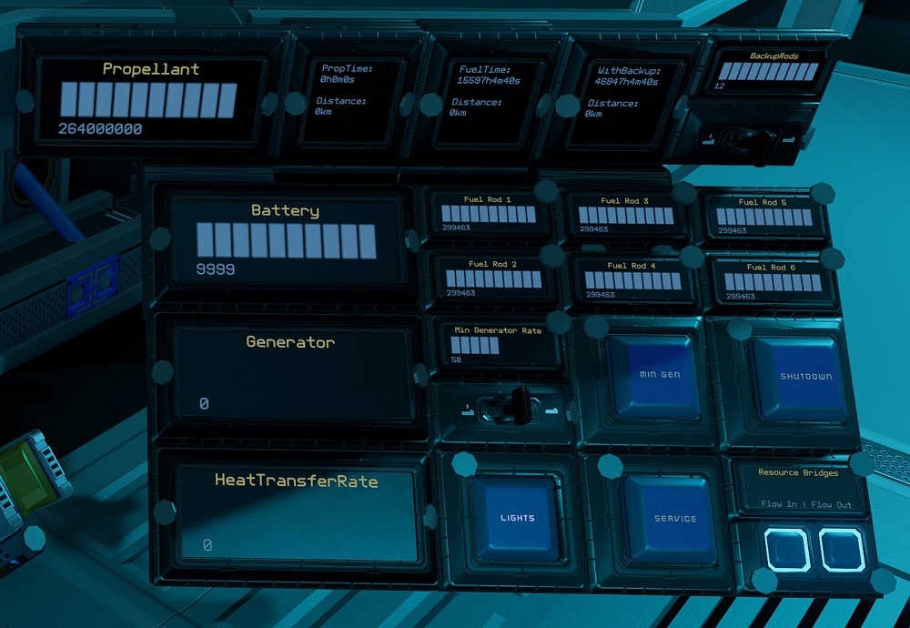

| Interface | Function |
|---|---|
| `Propellant` | Total propellant remaining in propellant tanks, maximum of 264,000,000 units. |
| `PropTime` | Time and distance remaining of propellant based on current usage. |
| `FuelTime` | Time and distance remaining of fuel based on current usage. |
| `WithBackup` | Same as FuelTime but takes into account backup rods available. Use the switch for `Backup Rods` to set the number of backup rods available. As standard there are 12 extra rods. |
| `Fuel Rod 1` to `Fuel Rod 6` | Fuel remaining on fuel rods in individual fuel chambers, maximum of 300,000 units for each. |
| `Generator` | Current generator rate, maximum of 100%. |
| `Min Gen` & `Min Generator Rate` | Toggle and sets minimum generator rate. See [Managing Power](#managing-power). |
| `Shutdown` | Will turn off all fuel chambers thus shutting down generators. |
| `Battery` | Shows current battery charge of the batteries, maximum of 10,000 units. |
| `HeatTransferRate` | Current heat transfer rate of the heat sinks, maximum of 100%. |
| `Flow In` & `Flow Out` | Toggle flow modes of resource bridges. See [Refueling Propellant](#refueling-propellant). |
| `Service` | Opens or closes access to propellant tanks from the top and bottom of the ship. |

#### Managing Power

By default the generator will only run and ramp up when the batteries need charging so there is minimum management needed. But you can set a minimum generate rate by setting the `Min Generator Rate` value using the switch for the minimum rate and turning on `Min Gen`.

#### Refueling Propellant

All four resource bridges can be used for refuelling propellant. To refuel from another ship, turn off `Flow Out` on the pilot right side console and leave `Flow In` turned on. Then connect a resource bridge to the other ship. To refuel another ship, do the opposite, `Flow Out` turned on and `Flow In` turned off.

Remember to turn `Flow In` and `Flow Out` back on if you are using the Endo to collect ore via any of the ship's resource bridges.

The `Service` button gives access to the propellant tanks. The tanks can be unbolted to used to craft refills if ice is available, then bolted back. The tank should be bolted to the support on top and bottom of the ship.

### Other Stuff

#### Timer

On the pilot center console there is a `Timer` panel which acts as a timer. It will run when the ship is active and show total time in years, weeks, days, hours, minutes and seconds. To reset the timer, hold down the `Reset Timer` button on the pilot left console.

#### Odometer

On the pilot center console there is a `Odometer` panel which will keep track of the ship's estimated flight distance based on speed. To reset the trip odometer, hold down the `Odometer` `Reset Trips` button on the pilot left console.

## Providing Feedback

I can be found in-game as Egomaniac and on discord as @vinteo81 (vinteo#4211). Feel free to contact me and provide feedback or if you need help. Pull requests are also welcomed for scripts changes/fixes.

I would also love to see any modifications or improvements you have made, so feel free to share! I hope to learn from the community and may also incorporate your changes into future versions.

Of course in-game tips are greatly appreciated.

## Designed by EGOTech

