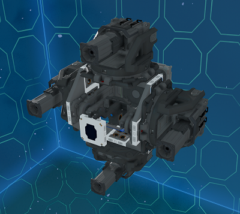

# 4 Laser Drill Module

This module is a rotating four laser drill on an advanced turret with pitching for all lasers plus a rangefinder in the center.
This base drill is used in the [Piercer](../../../piercer) mining ship, without the material point scanner.

The drill is bolted to a large hardpoint with a beam frame that can be welded to any ship.

## Using the Module

The module is free to download and use but if you distribute blueprints with it, please provide credit with the invite link to the EGOTech Discord server.

## Changelog

### v1.0.0 (Current) - 06/10/2022

- Initial release

## Designed by EGOTech

