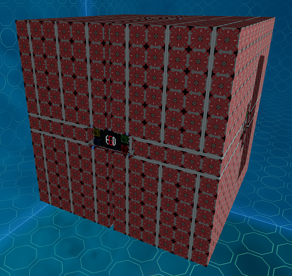
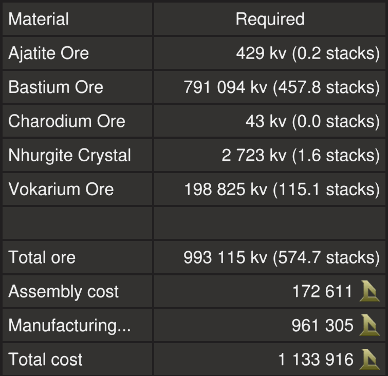

# Ore Stash Split Module

This module is a 1928 ore crate module to store ore, split into four compartments of 482 crates with colour coded resource bridges at the center on each side.
It has a valid ship frame so it can be used in a station or capital ship hangar (minimum 16x16x16 including corners) to expand its storage.

## Build Cost

## Download Blueprint

The blueprint file is available in the `blueprints` folder [here](https://github.com/EGO-Tech/starbase-ships/raw/main/others/modules/ore_stash_split/blueprints/ore_stash_split.fbe).

## Using the Module

The module is free to download and use but if you distribute blueprints with it, please provide credit with the invite link to the EGOTech Discord server.

## Changelog

### v1.0.0 (Current) - 24/10/2023

- Initial release

## Designed by EGOTech

