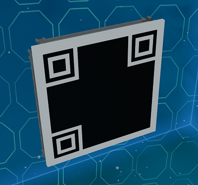

# QR Code Module

This module is a QR code template that has individual plates that can be painted to generate scannable QR codes.
It is bolted to a beam frame which you can weld to any ship.

## Using the Module

The module is free to download and use but if you distribute blueprints with it, please provide credit with the invite link to the EGOTech Discord server.

## Changelog

### v1.0.0 (Current) - 06/10/2022

- Initial release

## Designed by EGOTech

