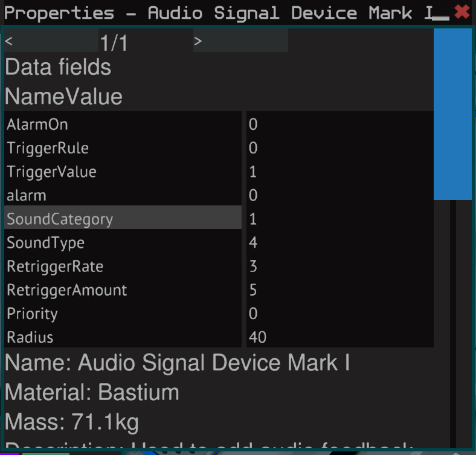

# Notes

## Audio Device

### Properties for audio device for avoidance system

## Autopilot

### Receivers for ISAN 3 in 1

- Back
  - SignalStrength: ke
  - TargetMessage: kt
- Front
  - SignalStrength: kf
  - TargetMessage: kt
- Bottom
  - SignalStrength: kg
  - TargetMessage: kt

### Receivers for NavGrid

- Back
  - SignalStrength: a
  - TargetMessage: at
- Front
  - SignalStrength: e
  - TargetMessage: et
- Bottom
  - SignalStrength: i
  - TargetMessage: it
