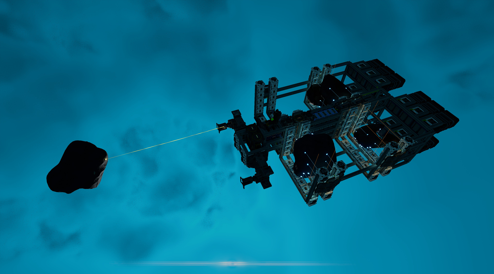
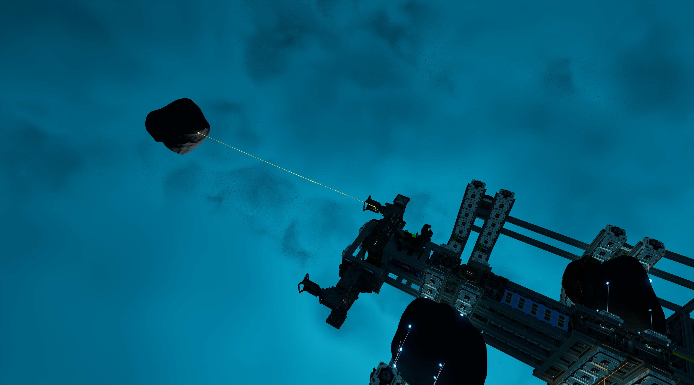
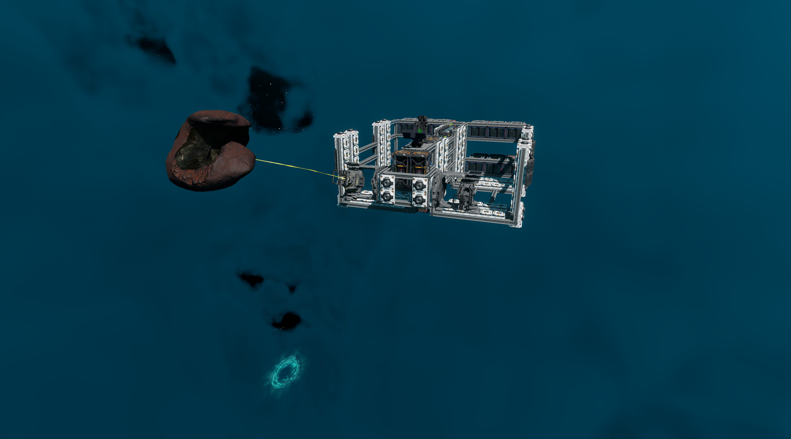
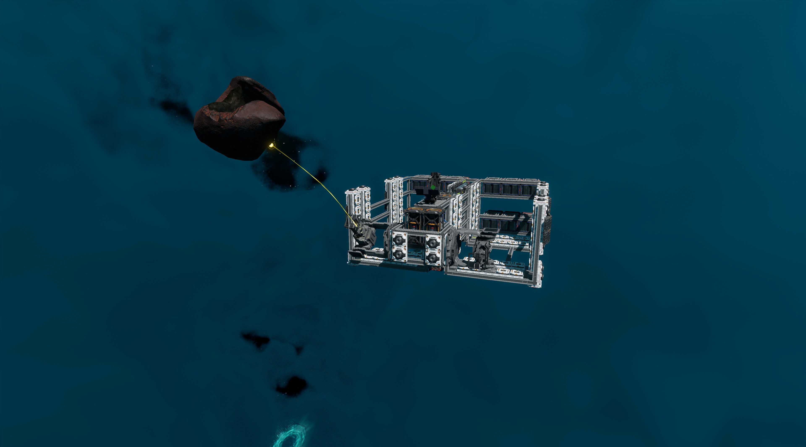
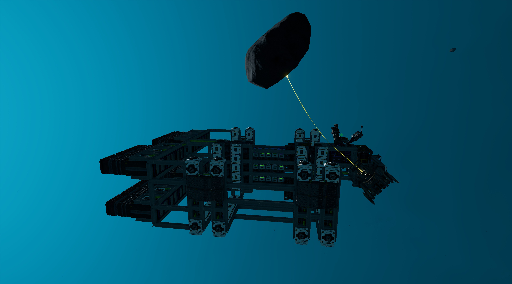
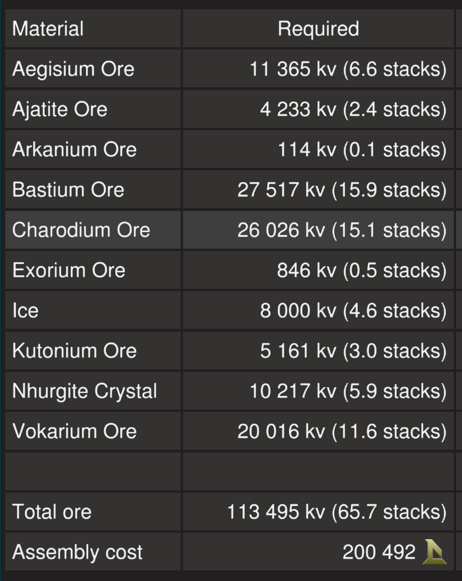

# Pebbler

The Pebbler is an **experimental** asteroid hauling ship. It is designed to be used in the safe zone and haul small asteroids. It uses two tractor beams to position asteroids into compartments of cargo lock beams. Although it is not very lucrative, the Pebbler is no frills and will pay itself back in about four or five quick trips to the belt.

The blueprint is provided for [free](#download-blueprint). All [feedback](#providing-feedback) is welcome and in game tips (in-game name Egomaniac) are appreciated. However support will be limited but I will try my best.

  
  
  

More photos in the [`photos` folder](photos)

## Features

The ship has the following features:

- Standard Cruise and Turtle functions
- Eight T2 generators with two T2 fuel chambers and six spare rods on racks
- Radiators that provide more than adequate cooling
- Eight small propellant tanks with 8,000,000 units of propellant
- 15 batteries
- 12 T2 box triangle thrusters providing forward thrust
- 36 T2 manuever thrusters with plenty of space for more
- Two tractor beams which will load asteroids into four compartments with cargo lock beams
- Rangefinder to help judge forward distance
- Pretty much max speed 150m/s when empty

## Changelog

### v1.1.0 (Current) - 26/09/2021

- Increase width of cargo beam areas, to better support 45Mv asteroids
- Increase force threshold of tractor beams when loading, to support 45Mv asteroids
- Reposition tractor beams, to better support 45Mv asteroids
- Add four additional spare fuel rods

### v1.0.0 - 24/09/2021

- Initial release

## Build Cost

TIP: If you can craft your generators (T2), box thruster components (T2) and ship tools to reduce assembly cost.

## Download Blueprint

The blueprint file is available in the `blueprints` folder [here](https://github.com/vinteo/starbase-ships/raw/main/pebbler/blueprints/pebbler.fbe).

## Known Issues

- Loading of asteriods are rather slow, especially the larger ones.

## Usage

### Flying the Ship

| Interface | Function |
|---|---|
| `ForwardThrust` | Current forwawrd thrust, maximum of 10,000 units |
| `Cruise` | Activates cruise control, forward thrust will not reset to zero unless turned down. |
| `Turtle` | Activates turtle mode which sets forward thrust to a maximum limit of 20% of full thrust. |
| `ID` | Toggle for the transponder. |
| `Distance` | Distance for rangefinder. Green button toggles the rangefinder.|
| `StoredBatteryPower` | Shows current battery charge of the 15 batteries, maximum of 10,000 units. |
| `GeneratorUnitRate` | Current generator rate, maximum of 100%. |
| `FuelRod1` | Total fuel remaining on top fuel rod, maximum of 300,000 units. |
| `FuelRod2` | Total fuel remaining on bottom fuel rod, maximum of 300,000 units. |
| `GasNetworkStoredResource` | Total propellant remaining in propellant tanks, maximum of 8,000,000 units. |

### Loading Asteroids

To load asteroids, activate `Left` or `Right` tractor beam and point the beam at an asteroid. Once the beam has locked on, use `Load` to use beam to load it into either the front or back compartments. The back compartment should be loaded first, **the loading of the back compartment will not activate if the front cargo lock beam is activated**.

Once the asteroid is in place the cargo lock beam should activate itself and the tarctor beam will reset. If it does not activate because the asteroid is too big or for any other reason, you can use `Toogle` to active the cargo lock beam manually and it will also reset the tractor beam.

## Providing Feedback

I can be found in-game as Egomaniac and on discord as vinteo#4211. Feel free to contact me and provide feedback or if you need help. Pull requests are also welcomed for scripts changes/fixes.

I would also love to see any modifications or improvements you have made, so feel free to share! I hope to learn from the community and may also incorporate your changes into future versions.

Of course in-game tips are greatly appreciated.

## Frequently Asked Questions

#### Why is the blueprint free?

This ship is experimental and was quickly put together in a day. I just wanted to test how tractor beams work.

Finally, I am hoping to get feedback from the community and learn from it, so hopefully I will be able to design better ships in the future.

#### Can I sell ships based on this blueprint?

No.

#### How much can I make from hauling safe zone asteriods?

It is not very lucrative, but here is an estimated breakdown of 45Mv asteriods (with a rough breakdown of 35Mv shell and 10Mv core) from the safe zone I got during testing.

| Material | Volume | Credits |
| --- | --- | --- |
| Ice/Vokarium | 45Mv | 36k |
| Ajatite/Charodium | 45Mv | 58k |
| Valkite/Bastium | 45Mv | 27k |
| Ice/Nhurgite | 45Mv | 56k |
