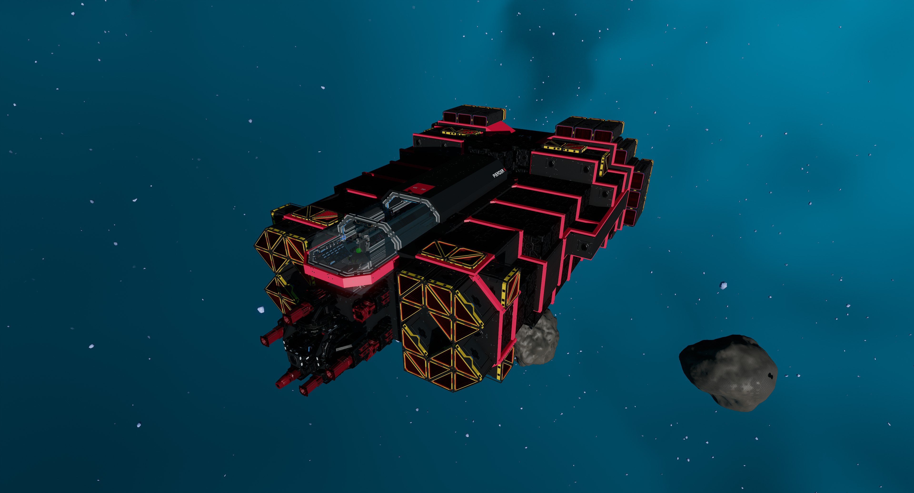
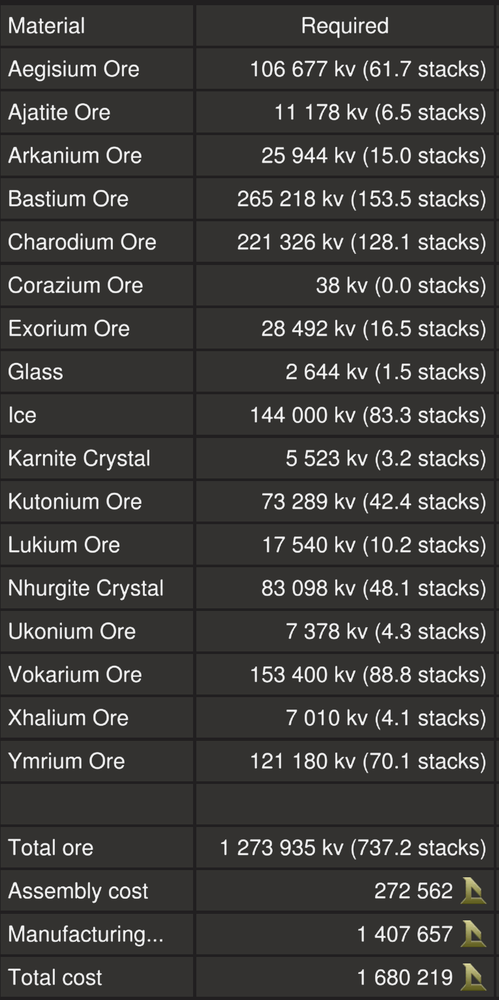

# Piercer X (Anorak Edition) by EGOTech

The Piercer X is a premium version of the [Piercer](../) with [T3 generators, fuel chambers, enhancers and thrusters](#comparison).

The blueprint is available for [purchase](#purchase-blueprint).

[Starbase Ship Shop Page](https://sb-creators.org/makers/Egomaniac/ship/Piercer%20X)

More photos in the [`photos` folder](photos)

## Comparison

|   | Piercer | Piercer X |
|---|---|---|
| Thrusters | T2 | T3 |
| Top Speed (empty) | 140m/s | 150m/s |
| Generators | T2 | T3 |
| Fuel Chambers | T2 | T3 |
| Enhancers | T2 | T3 |
| Power Generation | 32,000eps | 58,500eps |
| Laser Convergence | Approximation | Precise |

## Build Cost

TIP: You can craft your own crates, generators (T3), box and triangle thruster components (T3) and ship tools to reduce assembly cost.

## Purchase Blueprint

The blueprint is available for purchase on the EGOTech Discord server.

## Changelog

### v1.0.1 (Current) - 09/10/2022

- Changed laser convergence to use professional chip for better accuracy
- Removed references to laser pulse in YOLOL
- Removed one redundant memory chip
- Corrected naming of field in heat sinks to match `StoredHeat`

### v1.0.0 - 06/10/2022

- Initial release

## Usage

Please refer to the manual for the [Piercer](../).

## Frequently Asked Questions

### Can I sell ships based on this blueprint?

No.

### Can I share this blueprint or its derivatives?

No.
