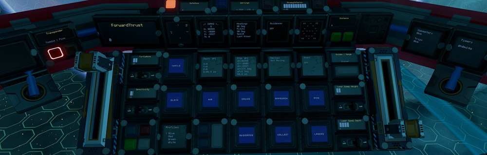
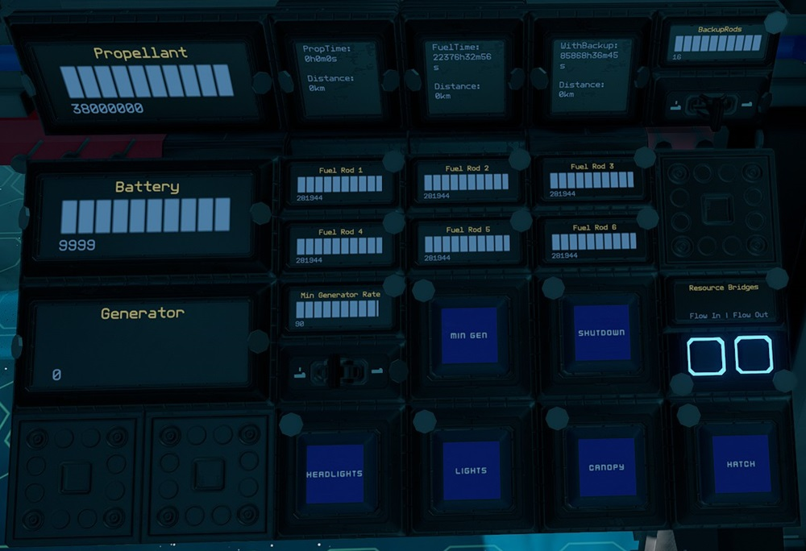

# Rigger by EGOTech

The Rigger is a fast medium sized mining ship. Although it has a limited autopilot and crash avoidance systems, it is mainly designed to be used in the safe zone. The blueprint is provided for [free](#download-blueprint). All [feedback](#providing-feedback) is welcome and in game tips (in-game name Egomaniac) are appreciated. However support will be limited but I will try my best.

## Changelog

View changelog [here](CHANGELOG.md)

## Build Cost

> TIP: You can craft your own crates, generators (T2), box and triangle thruster components (T2) and ship tools to reduce assembly cost.

## Download Blueprint

The blueprint file is available in the `blueprints` folder [here](https://github.com/EGO-Tech/starbase-ships/raw/main/rigger/blueprints/rigger.fbe).

## Usage

Summary of the ship functions can be found on the YOLOL chips bolted behind the pilot chair. Swipe down on the lock to read each one. More detailed usage instructions are available below.

To enter the ship, there is a button above the cockpit that will open a `Hatch`. Once inside you can also open and close the cockpit glass `Canopy`. Buttons for these are available in the pilot right side console and also on the ceiling next to the hatch.

### Flying the Ship

~~**IMPORTANT:** Before flying the ship you should bind your keys by using the `V` key while sitting on the pilot chair. You will to bind keys for FWD+/FWD- (for forward thrust, usually SHIFT and CTRL), YAW+/YAW- (for yaw, usually E and Q) and PCH+/PCH- (for pitch, usually S and W).~~ No longer needed as of v1.1.0.

The left lever on the center console controls backwards thrust (braking) and the right lever controls forward thrust.

| Interface | Function |
|---|---|
| `ForwardThrust` | Current forward thrust, maximum of 10,000 units |
| `SafeZone` | Whether current location is in the safe zone. |
| `StrengthFactor` | Current strength of ship. May fluctuate as ore crates are filled. Anything below 1.0 means ship is damaged. |
| `Cruise` | Activates cruise control, forward thrust will not reset to zero unless turned down. |
| `Turtle`, `TurtleRate` | Activates turtle mode which sets forward thrust to a maximum limit of `TurtleRate` (percent) of full thrust. |
| `Sloth`, `Sensitivity` | Activates sloth mode which sets yaw and pitch thrust to a maximum limit of `Sensitivity` (percent) of full thrust. |
| `Aim` | Reduces the response time of key presses for pitch and yaw. |
| `Guides` & `Guidance` | Activates rangefinders (except center one which can be activated separately). Can be used as guide lasers. `Guidance` shows alerts showing position of objects detected with text and visualisation. For the visualisation, `O` means object is detected by  the particular rangefinder. |
| `Range` & `Distance` | Activates center rangefinder, with `Distance` showing distance to object. |
| `Scanner` & `Scan` | Turns on the [Ore Scanner](#ore-scanner). |
| `Approach`, `Collect`, `Mine`, `Lasers`, `Laser Sweep Height` & `Laser Sweep Depth` | Mining controls. See [Mining](#mining). |
| `Nav`, `Autopilot` & `Avoidance` | Autopilot controls. See [Autopilot and Crash Avoidance](#autopilot-and-crash-avoidance). |
| Transponder `Toggle` & `Ping` | Transponder controls, `Toggle` turns on and off ship transponder while `Ping` will activate transponder for three seconds |
| `ISAN2`, `Heading`, `Dest`, `DTW` & `Deltas` | See [ISAN Waypoint System](https://github.com/Archaegeo/Starbase/tree/45a9bb464cb71d7de7a214f8e665111d6b2b5989/ISAN-Waypoint%20System) for more informaton. |
| `G` Rotated | Compass display. Shows direction towards `Dest` waypoint, `+` is in front of ship while `O` is behind the ship. Best used when stationary. See [Compass](https://gitlab.com/Firestar99/yolol/-/blob/master/src/compass/README.md) for more informaton. |

**NOTE:** For safety, firing full braking thrust will deactivate `Cruise`.

### Using the Waypoint System

This is a custom interface for the [ISAN Waypoint System](https://github.com/Archaegeo/Starbase/tree/45a9bb464cb71d7de7a214f8e665111d6b2b5989/ISAN-Waypoint%20System).

#### Viewing, Loading and Naming Waypoints

View a waypoint (`WP1` to `WP18`) by pressing the individual buttons. The waypoint will be shown on the `WP` panel. Load the waypoint in `WP` to `Dest` using the `Load Dest` button. Once in `Dest`, the waypoint will be used by the compass, ISAN and autopilot systems.

To give waypoints a name, use your universal tool to change the panel values with the name you want. This is for display purposes and your own reference only, it is not used anywhere else.

#### Saving Waypoints

Use `Save Loc` to save waypoint of current location to the waypoint position viewed on the `WP` panel.

To manually save coordinates, use your universal tool to add X, Y and Z values to `NewX`, `NewY` and `NewZ` respectively. Then use the button to save the coordinates to the waypoint position viewed on the `WP` panel.

### Autopilot and Crash Avoidance

The ship uses a modified version of [NavCas](https://github.com/fixerid/sb-projects/tree/main/NavCas) which uses the 3 in 1 ISAN from Compass and waypoint from ISAN Waypoint System.

Use while the ship is stationary. Activating `Nav` will start point the ship towards `Dest` waypoint and deactivate itself when done. `Autopilot` will activate `Nav` and fly to within 5km of `Dest` waypoint with `Avoidance` activated.

**NOTE:** `Nav` needs to be tuned more for accuracy. I recommend using it in conjunction with the compass.

`Avoidance` will activate `Guides`. If the guides detect objects it will pitch the ship down and cut forward thrust. If `Autopilot` is activated, it will readjust and continue its flight.

**NOTE:** There is very limited coverage of range finders for the crash avoidance system. It also hasn't been tested extensively. **Use at your own risk!**

### Mining

To approach an asteroid, point the center range finder at an asteroid and activate `Approach`. Once in range (optimum range is 10 to 14m on `Distance`), activate `Lasers` to turn on the mining lasers. `Laser Sweep Height` and `Laser Sweep Depth` will adjust sweeping distances of the lasers.

`Mine` is a button which will activate automated mining. Point the center range finder at an asteroid and activate. It will activate `Scanner` and `Approach`, and once in range it will automatically activate `Lasers`.

`Collect` turns on the two ore collectors. Ore collectors automatically adjust to point towards objects detected by the center range finder.

If batteries start running out of charge while mining, turn on `Min Gen`. Continous use of the lasers and collectors at the same time requires a `Min Generator Limit` of around 90%.

**NOTE:** For safety, lasers will turn off if the total fuel is less that 2,000 units.

#### Ore Scanner

Activate using the `Scanner` button. The laser will try to adjust to point at the objects detected by the center range finder. Scan results will show on the `Scan` panel in number of stacks. It has a maximum range of 100m.

### Managing Power and Fuel

| Interface | Function |
|---|---|
| `Battery` | Shows current battery charge of the batteries, maximum of 10,000 units. |
| `Generator` | Current generator rate, maximum of 100%. |
| `Min Generator Limit` & `Min Gen` | Toggle and sets minimum generator rate. See [Managing Power](#managing-power). |
| `HeatTransferRate` | Current heat transfer rate of the heat sinks, maximum of 100%. |
| `StoredHeat` | Current stored heat in the heat sinks, maximum of 15,000 units. |
| `Fuel Rod 1` to `Fuel Rod 6` | Fuel remaining on fuel rods in individual fuel chambers, maximum of 300,000 units for each. |
| `Propellant` | Total propellant remaining in propellant tanks, maximum of 38,000,000 units. |
| `PropTime` | Time and distance remaining of propellant based on current usage. Distance is calculated from ISAN speed*. |
| `FuelTime` | Time and distance remaining of fuel based on current usage. Distance is calculated from ISAN speed*. |
| `WithBackup` | Same as FuelTime but takes into account backup rods available. Use the switch for `BackupRods` to set the number of backup rods available. As standard there are 16 extra rods. |
| `Shutdown` | Will turn off all fuel chambers thus shutting down generators. |
| `FlowIn` & `FlowOut` | Toggle flow modes of resource bridges. See [Refueling Propellant](#refueling-propellant). |
| `Lights` | Turns on and off internal lights. |
| `Headlights` | Turns on and off external light on the nose of the ship. May help with mining asteroids. |
| `Canopy` | Opens or closes glass canopy. |
| `Hatch` | Opens or closes ship entry hatch. |
| `Timer` | See [Timer](#timer). |
| `Odometer` | See [Odometer](#odometer). |

*ISAN speed is normally quite conservative and not 100% accurate.

#### Managing Power

By default the generator will only run and ramp up when the batteries need charging so there is minimum management needed. But you can set a minimum generate rate by setting the `Min Generator Limit` value using the switch for the minimum rate and turning on `Min Gen`.

#### Refueling Propellant

All four resource bridges can be used for refuelling propellant. To refuel from another ship, turn off `FlowOut` on the pilot right side console and leave `FlowIn` turned on. Then connect a resource bridge to the other ship. To refuel another ship, do the opposite, `FlowOut` turned on and `FlowIn` turned off.

The small propellant tank above the crafting bench can also be used to refuel the ship. Turn off `FlowOut` and connect the tank's resource bridge to any of the ship's resource bridges, this will transfer the propellant from the tank to the ship. You can then unbolt the tank and craft refills for the tank using ice and then bolt the tank back to the support. Rinse and repeat until full.

Remember to turn `FlowIn` and `FlowOut` back on if you are using the Endo to collect ore via any of the ship's resource bridges.

If for some reason you need access to the ship's internal tanks, you can unbolt the grates on top of the ship which are marked with circular decals. This will give access to _some_ tanks.

### Other Stuff

#### Timer

On the pilot center console there is a `Timer` panel which acts as a timer. It will run when the ship is active and show total time in years, weeks, days, hours, minutes and seconds. To reset the timer, use your universal tool (`U` key) and clear the value of the `Timer` field.

#### Odometer

On the pilot right console there is a `Odometer` panel which will keep track of the ship's estimated flight distance based on speed from ISAN (may not be that accurate). To reset the trip odometer, use your universal tool (`U` key) and clear the value of the `Odometer` field.

## Providing Feedback

I can be found in-game as Egomaniac and on discord as @vinteo81 (vinteo#4211). Feel free to contact me and provide feedback or if you need help. Pull requests are also welcomed for scripts changes/fixes.

I would also love to see any modifications or improvements you have made, so feel free to share! I hope to learn from the community and may also incorporate your changes into future versions.

Of course in-game tips are greatly appreciated.

## Designed by EGOTech

