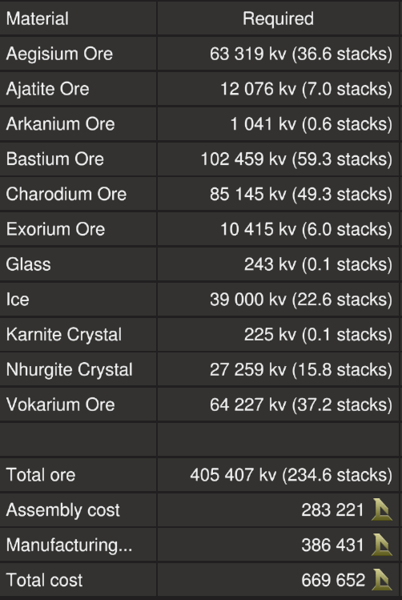

# Rigger

The Rigger is a fast medium sized mining ship. Although it has a limited autopilot and crash avoidance systems, it is mainly designed to be used in the safe zone. The blueprint is provided for [free](#download-blueprint). All [feedback](#providing-feedback) is welcome and in game tips (in-game name Egomaniac) are appreciated. However support will be limited but I will try my best.

[Starbase Ship Shop Page](https://sb-creators.org/makers/Egomaniac/ship/%5BFREE%5D%20Rigger)

  
  
  

More photos in the [`photos` folder](photos)

## Features

The ship has the following features:

- 100 Ore Crates
- Standard Cruise and Turtle functions
- Adjustable sensitivity system (Sloth function)
- Transponder system with ping function
- Two mining lasers on turrets that point towards asteroids with pulse and sweeping
- Two ore collectors that point towards asteroids
- Material scanner that will point towards asteroids
- Approach and auto mine functions
- Two external and two internal resource bridges
- Auto generator rate script with adjustable minimum rate
- 16 T2 generators (plus space for two more) with six T2 fuel chambers and 16 spare rods on racks
- Radiators that provide more than adequate cooling, with backup cooling using coolant
- Eight medium and six small propellant tanks with 38,000,000 units of propellant
- Estimated flight time of 6 hours and range of 3,000km
- Propellant time and fuel time panels
- 40 batteries
- 32 T2 box and 16 T2 triangle thrusters providing forward thrust
- Four T2 triangle thrusters providing braking thrust
- 40 T2 manuever thrusters with plenty of space for more
- Basic crafting bench to craft refills (will need to bolt own meter upgrade for T2 refills)
- Extra small propellant tank with its own resource bridge for emergency refueling
- Totally unnecessary amounts of extra hardpoints (all cabled and piped) all over the ship
- [ISAN Quad Waypoint System by Archaegeo](https://github.com/Archaegeo/Starbase/tree/45a9bb464cb71d7de7a214f8e665111d6b2b5989/ISAN-Waypoint%20System) with custom interface that supports 18 waypoints
- [NavCas (Autopilot and Crash Avoidance System) by fixerid](https://github.com/fixerid/sb-projects/tree/main/NavCas), customised to integrate with ISAN Waypoint System, running on separate set of  three ISAN Monos
- [Compass by Firestar99](https://gitlab.com/Firestar99/yolol/-/blob/master/src/compass/README.md), customised to integrate with ISAN Waypoint System and share the receivers with NavCas
- Alert panels and visualisations for obstacle detection
- Timer panel
- Odometer panel
- Two passenger seats
- Many extra slots for YOLOL or memory chips
- Extension points for modules (currently untested)

## Changelog

### v1.1.0 (Current) - 27/09/2021

- Updated scripts to remove need for custom key bindings for forward, pitch and yaw
- Increased ore collectors' power from 1000 to 1250
- Correctly set ore collectors' turret minimum pitch from -13 to -20
- Swapped `SafeZone`, `StrengthFactor` and Compass panels with `ForwardThrust` for better visibility
- Added individual progress panels for each fuel chambers on pilot right console
- Added odometer to pilot right console which shows lifetime and trip flight distances
- Added name decals
- Tuned approach script parameters (Thanks Rymn!)

### v1.0.1 - 25/09/2021

- Upgraded Compass to v1.1, use Compass' 3 in 1 ISAN Code and removed individual ISAN receiver codes.
- Changed NavCas to share Compass receivers' code rather than Compass to share NavCas receivers' code.

### v1.0.0 - 23/09/2021

- Initial release

## Build Cost

TIP: You can craft your own crates, generators (T2), box and triangle thruster components (T2) and ship tools to reduce assembly cost.

## Download Blueprint

The blueprint file is available in the `blueprints` folder [here](https://github.com/vinteo/starbase-ships/raw/main/rigger/blueprints/rigger.fbe).

## Known Issues

- There is very limited coverage of range finders for the crash avoidance system. It also hasn't been tested extensively. **Use at your own risk!**
- Autopilot doesn't seem to point ship directly to destination (a bit off), the parameters of the system probably need to be adjusted and tested more.
- Testing has been limited, it has mainly been tested in the safe zone and only by myself.

## Usage

Summary of the ship functions can be found on the YOLOL chips bolted behind the pilot chair. Swipe down on the lock to read each one. More detailed usage instructions are available below.

To enter the ship, there is a button above the cockpit that will open a `Hatch`. Once inside you can also open and close the cockpit glass `Canopy`. Buttons for these are available in the pilot right side console and also on the ceiling next to the hatch.

### Flying the Ship

~~**IMPORTANT:** Before flying the ship you should bind your keys by using the `V` key while sitting on the pilot chair. You will to bind keys for FWD+/FWD- (for forward thrust, usually SHIFT and CTRL), YAW+/YAW- (for yaw, usually E and Q) and PCH+/PCH- (for pitch, usually S and W).~~ No longer needed as of v1.1.0.

The left lever on the center console controls backwards thrust (braking) and the right lever controls forward thrust.

| Interface | Function |
|---|---|
| `ForwardThrust` | Current forwawrd thrust, maximum of 10,000 units |
| `SafeZone` | Whether current location is in the safe zone. |
| `StrengthFactor` | Current strength of ship. May fluctuate as ore crates are filled. Anything below 1.0 means ship is damaged. |
| `Cruise` | Activates cruise control, forward thrust will not reset to zero unless turned down. |
| `Turtle` | Activates turtle mode which sets forward thrust to a maximum limit of 20% of full thrust. |
| `Aim` | Reduces the response time of key presses for pitch and yaw. |
| `Sloth` | (Right Console) Activates the low sensitvity mode of pitch and yaw by limiting thrust. Use the `Sensitivity` switch to set the maximum thrust rate of sloth mode.|
| `Guides` & `Guidance` | Activates rangefinders (except center one which can be actiavted separately). Can be used as guide lasers. `Guidance` shows alerts showing position of objects detected with text and visualisation. For the visualisation, `O` means object is detected by  the particular rangefinder. |
| `Range` & `Distance` | Activates center rangefinder, with `Distance` showing distance to object. |
| `Scanner` & `Scan` | Turns on the [Ore Scanner](#ore-scanner). |
| `Approach`, `Collect`, `Mine`, `Lasers`, `Pulse`, `MineHeight` & `MineDepth` | Mining controls. See [Mining](#mining). |
| `Nav`, `Autopilot` & `Avoidance` | Autopilot controls. See [Autopilot and Crash Avoidance](#autopilot-and-crash-avoidance). |
| Transponder `Toggle` & `Ping` | Transponder controls, `Toggle` turns on and off ship transponder while `Ping` will activate transponder for three seconds |
| `ISAN2`, `Heading`, `Dest`, `DTW` & `Deltas` | See [ISAN Waypoint System](https://github.com/Archaegeo/Starbase/tree/45a9bb464cb71d7de7a214f8e665111d6b2b5989/ISAN-Waypoint%20System) for more informaton. |
| `G` Rotated | Compass display. Shows direction towards `Dest` waypoint, `+` is in front of ship while `O` is behind the ship. Best used when stationary. See [Compass](https://gitlab.com/Firestar99/yolol/-/blob/master/src/compass/README.md) for more informaton. |
| `Timer` | See [Timer](#timer). |

### Using the Waypoint System

This is a custom interface for the [ISAN Waypoint System](https://github.com/Archaegeo/Starbase/tree/45a9bb464cb71d7de7a214f8e665111d6b2b5989/ISAN-Waypoint%20System).

#### Viewing, Loading and Naming Waypoints

View a waypoint (`WP1` to `WP18`) by pressing the individual buttons. The waypoint will be shown on the `WP` panel. Load the waypoint in `WP` to `Dest` using the `Load Dest` button. Once in `Dest`, the waypoint will be used by the compass, ISAN and autopilot systems.

To give waypoints a name, use your universal tool to change the panel values with the name you want. This is for display purposes and your own reference only, it is not used anywhere else.

#### Saving Waypoints

Use `Save Loc` to save waypoint of current location to the waypoint position viewed on the `WP` panel.

To manually save coordinates, use your universal tool to add X, Y and Z values to `NewX`, `NewY` and `NewZ` respectively. Then use the button to save the coordinates to the waypoint position viewed on the `WP` panel.

### Autopilot and Crash Avoidance

The ship uses a modified version of [NavCas](https://github.com/fixerid/sb-projects/tree/main/NavCas) which uses the 3 in 1 ISAN from Compass and waypoint from ISAN Waypoint System.

Use while the ship is stationary. Activating `Nav` will start point the ship towards `Dest` waypoint and deactivate itself when done. `Autopilot` will activate `Nav` and fly to within 5km of `Dest` waypoint with `Avoidance` activated.

**NOTE:** `Nav` needs to be tuned more for accuracy. I recommend using it in conjunction with the compass.

`Avoidance` will activate `Guides`. If the guides detect objects it will pitch the ship down and cut forward thrust. If `Autopilot` is activated, it will readjust and continue its flight.

**NOTE:** There is very limited coverage of range finders for the crash avoidance system. It also hasn't been tested extensively. **Use at your own risk!**

### Mining

To approach an asteroid, point the center range finder at an asteroid and activate `Approach`. Once in range (optimum range is 10 to 14m on `Distance`), activate `Lasers` to turn on the mining lasers. `Pulse` will activate pulsing of the lasers while `MineHeight` and `MineDepth` will adjust sweeping distances of the lasers.

`Mine` is a button which will activate automated mining. Point the center range finder at an asteroid and activate. It will activate `Scanner` and `Approach`, and once in range it will automatically activate `Lasers`.

`Collect` turns on the two ore collectors. Ore collectors automatically adjust to point towards objects detected by the center range finder.

If batteries start running out of charge while mining, turn on `Min_EPS`. Continous use of the lasers and collectors at the same time requires a `MinEPS` of around 90%.

#### Ore Scanner

Activate using the `Scanner` button. The laser will try to adjust to point at the objects detected by the center range finder. Scan results will show on the `Scan` panel in number of stacks. It has a maximum range of 100m.

### Managing Power, Fuel and Cooling

| Interface | Function |
|---|---|
| `Battery` | Shows current battery charge of the 40 batteries, maximum of 10,000 units. |
| `Generator` | Current generator rate, maximum of 100%. |
| `MinEPS` & `Min_EPS` | Toggle and sets minimum generator rate. See [Managing Power](#managing-power). |
| `RadiationRate` | Current radiation rate of the radiators, maximum of 100%. If it is hitting 100% your radiators may be damaged, turn on [`Cooling`](#cooling) as backup. |
| `CoolerRate` | Current cooling rate from coolant, maximum of 100%. Will be 0% unless [`Cooling`](#cooling) is turned on. |
| `Cooling` | Turns on and off cooling using coolant. See [Cooling](#cooling). |
| `Fuel` | Total fuel remaining on fuel rods, maximum of 1,800,000 units for the six fuel chambers. |
| `Fuel1` to `Fuel6` | Fuel remaining on fuel rods in individual fuel chambers, maximum of 300,000 units for each. |
| `Propellant` | Total propellant remaining in propellant tanks, maximum of 38,000,000 units. |
| `PropTime` | Time and distance remaining of propellant based on current usage. Distance is calculated from ISAN speed*. |
| `FuelTime` | Time and distance remaining of fuel based on current usage. Distance is calculated from ISAN speed*. |
| `WithBackup` | Same as FuelTime but takes into account backup rods available. Use the switch for `BackupRods` to set the number of backup rods available. As standard there are 16 extra rods. |
| `Shutdown` | Will turn off all fuel chambers thus shutting down generators. |
| `FlowIn` & `FlowOut` | Toggle flow modes of resource bridges. See [Refueling Propellant](#refuelling-propellant). |
| `Lights` | Turns on and off internal lights. |
| `Headlights` | Turns on and off external light on the nose of the ship. May help with mining asteroids. |
| `Odometer` | See [Odometer](#odometer). |

*ISAN speed is normally quite conservative and not 100% accurate.

#### Managing Power

By default the generator will only run and ramp up when the batteries need charging so there is minimum management needed. But you can set a minimum generate rate by setting the `MinEPS` value using the switch for the minimum rate and turning on `Min_EPS`.

#### Refueling Propellant

All four resource bridges can be used for refuelling propellant. To refuel from another ship, turn off `FlowOut` on the pilot right side console and leave `FlowIn` turned on. Then connect a resource bridge to the other ship. To refuel another ship, do the opposite, `FlowOut` turned on and `FlowIn` turned off.

The small propellant tank above the crafting bench can also be used to refuel the ship. Turn off `FlowOut` and connect the tank's resource bridge to any of the ship's resource bridges, this will transfer the propellant from the tank to the ship. You can then unbolt the tank and craft refills for the tank using ice and then bolt the tank back to the support. Rinse and repeat until full.

Remember to turn `FlowIn` and `FlowOut` back on if you are using the Endo to collect ore via any of the ship's resource bridges.

If for some reason you need access to the ship's internal tanks, you can unbolt the grates on top of the ship which are marked with circular decals. This will give access to _some_ tanks.

#### Cooling

The radiators provide more than enough cooling (about 40% extra) for heat generated and you can always add more with all the hardpoints.

However in case of radiators failure you can activate the backup cooling using coolant but pressing the `Cooling` button. But the coolant can only provide partial cooling (about 30%) needed so it will only work for partial radiator failure. There are also two coolant recharge racks next to the internal resource bridges to recharge coolant.

### Other Stuff

#### Timer

On the pilot center console there is a `Timer` panel which acts as a timer. It will run when the ship is active and show total time in years, weeks, days, hours, minutes and seconds. To reset the timer, use your universal tool (`U` key) and clear the value of the `Timer` field.

#### Odometer

On the pilot right console there is a `Odometer` panel which will keep track of the ship's estimated flight distance based on speed from ISAN (may not be that accurate). To reset the trip odometer, use your universal tool (`U` key) and clear the value of the `Odometer` field.

## Providing Feedback

I can be found in-game as Egomaniac and on discord as vinteo#4211. Feel free to contact me and provide feedback or if you need help. Pull requests are also welcomed for scripts changes/fixes.

I would also love to see any modifications or improvements you have made, so feel free to share! I hope to learn from the community and may also incorporate your changes into future versions.

Of course in-game tips are greatly appreciated.

## Frequently Asked Questions

#### Why is the blueprint free?

This is only the second ever ship I have designed and honestly I don't think it is good enough to be sold. There are many talented ship designers with ships that look much better and seem to work much better. But I have spent countless hours on the ship and I decided to just share it so my time wouldn't all go to waste and I am not the only one using the ship. Also a lot of the systems I used are based on work shared for free by other generous people.

Finally, I am hoping to get feedback from the community and learn from it, so hopefully I will be able to design better ships in the future.

#### Can I sell ships based on this blueprint?

No.

#### I just printed the ship, why can't I control the ship (version <= 1.0.1)?

If using version 1.0.1 and earlier, please read the note [here](#flying-the-ship).

#### Why does it need so much Aegisium?

I converted all external plates to Aegisium for weight and armor, you can use other materials like Bastium for these plates by editing the blueprint in the ship designer.

#### Why is the compass panel label G?

~~I ran out of single character global variables while both the C and K are used by the ISAN and waypoint system which I was hoping to keep unmodified. I haven't used any digits though, so potentially one of those could be used. Suggestions welcomed.~~

As of version 1.0.1, I managed to free up a lot of global variables, but decided to keep it as it is. In fact with the panel rotated (see below), if you look closely enough the rotated `G` kinda looks like a compass pointing north (up/forward) :P

#### Why is the compass panel rotated (version > 1.0.1)?

 The original Compass uses front and right receivers, but this ship uses front and bottom receivers. For ease of future upgrades, I just rotated the panel instead of making changes to the original Compass code.

#### Why are there so many extra hardpoints?

I don't know, I went a bit crazy there, but you can use them to add whatever you want, including weapons.

#### Why can't the crafting bench craft T2 refills?

You need to bolt a meter upgrade to the bench. The ship designer doesn't provide it so I couldn't add it to the blueprint.

#### What are the square points with decals on the top, bottom and sides of the ship?

My idea was to have extension points where modules (more crates, warp core, more propellant, etc) can be attached. The plates there can be removed and there are beams with ducts available for module connection. However no modules have been created yet and this has not been tested.

However if you decide to build any of these modules, you can add range finders in front of the module and name the distance fields `RFT`, `RTB`, ``RTR` or `RTL` for top, bottom, right and left modules respectively. These should automatically be supported by the crash avoidance system plus the guidance alert and visualisation.

And I would love to see modules you have created, even if it is just a photo.
