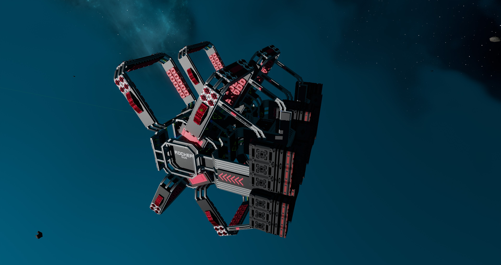
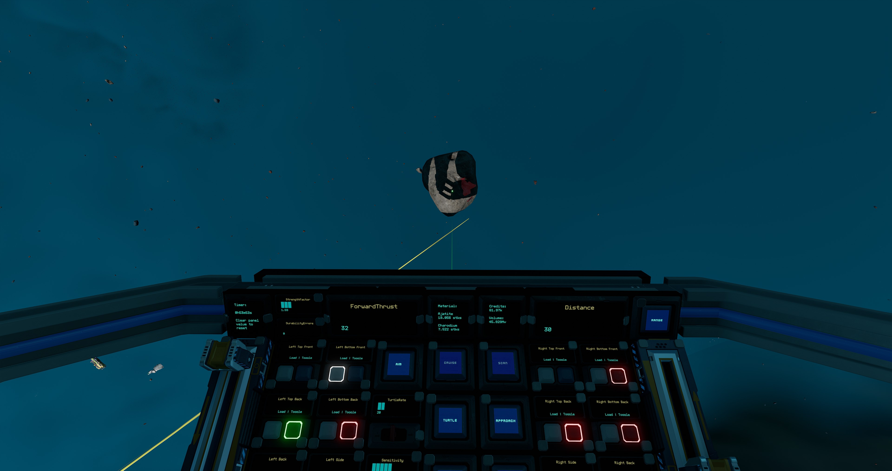
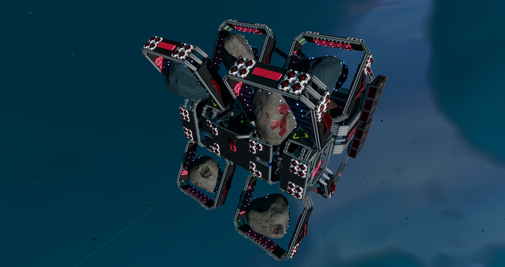
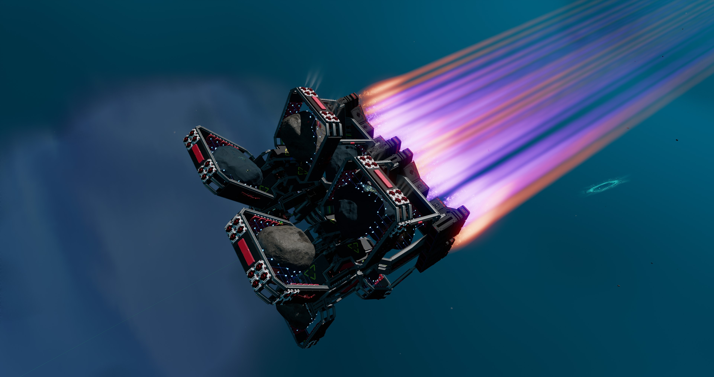
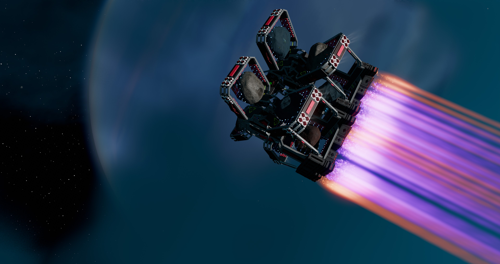
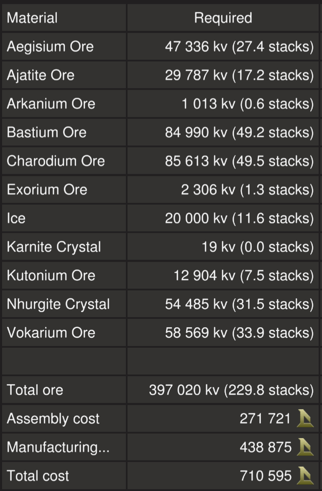

# Rocker Duo by EGOTech

The Rocker Duo is a asteroid hauling ship that is basically two [Rockers](../rocker) mashed together. It is designed to be used in the safe zone and haul small asteroids.
It uses two tractor beams to position asteroids into two sets of five compartments of cargo lock beams in a circular pattern so it can hold up to ten asteroids.
It has load automation to approach and load asteroids in the right order as well as a material scanner that gives estimated credits for selling the asteroids.

Loading of asteroids is the slowest compared to the [Rocker](../rocker) and [Hexxer](../hexxer) but it can hold the most asteroids (10 vs 5 or 6).

The blueprint is provided for [free](#download-blueprint). All [feedback](#providing-feedback) is welcome and in game tips (in-game name Egomaniac) are appreciated. However support will be limited but I will try my best.

[Starbase Ship Shop Page](https://sb-creators.org/makers/Egomaniac/ship/%5BFREE%5D%20Rocker%20Duo)

The Rocker Duo (v1.1.0) is also available to buy in game at Central Showroom of Rando 2 Ship Shop at stations with Rando ship shops.

  
  
  
  
  

More photos in the [`photos` folder](photos)

## Videos

| Channel | Video |
| --- | --- |
| [CrispyChestnuts](https://www.youtube.com/channel/UCZuFhUb3UwEfSiUvIZJJ55Q) | [Crispy demos the Rocker Duo (and Rocker) by Egomaniac](https://www.youtube.com/watch?v=SI1ndXVzCmE) |

## Features

The ship has the following features:

- Standard Cruise function
- Turtle and Sloth function with adjustable rates
- 24 T2 generators with eight T2 fuel chambers and 16 spare rods on racks
- Radiators that provide more than adequate cooling
- Four small and four medium propellant tanks with 20,000,000 units of propellant
- 80 batteries
- 24 T2 box and 56 T2 triangle thrusters providing forward thrust
- 124 T2 maneuver thrusters
- Two tractor beams which will load asteroids into two sets of five compartments with cargo lock beams
- Load automation that will load asteroids into the right container in the right order
- Material scanner that will output the materials in stacks as well as the estimated credits you will get for dropping the asteroid off at Origin stations
- Rangefinder to help judge forward distance and for approach
- Resource bridge for refueling
- Pretty much max speed 150m/s when empty

## Changelog

### v1.1.0 (Current, Ship Shop Version) - 23/05/2022

- Painted thrusters, generators and fuel chambers black
- Painted propellant tanks red
- Added four heat sinks
- Reduced radiators to four bases
- Replaced  `RadiationRate` panel with `HeatTransferRate`
- Added `StoredHeat` panel

### v1.0.2 - 04/03/2022

- Piped and cabled four braking thusters that were not connected
- Added `Unload` buttons which turns off cargo lock beams on right and left side respectively

### v1.0.1 - 03/02/2022

- Changed material of some beams that were accidently changed back to Bastium

### v1.0.0 - 04/12/2021

- Initial release

## Build Cost

> TIP: You can craft your own generators (T2), box thruster components (T2) and ship tools to reduce assembly cost.

## Download Blueprint

The blueprint file is available in the `blueprints` folder [here](https://github.com/EGO-Tech/starbase-ships/raw/main/rocker_duo/blueprints/rocker_duo.fbe).

## Known Issues

- Loading of asteroids is VERY slow, especially the larger ones.
- When asteroids are loaded more on one side, the ship can become unbalanced and thrust efficiency drops
- Ship pitch is not very good.
- Currently there are no navigation features but will possibly add ISAN and Compass in the future if this ship becomes useful to Endos
- Sometimes after printing the ship, the tractor beams' pitch are not right at the starting position, fix by manually setting the turret pitch (`tbh1` & `tbh2`) to `-15`. Or it will fix itself after you load an asteroid on each side (manually point beam at the asteroids).

## Usage

### Flying the Ship

The left lever on the center console controls backwards thrust (braking) and the right lever controls forward thrust.

| Interface | Function |
|---|---|
| `ForwardThrust` | Current forward thrust, maximum of 10,000 units |
| `Cruise` | Activates cruise control, forward thrust will not reset to zero unless turned down. |
| `Turtle`, `TurtleRate` | Activates turtle mode which sets forward thrust to a maximum limit of `TurtleRate` (percent) of full thrust. |
| `Sloth`, `Sensitivity` | Activates sloth mode which sets yaw and pitch thrust to a maximum limit of `Sensitivity` (percent) of full thrust. |
| `Aim` | Reduces the response time of key presses for pitch and yaw. |
| `Distance` & `Range` | Distance for rangefinder. `Range` toggles the rangefinders.|
| `Scan`, `Material`, & `Credits` | Material scanning controls. See [Scanning Asteroids](#scanning-asteroids). |
| `Approach`, `Beam`, `Unload`, `Load`, Cargo `Load` & `Toggle` | Cargo loading controls. See [Loading Asteroids](#loading-asteroids). |
| `StrengthFactor` | Current strength of ship. May fluctuate as ore crates are filled. Anything below 1.0 means ship is damaged. |
| `DurabilityErrors` | Number of durability errors on the ship. If the asteroids are not position correctly it may cause errors |
| `Timer` | See [Timer](#timer). |

### Managing Power and Fuel

| Interface | Function |
|---|---|
| `Propellant` | Total propellant remaining in propellant tanks, maximum of 10,000,000 units. |
| `Battery` | Shows current battery charge of the batteries, maximum of 10,000 units. |
| `Generator` | Current generator rate, maximum of 100%. |
| `Min Generator Rate` & `Min Gen` | Toggle and sets minimum generator rate. See [Managing Power](#managing-power). |
| `HeatTransferRate` | Current heat transfer rate of the heat sinks, maximum of 100%. |
| `StoredHeat` | Current stored heat in the heat sinks, maximum of 15,000 units. |
| `Fuel Rod 1`, `Fuel Rod 2`, `Fuel Rod 3`, `Fuel Rod 4`, `Fuel Rod 5`, `Fuel Rod 6`, `Fuel Rod 7`, `Fuel Rod 8` | Total fuel remaining on fuel rods, maximum of 300,000 units each. |
| `Shutdown` | Will turn off all fuel chambers thus shutting down generators. |
| `ID` | Toggle for the transponder. |

#### Managing Power

By default the generator will only run and ramp up when the batteries need charging so there is minimum management needed. But you can set a minimum generate rate by setting the `Min Generator Rate` value using the switch for the minimum rate and turning on `Min Gen`.

### Scanning Asteroids

`Scan` turns on the material scanner. The beam has a range of 100m.
Point the beam at an asteroid and `Material` will show the materials in the asteroid along with the volume of each in stacks.
`Credits` will show the _estimated_ amount of credits you will get for the asteroid if you drop it off at Origin stations.
The calculation is 158.8% (worked out this with testing) of the cost of ore of the vendor price. **This only has data for safe zone materials.** The total volume of the asteroid in Mv is also shown.

### Loading Asteroids

Approach an asteroid by pointing the center rangefinder at an asteroid and activating `Approach`. This will guide the ship to around 10m of the asteroid.

To load asteroids, activate `Beam` of either side to activate tractor beam and point the beam at an asteroid. Once the beam has locked on, use `Load` to use beam to load to a compartment.
The back compartment should be loaded first followed by the left and right back and finally the the front compartments.
**The loading of the a compartment will not activate if cargo lock beam of the compartments in front of it is activated**.

Once the asteroid is in place the cargo lock beam should activate itself and the tractor beam will reset. If it does not activate for any reason, you can use `Toggle` to active the cargo lock beam manually and it will also reset the tractor beam.

All these can be done the automated `Load` function. Point the center rangefinder at the asteroid you wish to load and activate `Load`. This is activate `Approach`, `Scan` and `Beam` as well as smartly activating the `Load` of the right compartment. So you can just use `Load` each time and it will load the asteroids to the right compartment in the right order.

`Unload` will turn of all cargo lock beams on either side.

### Other Stuff

#### Timer

On the pilot center console there is a `Timer` panel which acts as a timer. It will run when the ship is active and show total time in years, weeks, days, hours, minutes and seconds. To reset the timer, use your universal tool (`U` key) and clear the value of the `Timer` field.

## Providing Feedback

I can be found in-game as Egomaniac and on discord as vinteo#4211. Feel free to contact me and provide feedback or if you need help. Pull requests are also welcomed for scripts changes/fixes.

I would also love to see any modifications or improvements you have made, so feel free to share! I hope to learn from the community and may also incorporate your changes into future versions.

Of course in-game tips are greatly appreciated.

## Frequently Asked Questions

### Can I sell ships based on this blueprint?

No.

### How much can I make from hauling safe zone asteroids?

It is not very lucrative, but here is an estimated breakdown of 45Mv asteroids (with a rough breakdown of 35Mv shell and 10Mv core) from the safe zone I got during testing.

| Material | Volume | Credits |
| --- | --- | --- |
| Ice/Vokarium | 45Mv | 36k |
| Ajatite/Charodium | 45Mv | 58k |
| Valkite/Bastium | 45Mv | 27k |
| Ice/Nhurgite | 45Mv | 56k |

## Designed by EGOTech

