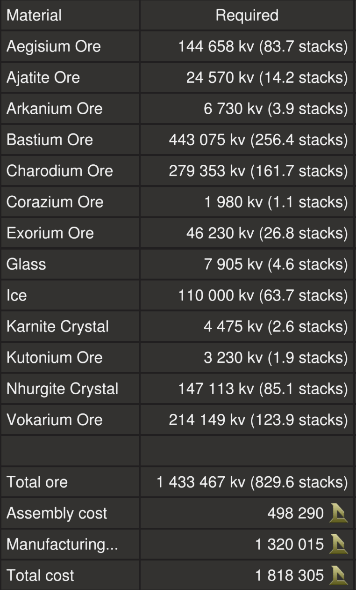
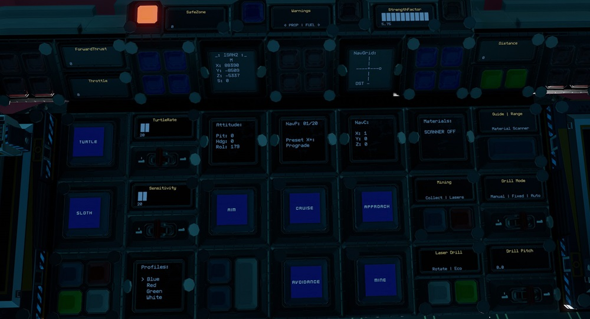
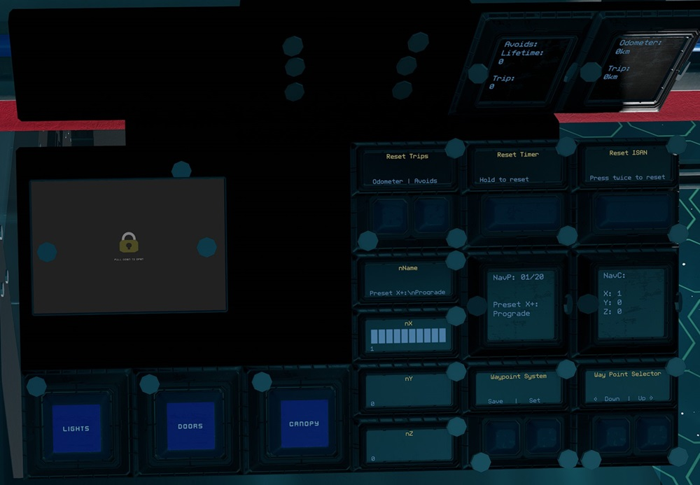
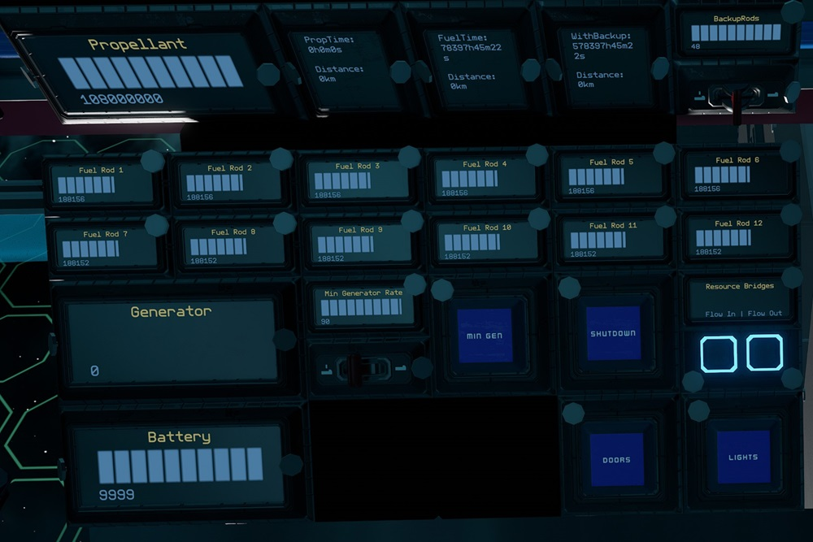

# Shifter by EGOTech

The Shifter is a 450 ore crate capacity mining ship with two automated rotating laser drills for mining operations plus a spacious interior allowing for multi crew operations.
The blueprint is provided for [free](#download-blueprint). All [feedback](#providing-feedback) is welcome and in game tips (in-game name Egomaniac) are appreciated. However support will be limited but I will try my best.

[Starbase Ship Shop Page](https://sb-creators.org/makers/Egomaniac/ship/%5BFREE%5D%20Shifter)

The Shifter (v1.1.0) is also available to buy in game at Central Showroom of Rando 1 Ship Shop at stations with Rando ship shops.

  
  
  
  
  
  

More photos in the [`photos` folder](photos)

## Videos

| Channel | Video |
| --- | --- |
| [Flames_Yue](https://www.youtube.com/@flames_yue550) | [EGOTech Shifter Asteroid Miner Showcase](https://www.youtube.com/watch?v=xvv7hNlfqLY) |

## Features

The ship has the following features:

- 450 ore crates
- Spacious double level interior
- Two additional seats for co-pilots
- Standard Cruise function
- Turtle and Sloth functions with adjustable rates
- Transponder system with ping function
- Two automated rotating drills with four mining lasers each
- Six ore collectors
- Material scanner with display of materials in stacks
- Approach and auto mine functions
- Two external and four internal resource bridges
- Auto generator rate script with adjustable minimum rate
- 36 T2 generators (with 40 T1 and 16 T2 enhancers) with 12 T2 fuel chambers and 48 spare rods on racks
- Radiators and heat sinks that provide more than adequate cooling
- Nine large propellant tanks with 108,000,000 units of propellant
- Estimated flight time of 4 hours and range of 2,000km
- Propellant time and fuel time panels
- 216 batteries
- 42 T2 box and 124 T2 triangle thrusters providing forward thrust
- 48 T2 triangle thrusters providing braking thrust
- Eight T2 maneuver and 72 T2 triangle thrusters for maneuvers
- Basic crafting bench to craft refills with meter upgrade plus the other two benches
- Extra two small propellant tank with its own resource bridge for emergency refueling
- Two extra hardpoints (all cabled and piped)
- [NavGrid by StandPeter](https://github.com/pcbennion/starbase-navgrid)
- [NavCas by fixerid](https://github.com/fixerid/sb-projects/tree/main/NavCas), using custom avoidance system and ISAN 3 in 1 from [Compass by Firestar99](https://gitlab.com/Firestar99/yolol/-/blob/master/src/compass/README.md), with ability to load target from NavGrid
- Warning lights and alarm for obstacle detection and avoidance, powered by 35 rangefinders
- Speedometer
- Timer panel
- Odometer panel
- Many extra slots for YOLOL or memory chips
- Top speed of 135m/s when empty

## Changelog

### v2.0.1 (Current) - 28/12/2022

- Renamed `Material` panel to `Materials`
- Fixed upper limit of laser pitch control
- Added cruise safety chip
- Added lasers safety chip

### v2.0.0 - 01/12/2022

- Added EGOTech logo decal
- Removed chamber numbering plates to give way to enhancers
- Added four more T2 generators, 40 T1 and 16 T2 enhancers, increasing power generation to 63,000eps
- Added 22 more heat sinks
- Added six more radiator bases and 12 extensions
- Replaced sweeping mining lasers with two automated rotating drills with four mining lasers each
- Swapped center rangefinder with lower rangefinder to be in line with the drills
- Moved material scanner lower inside the ship to be more in line with the center rangefinder
- Added 120 more batteries
- Moved collectors and added four extra collectors behind the drills
- Added windows to where collectors used to be
- Updated dynamic generator script to take into account lasers
- Added eight maneuver thrusters around drills
- Remove belt and atmosphere furnaces
- Increased default min generator rate to 90
- Adjusted maximum backup rods to 48
- Added avoidance safety chip to disable avoidance when laser drills are not in starting position
- Moved a couple of guide rangefinders onto drill, disabled when drills are turned on
- Removed forward thrust total chip
- Split side thruster blocks into three blocks each for better balance
- Changed other rear thruster groupings

### v1.1.1 - 27/05/2022

- Replaced speedometer by MoriWatari with new speedometer
- Removed fast travel core
- Added asteroid belt and moon atmosphere furnaces
- Added 24 spare T2 fuel rods on racks
- Increased max propellant to 108,000,000

### v1.1.0 (Ship Shop Version) - 27/05/2022

- Painted thrusters black
- Added meter upgrade to basic crafting bench
- Added 10 heat sinks
- Reduced radiators to four bases and eight extensions
- Replaced all `RadiationRate` panels with `HeatTransferRate`
- Added `StoredHeat` panels
- Moved `Canopy` button from pilot right console to left console
- Piped mining lasers in case of heat generation in the future

### v1.0.4 - 16/02/2022

- Fixed sweeping of lasers
- Changed material of some beams which was mistakenly changed back to Bastium
- Painted all thrusters' nozzles to red

### v1.0.3 - 04/01/2022

- Added reset buttons for timer, odometer and avoids as current method does not work with duplicate panels
- Added `Lights` and `Doors` buttons on the pilot left console as well
- Swapped `NavGrid` `Up` and `Down` button positions
- Moved some plates that was positioned wrongly below the ship

### v1.0.2 - 31/12/2021

- Removed `nName`, `nX`, `nY` and `nZ` panels from navigation co-pilot console as duplicates interfere with operation

### v1.0.1 - 21/12/2021

- Added Reset ISAN button

### v1.0.0 - 20/12/2021

- Initial release

## Build Cost

> TIP: You can craft your own crates, generators (T2), box and triangle thruster components (T2) and ship tools to reduce assembly cost.

## Download Blueprint

The blueprint file is available in the `blueprints` folder [here](https://github.com/vinteo/starbase-ships/raw/main/shifter/blueprints/shifter.fbe).

## Known Issues

- There is limited coverage of range finders for the crash avoidance system. **Use at your own risk!**
- Autopilot doesn't seem to point ship directly to destination (a bit off), use in conjunction with NavGrid.
- Right/left strafe will spin the ship slightly as well.
- There may be a slight drift when crates start to fill, especially at low speeds.

## Usage

To enter the ship, there is are buttons on either side of the body of the ship that will open `Doors`. Once inside you can also open and close the cockpit glass `Canopy`. Buttons for these are available in the pilot left side console and also on the ceiling above the pilot seat.

### Flying the Ship

The left lever on the center console controls backwards thrust (braking) and the right lever controls forward thrust.

| Interface | Function |
|---|---|
| `Speed` | Current speed in metres per second. |
| `ForwardThrust` | Current forward thrust, maximum of 10,000 units |
| `Throttle` | Current throttle level, maximum of 100 percent |
| `Cruise` | Activates cruise control, forward thrust will not reset to zero unless turned down. |
| `Turtle` | Activates turtle mode which sets forward thrust to a maximum limit of `TurtleRate` of full thrust. |
| `Sloth` | Activates the low sensitvity mode of pitch and yaw by limiting thrust. Use the `Sensitivity` switch to set the maximum thrust rate of sloth mode.|
| `Aim` | Reduces the response time of key presses for pitch and yaw. |
| `Guides` | Activates rangefinders (except center one which can be activated separately). Can be used as guide lasers. `Red` warning lights show location of obstacles (left, right and centre). |
| `Range` & `Distance` | Activates center rangefinder, with `Distance` showing distance to object. |
| `Material Scanner` & `Materials` | Turns on the [Ore Scanner](#ore-scanner) and shows results of scan. |
| `Approach`, `Collect`, `Mine`, `Lasers`, `Rotate`, `Eco`, `Drill Mode` & `Drill Pitch` | Mining controls. See [Mining](#mining). |
| `Nav`, `Autopilot`, `Avoidance` & `Target` | Autopilot controls. See [Autopilot and Crash Avoidance](#auto-pilot-and-crash-avoidance). |
| `ISAN2` | Current ISAN coordinates of ship. |
| `NavGrid`, `NavP`, `NavC` & `Attitude` | [NavGrid](https://github.com/pcbennion/starbase-navgrid) system, see [Using the Waypoint System](#using-the-waypoint-system). |
| `SafeZone` | Whether current location is in the safe zone. |
| `StrengthFactor` | Current strength of ship. May fluctuate as ore crates are filled. Anything below 1.0 means ship is damaged. |
| Transponder `Toggle` & `Ping` | Transponder controls, `Toggle` turns on and off ship transponder while `Ping` will activate transponder for three seconds |
| `Timer` | See [Timer](#timer). |

**NOTE:** For safety, firing full braking thrust will deactivate `Cruise`.

### Using the Waypoint System

#### Viewing and Selecting Waypoints

This uses the [NavGrid](https://github.com/pcbennion/starbase-navgrid) system. Use the `Down` and `Up` waypoints selectors to select waypoint. The selected waypoint information is shown on `NavP` and `NavC` panels.

On the pilot center console, `NavGrid` will show the compass towards the selected waypoint while `Attitude` will show the ship's pitch, heading and roll directions. `NavGrid` is best used while not moving.

#### Editing and Saving Waypoints

Use `Set` to save waypoint of current location to the current selected waypoint position.

To edit currently selected waypoint, use your `U` tool to add name, X, Y and Z values to `nName`, `nX`, `nY` and `nZ` respectively. Then use the `Save` button to save.

**NOTE:** Waypoint 1 to 6 are presets and can not be over written.

#### Loading Waypoint to Auto Pilot

Use `Load to Auto Pilot` to load curretnly selected waypoint to `Target` to be used with the auto pilot system.

### Auto Pilot and Crash Avoidance

The ship uses a modified version of [NavCas](https://github.com/fixerid/sb-projects/tree/main/NavCas) which uses the 3 in 1 ISAN from Compass. Waypoints are loaded from NavGrid waypoint system.

Use while the ship is stationary. Activating `Nav` will start point the ship towards `Target` waypoint and deactivate itself when done. `Autopilot` will activate `Nav` and fly to within 5km of `Target` waypoint with `Avoidance` activated.

**NOTE:** `Nav` may not be very accurate. I recommend using it in conjunction with the NavGrid compass. The `dd` panel on the pilot left console shows debugging information for NavCas.

`Avoidance` will activate `Guides`. If the guides detect objects it will cut thrust and strafe up or down (will flash either the top or bottom `Blue` warning lights on the pilot center console according to the direction) while sounding an alarm (check game settings if you do not hear the alarm).
It will also flash `Red` warning lights on the pilot center console according to the position of obstacle detected. If `Autopilot` is activated, it will readjust and continue its flight.

**NOTE:** For safety, `Avoidance` will not activate if the mining lasers are turned on. Do not turn on `Avoidance`, `Autopilot` and `Nav` while lasers are turned on.

`Avoids` will show the counters for number of avoidances. The `Trip` counter can be reset by holding down the `Avoids` `Reset Trips` button.

**NOTE:** There is very limited coverage of range finders for the crash avoidance system. **Use at your own risk!**

### Resetting Navigation

If ISAN or NavGrid is not working, it can be reset using the `Reset ISAN` button. Press once to take ISAN offline, then press again to reset.

For v1.0.0, this has to be done manually.
Since this ship has three ISAN panels (one each on the pilot, engineering and navigation consoles), before reseting ISAN, rename the `_` field of two of the panels to something else temporarily using the universal tool.
Then using your universal tool on the remaining ISAN panel, clear the value of the `_` field.
The first time will show ISAN as offline, repeat clearing the value again to reset ISAN and NavGrid. You can then rename the fields back to `_` on the two panels earlier.

### Mining

To approach an asteroid, point the center range finder at an asteroid and activate `Approach`. Once in range (optimum range is 16 to 20m on `Distance`), activate `Lasers` to turn on the mining lasers. Activating `Rotate` will rotate the laser drill.

The laser drill has three modes.

- `Fixed` mode will keep all lasers converged to the asteroid detected by the center range finder.
- `Manual` mode allows adjustment of the `Drill Pitch`. The pitch range is from `-15` to `20` degrees.
- `Auto` mode will activate `Rotate` and progressively increase the drill pitch with the rotations

`Drill Pitch` can only be adjusted in `Manual` mode. `Eco` mode will only use two lasers to conserve power.

`Mine` is a button which will activate automated mining. Point the center range finder at an asteroid and activate. It will activate `Material Scanner` and `Approach`, and once in range it will automatically activate `Lasers`.

`Collect` turns on the six ore collectors.

If batteries start running out of charge while mining, turn on `Min Gen`. Continous use of the lasers and collectors at the same time requires a `Min Generator Limit` of around 90%.

**NOTE:** For safety, lasers will turn off if the total fuel is less that 2,000 units.

#### Ore Scanner

Activate using the `Material Scanner` button. The laser will try to adjust to point at the objects detected by the center range finder. Scan results will show on the `Materials` panel in number of stacks. It has a maximum range of 100m.

### Managing Power and Fuel

| Interface | Function |
|---|---|
| `Propellant` | Total propellant remaining in propellant tanks, maximum of 108,000,000 units. |
| `PropTime` | Time and distance remaining of propellant based on current usage. Distance is calculated from speed. |
| `FuelTime` | Time and distance remaining of fuel based on current usage. Distance is calculated from speed. |
| `WithBackup` | Same as FuelTime but takes into account backup rods available. Use the switch for `Backup Rods` to set the number of backup rods available. As standard there are 48 extra rods. |
| `Fuel Rod 1` to `Fuel Rod 12` | Fuel remaining on fuel rods in individual fuel chambers, maximum of 300,000 units for each. |
| `Generator` | Current generator rate, maximum of `Generator Limit`. |
| `Min Gen` & `Min Generator Limit` | Toggle and sets minimum generator rate. See [Managing Power](#managing-power). |
| `Shutdown` | Will turn off all fuel chambers thus shutting down generators. |
| `Battery` | Shows current battery charge of the batteries, maximum of 10,000 units. |
| `HeatTransferRate` | Current heat transfer rate of the heat sinks, maximum of 100%. |
| `StoredHeat` | Current stored heat in the heat sinks, maximum of 15,000 units. |
| `Flow In` & `Flow Out` | Toggle flow modes of resource bridges. See [Refueling Propellant](#refueling-propellant). |
| `Lights` | Turns on and off internal lights. |
| `Doors` | Opens or closes ship entry doors. |

#### Managing Power

By default the generator will only run and ramp up when the batteries need charging so there is minimum management needed. But you can set a minimum generate rate by setting the `Min Generator Limit` value using the switch for the minimum rate and turning on `Min Gen`.

#### Refueling Propellant

All four resource bridges can be used for refuelling propellant. To refuel from another ship, turn off `Flow Out` on the pilot right side console and leave `Flow In` turned on. Then connect a resource bridge to the other ship. To refuel another ship, do the opposite, `Flow Out` turned on and `Flow In` turned off.

The two red propellant tanks on the bottom level at the back of ship can also be used to refuel the ship. Connect the `Red` resource bridge to the `Green` resource bridge to transfer propellant.
You can then unbolt the red tanks and craft refills for the tanks using ice and then bolt the tank back to the support. Rinse and repeat until full. The `Red` and `Green` buttons toggles the respective resource bridges.

Remember to turn `Flow In` and `Flow Out` back on if you are using the Endo to collect ore via any of the ship's resource bridges.

### Other Stuff

#### Timer

On the pilot center console there is a `Timer` panel which acts as a timer. It will run when the ship is active and show total time in years, weeks, days, hours, minutes and seconds. To reset the timer, hold down the `Reset Timer` button on the pilot left console.

#### Odometer

On the pilot right console there is a `Odometer` panel which will keep track of the ship's estimated flight distance based on speed. To reset the trip odometer, hold down the `Odometer` `Reset Trips` button on the pilot left console.

## Providing Feedback

I can be found in-game as Egomaniac and on discord as vinteo#4211. Feel free to contact me and provide feedback or if you need help. Pull requests are also welcomed for scripts changes/fixes.

I would also love to see any modifications or improvements you have made, so feel free to share! I hope to learn from the community and may also incorporate your changes into future versions.

Of course in-game tips are greatly appreciated.

## Frequently Asked Questions

### Can I sell ships based on this blueprint?

No.

### Will changing all thruster nozzles to T3 versions increase speed?

Yes, only slightly, by about an additional 2m/s. For all thrusters (including maneuver and braking thrusters), this is at a cost of 3.6 stacks of Ymrium and 14.3 Kutonium as well of 120K credits for assembly.

### Why does NavGrid show an error?

This usually happens after travelling to the moon via the warp gate where ISAN is not available. After returning, this can be fixed by reseting ISAN. See [Resetting Navigation](#resetting-navigation).

## Designed by EGOTech

