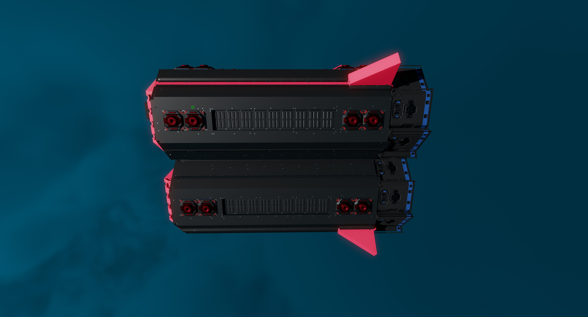
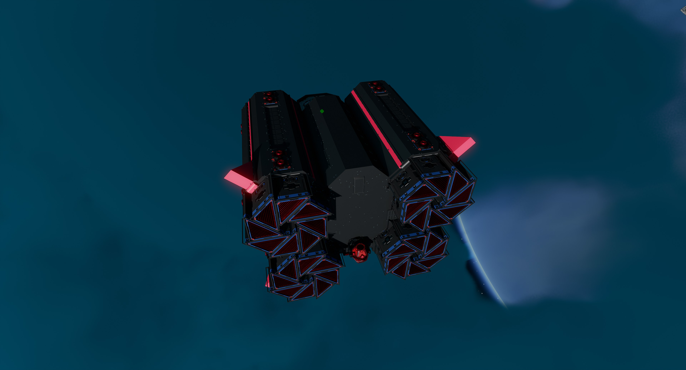
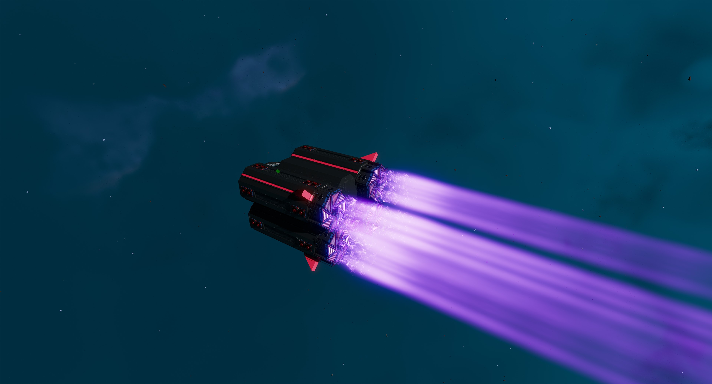
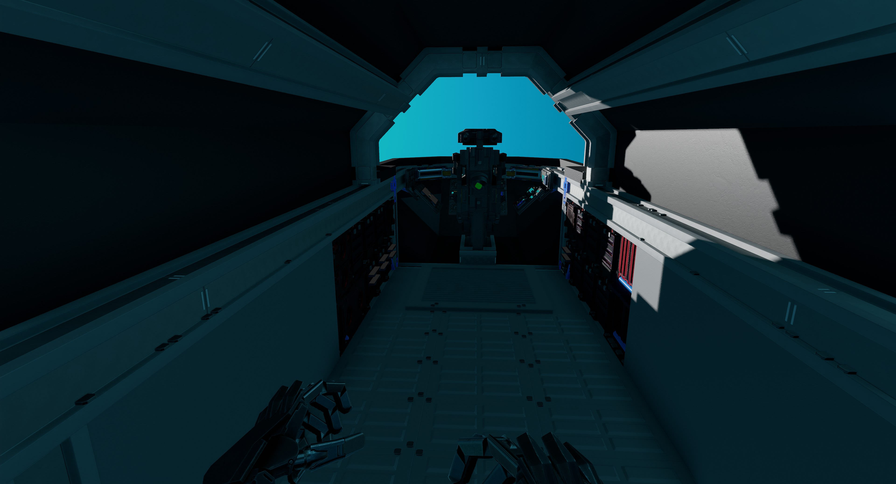
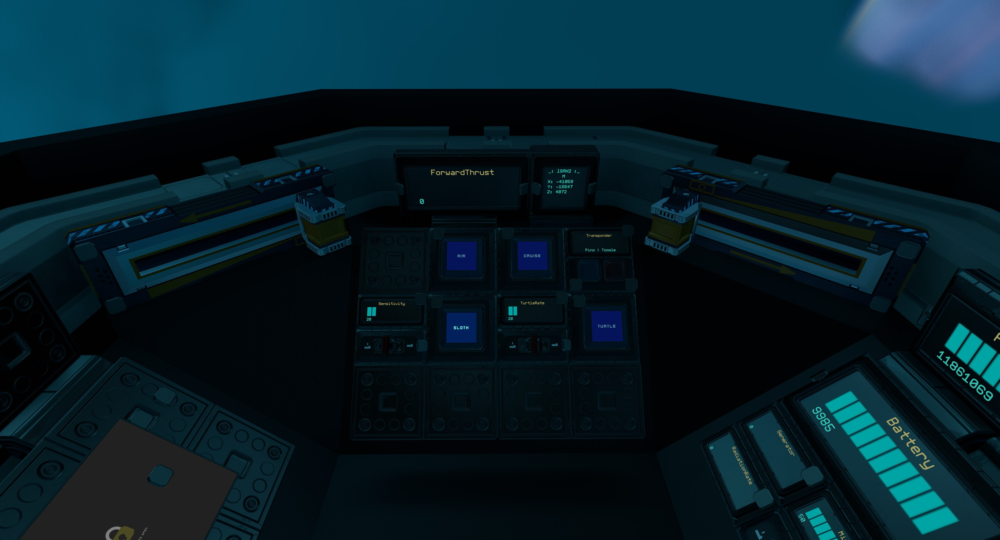
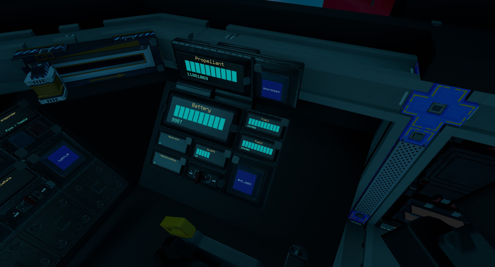
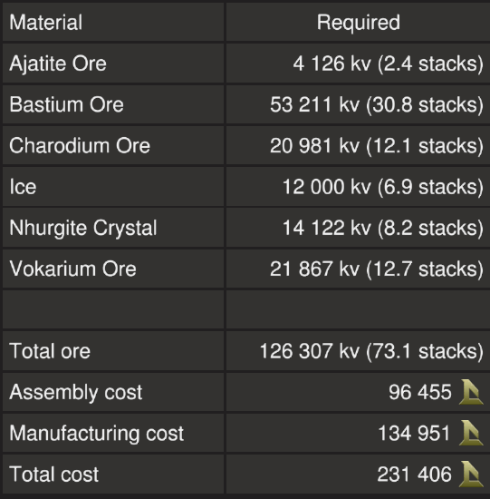
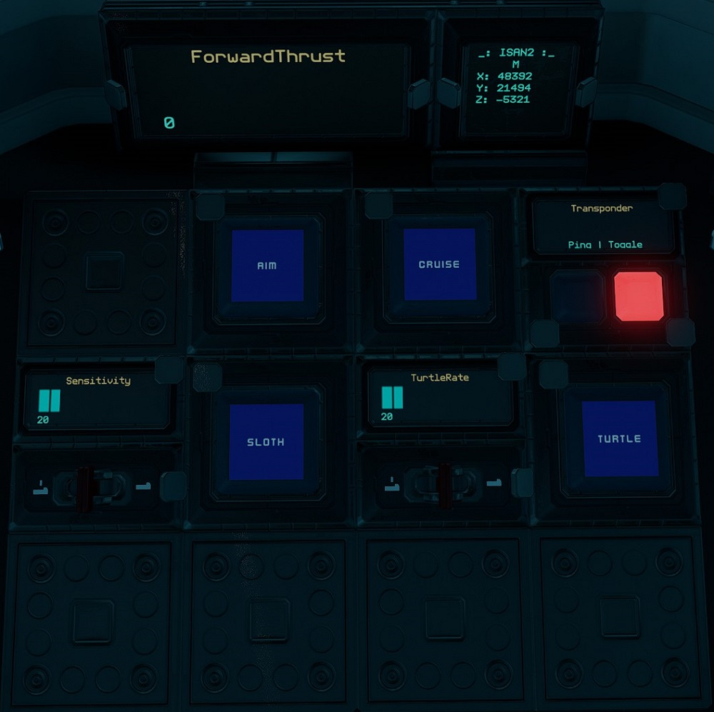
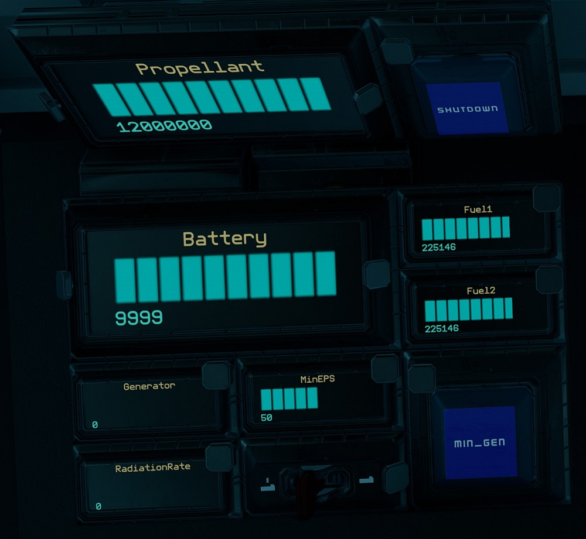

# Sower

The Sower is a starter ship designed to only require safe zone ore to build. It is quite fast and cheap, and with 36 crates, it makes a decent ship to use to help with the grind towards a more advanced ship.
The blueprint is provided for [free](#download-blueprint). All [feedback](#providing-feedback) is welcome and in game tips (in-game name Egomaniac) are appreciated. However support will be limited but I will try my best.

[Starbase Ship Shop Page](https://sb-creators.org/makers/Egomaniac/ship/%5BFREE%5D%20Sower)

  
  
  

More photos in the [`photos` folder](photos)

## Features

The ship has the following features:

- Standard Cruise function
- Turtle and Sloth functions with adjustable rates
- Transponder system with ping function
- One resource bridge
- Auto generator rate script with adjustable minimum rate
- Six T1 generators with two T1 fuel chambers and four spare rods on racks
- Radiators that provide more than adequate cooling
- 12 small tanks with 12,000,000 units of propellant
- 20 batteries
- 32 T1 triangle thrusters providing forward thrust
- 16 T1 manuever thrusters providing braking thrust
- 32 T1 manuever thrusters
- ISAN Mono
- Top speed of 140 m/s empty

## Changelog

### v1.0.0 - 11/03/2022

- Initial release

## Build Cost

TIP: You can craft your own crates, generators (T1) and triangle thruster components (T1) reduce assembly cost.

## Download Blueprint

The blueprint file is available in the `blueprints` folder [here](https://github.com/vinteo/starbase-ships/raw/main/sower/blueprints/sower.fbe).

## Usage

### Flying the Ship

The left lever on the center console controls backwards thrust (braking) and the right lever controls forward thrust.

| Interface | Function |
|---|---|
| `ForwardThrust` | Current forward thrust, maximum of 10,000 units |
| `Cruise` | Activates cruise control, forward thrust will not reset to zero unless turned down. |
| `Aim` | Reduces the response time of key presses for pitch and yaw. |
| `Turtle` | Activates turtle mode which sets forward thrust to a maximum limit of `TurtleRate` of full thrust. |
| `Sloth` | (Right Console) Activates the low sensitvity mode of pitch and yaw by limiting thrust. Use the `Sensitivity` switch to set the maximum thrust rate of sloth mode.|
| Transponder `Toggle` & `Ping` | Transponder controls, `Toggle` turns on and off ship transponder while `Ping` will activate transponder for three seconds |
| `ISAN2` | ISAN Mono system. No speed reading as that requires advanced chip which requires non safe zone ore |

#### Managing Power

| Interface | Function |
|---|---|
| `Battery` | Shows current battery charge of the 20 batteries, maximum of 10,000 units. |
| `Generator` | Current generator rate, maximum of 100%. |
| `RadiationRate` | Current radiation rate, maximum of 100%. |
| `MinEPS` & `Min_Gen` | Toggle and sets minimum generator rate. See [Managing Power](#managing-power). |
| `Fuel1` & `Fuel2` | Fuel remaining on fuel rods in individual fuel chambers, maximum of 300,000 units for each. |
| `Shutdown` | Turns off fuel chambers. |
| `Propellant` | Total propellant remaining in propellant tanks, maximum of 12,000,000 units. |

By default the generator will only run and ramp up when the batteries need charging so there is minimum management needed. But you can set a minimum generate rate by setting the `MinEPS` value using the switch for the minimum rate and turning on `Min_Gen`.

`Shutdown` will turn off the fuel chambers.

## Providing Feedback

I can be found in-game as Egomaniac and on discord as vinteo#4211. Feel free to contact me and provide feedback or if you need help. Pull requests are also welcomed for scripts changes/fixes.

I would also love to see any modifications or improvements you have made, so feel free to share! I hope to learn from the community and may also incorporate your changes into future versions.

Of course in-game tips are greatly appreciated.

## Frequently Asked Questions

### Can I sell ships based on this blueprint?

No.
