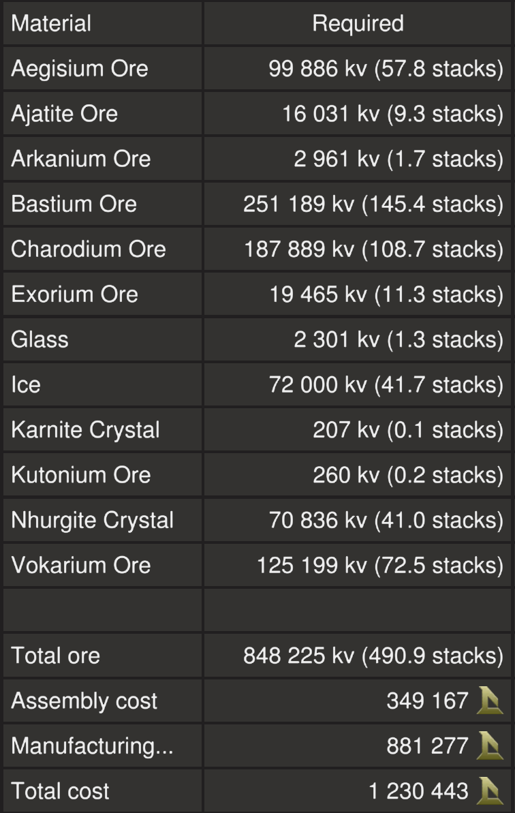
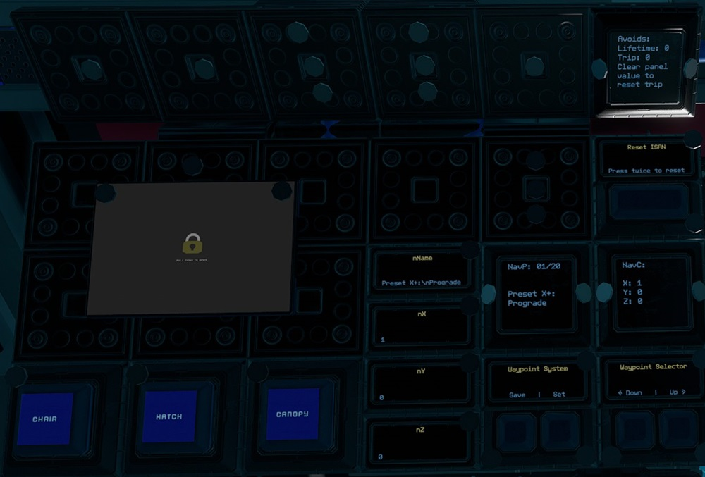
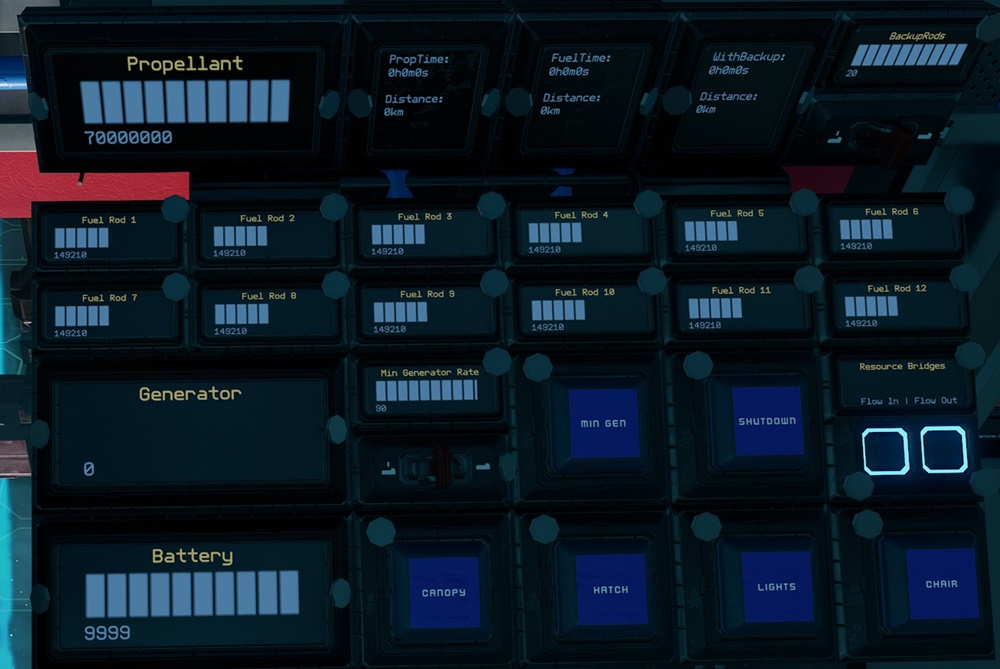

# Stocker by EGOTech

The Stocker is a 232 ore crate capacity mining ship. It is designed as a direct upgrade for those who have outgrown the [Rigger](../rigger). The blueprint is provided for [free](#download-blueprint). All [feedback](#providing-feedback) is welcome and in game tips (in-game name Egomaniac) are appreciated. However support will be limited but I will try my best.

[Starbase Ship Shop Page](https://sb-creators.org/makers/Egomaniac/ship/%5BFREE%5D%20Stocker)

The Stocker (v1.1.0) is also available to buy in game at Scenery Showroom of Rando 4 Ship Shop at stations with Rando ship shops.

  
  
  
  

More photos in the [`photos` folder](photos)

## Videos

| Channel | Video |
| --- | --- |
| [Krawll Unchained](https://www.youtube.com/channel/UCCqloSZ0VHn0BCFhIlJNS8A) | [Starbase - Community Ship Showcase - 3 Ships by "Egomaniac" ( The moon Crasher) 😉😁](https://www.youtube.com/watch?v=RXAccUqcWhI) |

## Features

The ship has the following features:

- 232 ore crates
- Standard Cruise function
- Turtle and Sloth functions with adjustable rates
- Transponder system with ping function
- Four mining lasers on turrets that point towards asteroids with sweeping
- Two ore collectors that point towards asteroids
- Material scanner that will point towards asteroids
- Approach and auto mine functions
- Two external and two internal resource bridges
- Auto generator rate script with adjustable minimum rate
- 32 T2 generators with 12 T2 fuel chambers and 20 spare rods on racks
- Radiators and heat sinks that provide more than adequate cooling
- 12 medium and 22 small propellant tanks with 70,000,000 units of propellant
- Estimated flight time of 6 hours and range of 3,000km
- Propellant time and fuel time panels
- 104 batteries
- 38 T2 box and 104 T2 triangle thrusters providing forward thrust
- 32 T2 triangle thrusters providing braking thrust
- 32 T2 triangle thrusters for maneuvers
- Basic crafting bench to craft refills
- Extra two small propellant tank with its own resource bridge for emergency refueling
- Two extra hardpoints (all cabled and piped)
- [NavGrid by StandPeter](https://github.com/pcbennion/starbase-navgrid)
- [NavCas by fixerid](https://github.com/fixerid/sb-projects/tree/main/NavCas), using custom avoidance system and ISAN 3 in 1 from [Compass by Firestar99](https://gitlab.com/Firestar99/yolol/-/blob/master/src/compass/README.md), with ability to load target from NavGrid
- Warning lights and alarm for obstacle detection and avoidance, powered by 34 rangefinders
- Speedometer
- Timer panel
- Odometer panel
- Many extra slots for YOLOL or memory chips, with two subnetworks setup

## Changelog

### v1.1.2 (Current) - 29/12/2022

- Added Discord link to help chip
- Added cruise safety chip
- Added laser safety chip
- Added EGOTech logo decal
- Removed laser pulse function

### v1.1.1 - 27/05/2022

- Replaced speedometer by MoriWatari with new speedometer
- Removed fast travel core
- Moved red tanks for easier access
- Added 16 extra ore crates
- Added eight extra small propellant tanks
- Removed four heat sinks

### v1.1.0 (Ship Shop Version) - 27/05/2022

- Painted thrusters black
- Painted emergency propellant tanks red
- Fixed typo in thruster name
- Added meter upgrade to basic crafting bench
- Added 14 heat sinks
- Reduced radiators to 6 bases and 12 extensions
- Replaced all `RadiationRate` panels with `HeatTransferRate`
- Added `StoredHeat` panel

### v1.0.4 - 16/02/2022

- Fixed sweeping of bottom two lasers
- Switched lights from white to light blue for less glare

### v1.0.3 - 20/12/2021

- Added Reset ISAN button

### v1.0.2 - 17/12/2021

- Fixed labels for memory relays
- Painted a small plate black that wasn't painted by mistake
- Painted hardpoints of rangefinders and tools black

### v1.0.1 - 28/10/2021

- Fixed some broken cables on pilot left console

### v1.0.0 - 24/10/2021

- Initial release

## Build Cost

> TIP: You can craft your own crates, generators (T2), box and triangle thruster components (T2) and ship tools to reduce assembly cost.

## Download Blueprint

The blueprint file is available in the `blueprints` folder [here](https://github.com/EGO-Tech/starbase-ships/raw/main/stocker/blueprints/stocker.fbe).

## Known Issues

- There is limited coverage of range finders for the crash avoidance system. **Use at your own risk!**
- Autopilot doesn't seem to point ship directly to destination (a bit off), use in conjunction with NavGrid.

## Usage

To enter the ship, there is a button on top of the center of the ship that will open a `Hatch`. Once inside you can also open and close the cockpit glass `Canopy`. The pilot `Chair` can be rotated around for easy access. Buttons for these are available in the pilot side consoles and also on the ceiling above the pilot seat.

### Flying the Ship

The left lever on the center console controls backwards thrust (braking) and the right lever controls forward thrust.

| Interface | Function |
|---|---|
| `Speed` | Current speed in metres per second. |
| `ForwardThrust` | Current forward thrust, maximum of 10,000 units |
| `Cruise` | Activates cruise control, forward thrust will not reset to zero unless turned down. |
| `Turtle` | Activates turtle mode which sets forward thrust to a maximum limit of `TurtleRate` of full thrust. |
| `Sloth` | Activates the low sensitvity mode of pitch and yaw by limiting thrust. Use the `Sensitivity` switch to set the maximum thrust rate of sloth mode.|
| `Aim` | Reduces the response time of key presses for pitch and yaw. |
| `Guides` | Activates rangefinders (except center one which can be activated separately). Can be used as guide lasers. `Red` warning lights show location of obstacles (left, right and centre). |
| `Range` & `Distance` | Activates center rangefinder, with `Distance` showing distance to object. |
| `Material Scanner` & `Materials` | Turns on the [Ore Scanner](#ore-scanner) and shows results of scan. |
| `Approach`, `Collect`, `Mine`, `Mining Lasers`, `Eco`, `Laser Sweep Height` & `Laser Sweep Depth` | Mining controls. See [Mining](#mining). |
| `Nav`, `Autopilot`, `Avoidance` & `Target` | Autopilot controls. See [Autopilot and Crash Avoidance](#auto-pilot-and-crash-avoidance). |
| `ISAN2` | Current ISAN coordinates of ship. |
| `NavGrid`, `NavP`, `NavC` & `Attitude` | [NavGrid](https://github.com/pcbennion/starbase-navgrid) system, see [Using the Waypoint System](#using-the-waypoint-system). |
| `SafeZone` | Whether current location is in the safe zone. |
| `StrengthFactor` | Current strength of ship. May fluctuate as ore crates are filled. Anything below 1.0 means ship is damaged. |
| Transponder `Toggle` & `Ping` | Transponder controls, `Toggle` turns on and off ship transponder while `Ping` will activate transponder for three seconds |
| `Timer` | See [Timer](#timer). |

**NOTE:** For safety, firing full braking thrust will deactivate `Cruise`.

### Using the Waypoint System

#### Viewing and Selecting Waypoints

This uses the [NavGrid](https://github.com/pcbennion/starbase-navgrid) system. Use the `Down` and `Up` waypoints selectors to select waypoint. The selected waypoint information is shown on `NavP` and `NavC` panels.

On the pilot center console, `NavGrid` will show the compass towards the selected waypoint while `Attitude` will show the ship's pitch, heading and roll directions. `NavGrid` is best used while not moving.

#### Editing and Saving Waypoints

Use `Set` to save waypoint of current location to the current selected waypoint position.

To edit currently selected waypoint, use your `U` tool to add name, X, Y and Z values to `nName`, `nX`, `nY` and `nZ` respectively. Then use the `Save` button to save.

**NOTE:** Waypoint 1 to 6 are presets and can not be over written.

#### Loading Waypoint to Auto Pilot

Use `Load to Auto Pilot` to load curretnly selected waypoint to `Target` to be used with the auto pilot system.

### Auto Pilot and Crash Avoidance

The ship uses a modified version of [NavCas](https://github.com/fixerid/sb-projects/tree/main/NavCas) which uses the 3 in 1 ISAN from Compass. Waypoints are loaded from NavGrid waypoint system.

Use while the ship is stationary. Activating `Nav` will start point the ship towards `Target` waypoint and deactivate itself when done. `Autopilot` will activate `Nav` and fly to within 5km of `Target` waypoint with `Avoidance` activated.

**NOTE:** `Nav` may not be very accurate. I recommend using it in conjunction with the NavGrid compass. The `dd` panel on the pilot left console shows debugging information for NavCas.

`Avoidance` will activate `Guides`. If the guides detect objects it will cut thrust and strafe up or down (will flash either the top or bottom `Blue` warning lights on the pilot center console according to the direction) while sounding an alarm (check game settings if you do not hear the alarm).
It will also flash `Red` warning lights on the pilot center console according to the position of obstacle detected. If `Autopilot` is activated, it will readjust and continue its flight.

`Avoids` will show the counters for number of avoidances. The `Trip` counter can be reset by clearing the panel value using the `U` tool.

**NOTE:** There is very limited coverage of range finders for the crash avoidance system. **Use at your own risk!**

### Resetting Navigation

If ISAN or NavGrid is not working, it can be reset using the `Reset ISAN` button. Press once to take ISAN offline, then press again to reset.

For v1.0.2 and below, do this by using your universal tool on the ISAN panel on the pilot console and clearing the value of the `_` field.
The first time will show ISAN as offline, repeat clearing the value again to reset ISAN and NavGrid.

### Mining

To approach an asteroid, point the center range finder at an asteroid and activate `Approach`. Once in range (optimum range is 10 to 14m on `Distance`), activate `Mining Lasers` to turn on the mining lasers.
`Laser Sweep Height` and `Laser Sweep Depth` will adjust sweeping distances of the lasers. `Eco` mode will only use the top two lasers to conserve power if needed.

`Mine` is a button which will activate automated mining. Point the center range finder at an asteroid and activate. It will activate `Material Scanner` and `Approach`, and once in range it will automatically activate `Lasers`.

`Collect` turns on the two ore collectors. Ore collectors automatically adjust to point towards objects detected by the center range finder.

If batteries start running out of charge while mining, turn on `Min Gen`. Continous use of the lasers and collectors at the same time requires a `Min Generator Limit` of around 90%.

**NOTE:** For safety, lasers will turn off if the total fuel is less that 2,000 units.

#### Ore Scanner

Activate using the `Material Scanner` button. The laser will try to adjust to point at the objects detected by the center range finder. Scan results will show on the `Materials` panel in number of stacks. It has a maximum range of 100m.

### Managing Power and Fuel

| Interface | Function |
|---|---|
| `Propellant` | Total propellant remaining in propellant tanks, maximum of 70,000,000 units. |
| `PropTime` | Time and distance remaining of propellant based on current usage. Distance is calculated from speed. |
| `FuelTime` | Time and distance remaining of fuel based on current usage. Distance is calculated from speed. |
| `WithBackup` | Same as FuelTime but takes into account backup rods available. Use the switch for `Backup Rods` to set the number of backup rods available. As standard there are 20 extra rods. |
| `Fuel Rod 1` to `Fuel Rod 12` | Fuel remaining on fuel rods in individual fuel chambers, maximum of 300,000 units for each. |
| `Generator` | Current generator rate, maximum of `Generator Limit`. |
| `Min Gen` & `Min Generator Limit` | Toggle and sets minimum generator rate. See [Managing Power](#managing-power). |
| `Shutdown` | Will turn off all fuel chambers thus shutting down generators. |
| `Battery` | Shows current battery charge of the batteries, maximum of 10,000 units. |
| `HeatTransferRate` | Current heat transfer rate of the heat sinks, maximum of 100%. |
| `StoredHeat` | Current stored heat in the heat sinks, maximum of 15,000 units. |
| `Flow In` & `Flow Out` | Toggle flow modes of resource bridges. See [Refueling Propellant](#refueling-propellant). |
| `Lights` | Turns on and off internal lights. |
| `Canopy` | Opens or closes glass canopy. |
| `Hatch` | Opens or closes ship entry hatch. |
| `Chair` | Rotates pilot chair. |

#### Managing Power

By default the generator will only run and ramp up when the batteries need charging so there is minimum management needed. But you can set a minimum generate rate by setting the `Min Generator Limit` value using the switch for the minimum rate and turning on `Min Gen`.

#### Refueling Propellant

All four resource bridges can be used for refuelling propellant. To refuel from another ship, turn off `Flow Out` on the pilot right side console and leave `Flow In` turned on. Then connect a resource bridge to the other ship. To refuel another ship, do the opposite, `Flow Out` turned on and `Flow In` turned off.

The two red propellant tanks behind the generators can also be used to refuel the ship. Connect the `Red` resource bridge to the `Green` resource bridge to transfer propellant.
You can then unbolt the red tanks and craft refills for the tanks using ice and then bolt the tank back to the support. Rinse and repeat until full. The `Red` and `Green` buttons toggles the respective resource bridges.

Remember to turn `Flow In` and `Flow Out` back on if you are using the Endo to collect ore via any of the ship's resource bridges.

### Other Stuff

#### Timer

On the pilot center console there is a `Timer` panel which acts as a timer. It will run when the ship is active and show total time in years, weeks, days, hours, minutes and seconds. To reset the timer, use your universal tool (`U` key) and clear the value of the `Timer` field.

#### Odometer

On the pilot right console there is a `Odometer` panel which will keep track of the ship's estimated flight distance based on speed. To reset the trip odometer, use your universal tool (`U` key) and clear the value of the `Odometer` field.

## Providing Feedback

I can be found in-game as Egomaniac and on discord as vinteo#4211. Feel free to contact me and provide feedback or if you need help. Pull requests are also welcomed for scripts changes/fixes.

I would also love to see any modifications or improvements you have made, so feel free to share! I hope to learn from the community and may also incorporate your changes into future versions.

Of course in-game tips are greatly appreciated.

## Frequently Asked Questions

### Can I sell ships based on this blueprint?

No.

### Why does NavGrid show an error?

This usually happens after travelling to the moon via the warp gate where ISAN is not available. After returning, this can be fixed by reseting ISAN. See [Resetting Navigation](#resetting-navigation).

## Designed by EGOTech

