# Tourer

The Tourer is a ship that can be used to transport Endos in the style of a tour bus. It has seating for 16 passengers and a fast travel core for mooon trips. The blueprint is provided for [free](#download-blueprint). All [feedback](#providing-feedback) is welcome and in game tips (in-game name Egomaniac) are appreciated. However support will be limited but I will try my best.

[Starbase Ship Shop Page](https://sb-creators.org/makers/Egomaniac/ship/%5BFREE%5D%20Tourer)

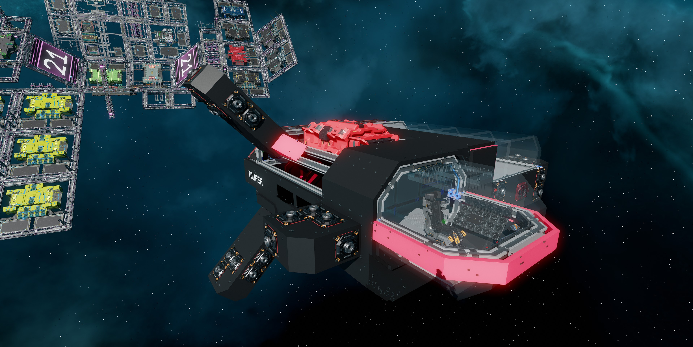 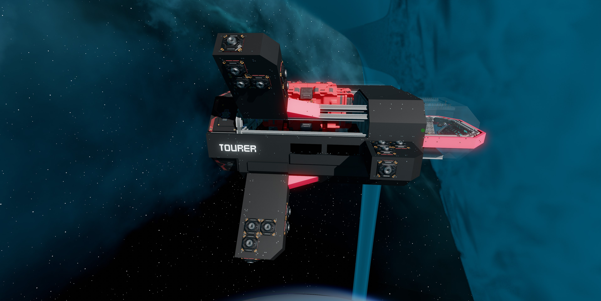 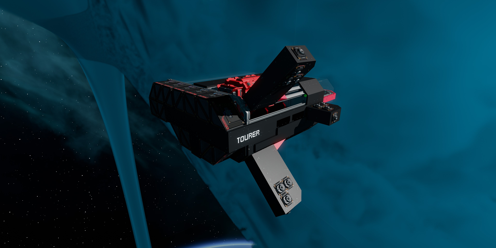
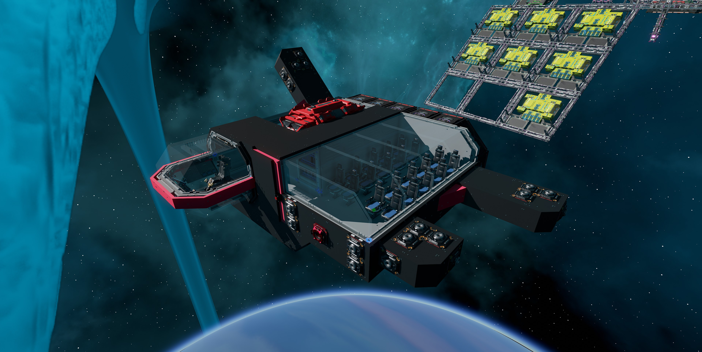 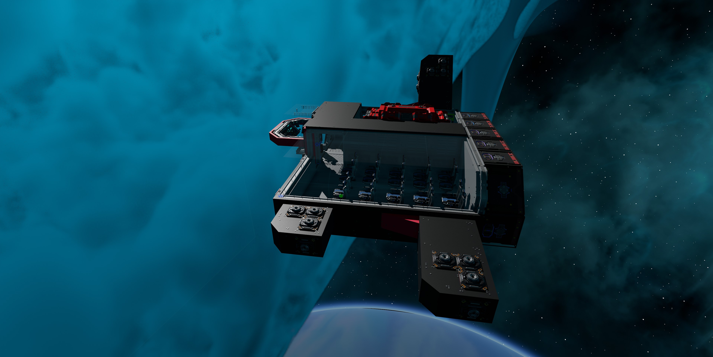 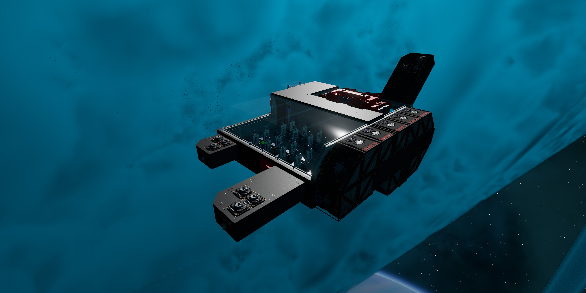
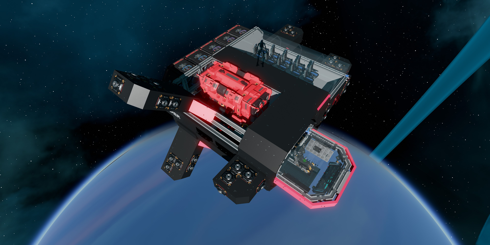 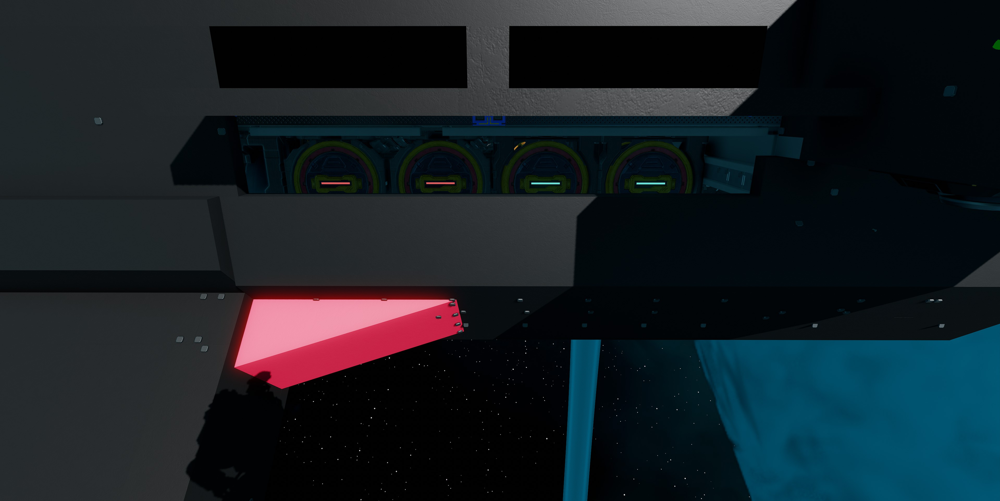 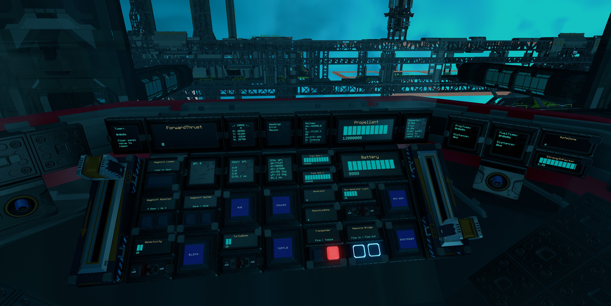

More photos in the [`photos` folder](photos)

## Features

The ship has the following features:

- Seating for 16 passengers
- Fast travel core
- Standard Cruise function
- Turtle and Sloth functions with adjustable rates
- Transponder system with ping function
- One resource bridge
- Auto generator rate script with adjustable minimum rate
- Six T2 generators with two T2 fuel chambers and two spare rods on racks
- Radiators that provide more than adequate cooling
- Three medium with 12,000,000 units of propellant
- Propellant time and fuel time panels
- 8 batteries
- 22 T2 triangle thrusters providing forward thrust
- 10 T2 manuever thrusters providing braking thrust
- 35 T2 manuever thrusters
- [ISAN Mono Waypoint System by Archaegeo](https://github.com/Archaegeo/Starbase/tree/45a9bb464cb71d7de7a214f8e665111d6b2b5989/ISAN-Waypoint%20System)
- Timer panel
- Odometer panel
- Service hatches for easy access to fuel
- Top speed of 105 m/s empty

## Changelog

### v1.0.0 (Current) - 26/01/2022

- Initial release

## Build Cost

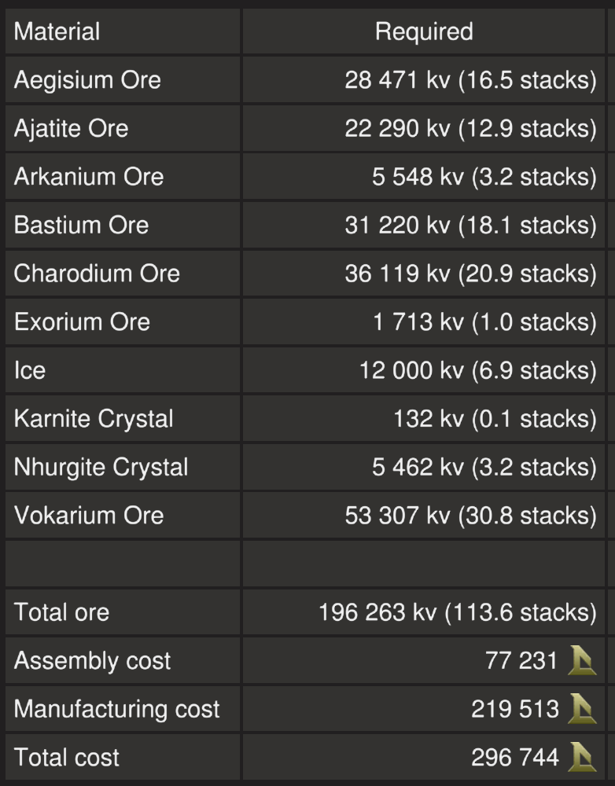

TIP: You can craft your own crates, generators (T2), box and triangle thruster components (T2) and ship weapons to reduce assembly cost.

## Download Blueprint

The blueprint file is available in the `blueprints` folder [here](https://github.com/vinteo/starbase-ships/raw/main/tourer/blueprints/tourer.fbe).

## Known Issues

- The ship has yet to be tested with a full capacity of Endos
- The ship is quite slow
- The ship rolls slightly when flying straight empty

## Usage

To enter the ship, there is a button for `Door` next to the cockpit of the ship. Once inside you can also open and close the cockpit glass `Canopy`. Buttons for these are available in the pilot right side console

### Flying the Ship

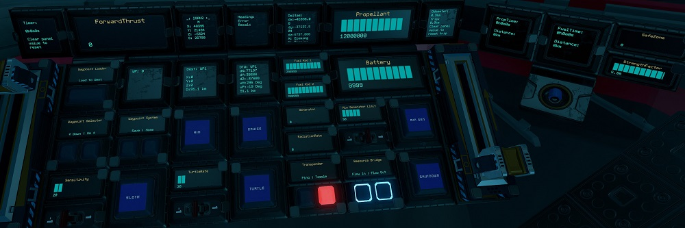

The left lever on the center console controls backwards thrust (braking) and the right lever controls forward thrust.

| Interface | Function |
|---|---|
| `ForwardThrust` | Current forward thrust, maximum of 10,000 units |
| `Cruise` | Activates cruise control, forward thrust will not reset to zero unless turned down. |
| `Aim` | Reduces the response time of key presses for pitch and yaw. |
| `Turtle` | Activates turtle mode which sets forward thrust to a maximum limit of `TurtleRate` of full thrust. |
| `Sloth` | (Right Console) Activates the low sensitvity mode of pitch and yaw by limiting thrust. Use the `Sensitivity` switch to set the maximum thrust rate of sloth mode.|
| Transponder `Toggle` & `Ping` | Transponder controls, `Toggle` turns on and off ship transponder while `Ping` will activate transponder for three seconds |
| `ISAN2`, `Heading`, `Dest`, `DTW`, `Deltas`, `WP`, `Up`, `Down`, `Save` & `Home` | See [ISAN Waypoint System](https://github.com/Archaegeo/Starbase/tree/45a9bb464cb71d7de7a214f8e665111d6b2b5989/ISAN-Waypoint%20System) for more informaton. |
| `Timer` | See [Timer](#timer). |
| `Odometer` | See [Odometer](#odometer). |
| `Battery` | Shows current battery charge of the eight batteries, maximum of 10,000 units. |
| `Generator` | Current generator rate, maximum of 100%. |
| `RadiationRate` | Current radiation rate, maximum of 100%. |
| `Min Generator Limit` & `Min Gen` | Toggle and sets minimum generator rate. See [Managing Power](#managing-power). |
| `Fuel Rod 1` & `Fuel Rod 2` | Fuel remaining on fuel rods in individual fuel chambers, maximum of 300,000 units for each. |
| `Shutdown` | Turns off fuel chambers. |
| `Propellant` | Total propellant remaining in propellant tanks, maximum of 8,000,000 units. |
| `Flow In` & `Flow Out` | Toggle flow modes of resource bridges. See [Refueling Propellant](#refuelling-propellant). |
| `PropTime` | Time and distance remaining of propellant based on current usage. Distance is calculated from ISAN speed*. |
| `FuelTime` | Time and distance remaining of fuel based on current usage. Distance is calculated from ISAN speed*. |
| `SafeZone` | Whether current location is in the safe zone. |
| `StrengthFactor` | Current strength of ship. May fluctuate as ore crates are filled. Anything below 1.0 means ship is damaged. |
| `Canopy` | Open and closes the cockpit glass canopy. |
| `Door` | Open and closes the door into the ship. |
| `Service` | Open and closes the service hatches on side of the ship for access to the fuel rods. |

#### Managing Power

By default the generator will only run and ramp up when the batteries need charging so there is minimum management needed. But you can set a minimum generate rate by setting the `Min Generator Limit` value using the switch for the minimum rate and turning on `Min Gen`.

`Shutdown` will turn off the fuel chambers.

Open the `Service` hatches for access to the fuel rods.

#### Refueling Propellant

The resource bridgescan be used for refuelling propellant. To refuel from another ship, turn off `Flow Out` on the pilot console and leave `Flow In` turned on. Then connect a resource bridge to the other ship. To refuel another ship, do the opposite, `Flow Out` turned on and `Flow In` turned off.

### Other Stuff

#### Timer

On the pilot center console there is a `Timer` panel which acts as a timer. It will run when the ship is active and show total time in years, weeks, days, hours, minutes and seconds. To reset the timer, use your universal tool (`U` key) and clear the value of the `Timer` field.

#### Odometer

On the pilot right console there is a `Odometer` panel which will keep track of the ship's estimated flight distance based on speed from ISAN (may not be that accurate). To reset the trip odometer, use your universal tool (`U` key) and clear the value of the `Odometer` field.

## Providing Feedback

I can be found in-game as Egomaniac and on discord as vinteo#4211. Feel free to contact me and provide feedback or if you need help. Pull requests are also welcomed for scripts changes/fixes.

I would also love to see any modifications or improvements you have made, so feel free to share! I hope to learn from the community and may also incorporate your changes into future versions.

Of course in-game tips are greatly appreciated.

## Frequently Asked Questions

### Can I sell ships based on this blueprint?

No.
