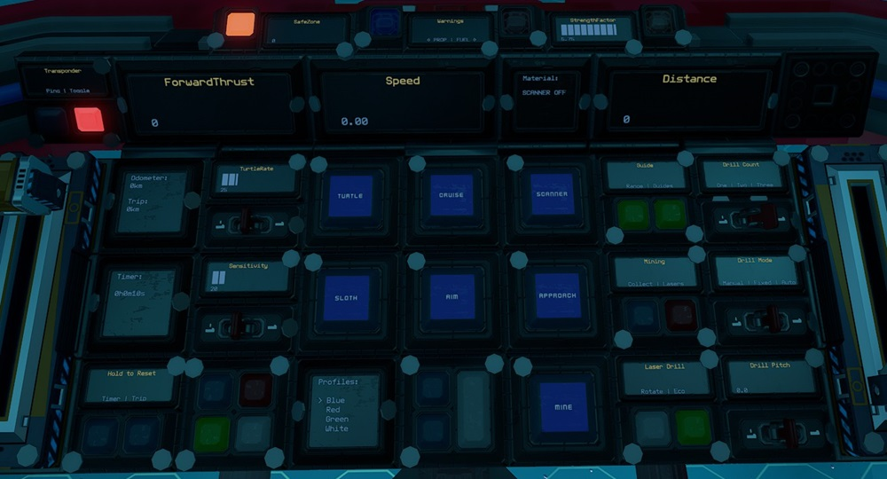

# Trebler by EGOTech

The Trebler is a 534 ore crate capacity mining ship with three automated rotating laser drills for mining operations. It is designed to be a short range, high capacity and high efficiency miner used out of a capital ship.
The blueprint is provided for [free](#download-blueprint). All [feedback](#providing-feedback) is welcome and in game tips (in-game name Egomaniac) are appreciated. However support will be limited but I will try my best.

[Starbase Ship Shop Page](https://sb-creators.org/makers/Egomaniac/ship/%5BFREE%5D%20Trebler)

  
  
  
  
  
  

More photos in the [`photos` folder](photos)

## Features

The ship has the following features:

- 534 ore crates
- Standard Cruise function
- Turtle and Sloth functions with adjustable rates
- Transponder system with ping function
- Three automated rotating drills with three mining lasers each
- Nine ore collectors
- Material scanner with display of materials in stacks
- Approach and auto mine functions
- One external and two internal resource bridges
- Auto generator rate script with adjustable minimum rate
- 36 T2 generators (with 36 T1 and 36 T2 enhancers) with 12 T2 fuel chambers and 24 spare rods on racks
- Radiators and heat sinks that provide more than adequate cooling
- Four large propellant tanks with 48,000,000 units of propellant
- Estimated flight time of 2.5 hours and range of 1,200km
- Propellant time and fuel time panels
- 290 batteries
- 142 T2 triangle thrusters providing forward thrust
- 48 T2 triangle thrusters providing braking thrust
- 64 T2 triangle thrusters for maneuvers
- Basic crafting bench to craft refills with meter upgrade plus tools bench
- Speedometer
- Timer panel
- Odometer panel
- Many extra slots for YOLOL or memory chips
- Top speed of 125m/s when empty

## Changelog

View changelog [here](CHANGELOG.md)

## Build Cost

> TIP: You can craft your own crates, generators (T2), box and triangle thruster components (T2) and ship tools to reduce assembly cost.

## Download Blueprint

The blueprint file is available in the `blueprints` folder [here](https://github.com/EGO-Tech/starbase-ships/raw/main/trebler/blueprints/trebler.fbe).

## Usage

To enter the ship, there is are buttons on either side of the cockpit of the ship that will open `Doors`. Once inside you can also open and close the cockpit glass `Canopy`. Buttons for these are available in the pilot left side console.

### Flying the Ship

The left lever on the center console controls backwards thrust (braking) and the right lever controls forward thrust.

| Interface | Function |
|---|---|
| `Speed` | Current speed in metres per second. |
| `ForwardThrust` | Current forward thrust, maximum of 10,000 units |
| `Throttle` | Current throttle level, maximum of 100 percent |
| `Cruise` | Activates cruise control, forward thrust will not reset to zero unless turned down. |
| `Turtle` | Activates turtle mode which sets forward thrust to a maximum limit of `TurtleRate` of full thrust. |
| `Sloth` | Activates the low sensitvity mode of pitch and yaw by limiting thrust. Use the `Sensitivity` switch to set the maximum thrust rate of sloth mode.|
| `Aim` | Reduces the response time of key presses for pitch and yaw. |
| `Guides` | Activates four forward facing rangefinders as guides. |
| `Range` & `Distance` | Activates center rangefinder, with `Distance` showing distance to object. |
| `Scanner` & `Materials` | Turns on the [Ore Scanner](#ore-scanner) and shows results of scan. |
| `Approach`, `Collect`, `Mine`, `Lasers`, `Rotate`, `Eco`, `Drill Mode`, `Drill Pitch` & `Drill Count` | Mining controls. See [Mining](#mining). |
| `SafeZone` | Whether current location is in the safe zone. |
| `StrengthFactor` | Current strength of ship. May fluctuate as ore crates are filled. Anything below 1.0 means ship is damaged. |
| Transponder `Toggle` & `Ping` | Transponder controls, `Toggle` turns on and off ship transponder while `Ping` will activate transponder for three seconds |
| `Timer` | See [Timer](#timer). |
| `Odometer` | See [Odometer](#odometer). |

**NOTE:** For safety, firing full braking thrust will deactivate `Cruise`.

### Mining

To approach an asteroid, point the center range finder at an asteroid and activate `Approach`. Once in range (optimum range is 16 to 20m on `Distance`), activate `Lasers` to turn on the mining lasers. Activating `Rotate` will rotate the laser drill.

The laser drill has three modes.

- `Fixed` mode will keep all lasers converged to the asteroid detected by the center range finder.
- `Manual` mode allows adjustment of the `Drill Pitch`. The pitch range is from `-15` to `20` degrees.
- `Auto` mode will activate `Rotate` and progressively increase the drill pitch with the rotations

`Drill Pitch` can only be adjusted in `Manual` mode. `Eco` mode will only use two lasers to conserve power. `Drill Count` controls whether one, two or three drills are activated when mining.

`Mine` is a button which will activate automated mining. Point the center range finder at an asteroid and activate. It will activate `Material Scanner` and `Approach`, and once in range it will automatically activate `Lasers`.

`Collect` turns on the six ore collectors.

If batteries start running out of charge while mining, turn on `Min Gen`. Continous use of the lasers and collectors at the same time requires a `Min Generator Limit` of around 90%.

**NOTE:** For safety, lasers will turn off if the total fuel is less that 2,000 units.

#### Ore Scanner

Activate using the `Material Scanner` button. The laser will try to adjust to point at the objects detected by the center range finder. Scan results will show on the `Materials` panel in number of stacks. It has a maximum range of 100m.

### Managing Power and Fuel

| Interface | Function |
|---|---|
| `Propellant` | Total propellant remaining in propellant tanks, maximum of 48,000,000 units. |
| `PropTime` | Time and distance remaining of propellant based on current usage. Distance is calculated from speed. |
| `FuelTime` | Time and distance remaining of fuel based on current usage. Distance is calculated from speed. |
| `WithBackup` | Same as FuelTime but takes into account backup rods available. Use the switch for `Backup Rods` to set the number of backup rods available. As standard there are 24 extra rods. |
| `Fuel Rod 1` to `Fuel Rod 12` | Fuel remaining on fuel rods in individual fuel chambers, maximum of 300,000 units for each. |
| `Generator` | Current generator rate, maximum of `Generator Limit`. |
| `Min Gen` & `Min Generator Limit` | Toggle and sets minimum generator rate. See [Managing Power](#managing-power). |
| `Shutdown` | Will turn off all fuel chambers thus shutting down generators. |
| `Battery` | Shows current battery charge of the batteries, maximum of 10,000 units. |
| `HeatTransferRate` | Current heat transfer rate of the heat sinks, maximum of 100%. |
| `Flow In` & `Flow Out` | Toggle flow modes of resource bridges. See [Refueling Propellant](#refueling-propellant). |
| `Lights` | Turns on and off internal lights. |
| `Doors` | Opens or closes ship entry doors. |

#### Managing Power

By default the generator will only run and ramp up when the batteries need charging so there is minimum management needed. But you can set a minimum generate rate by setting the `Min Generator Limit` value using the switch for the minimum rate and turning on `Min Gen`.

#### Refueling Propellant

All four resource bridges can be used for refuelling propellant. To refuel from another ship, turn off `Flow Out` on the pilot right side console and leave `Flow In` turned on. Then connect a resource bridge to the other ship. To refuel another ship, do the opposite, `Flow Out` turned on and `Flow In` turned off.

Remember to turn `Flow In` and `Flow Out` back on if you are using the Endo to collect ore via any of the ship's resource bridges.

### Other Stuff

#### Timer

On the pilot center console there is a `Timer` panel which acts as a timer. It will run when the ship is active and show total time in years, weeks, days, hours, minutes and seconds. To reset the timer, hold down the `Reset Timer` button on the pilot left console.

#### Odometer

On the pilot right console there is a `Odometer` panel which will keep track of the ship's estimated flight distance based on speed. To reset the trip odometer, hold down the `Odometer` `Reset Trips` button on the pilot left console.

## Providing Feedback

I can be found in-game as Egomaniac and on discord as @vinteo81 (vinteo#4211). Feel free to contact me and provide feedback or if you need help. Pull requests are also welcomed for scripts changes/fixes.

I would also love to see any modifications or improvements you have made, so feel free to share! I hope to learn from the community and may also incorporate your changes into future versions.

Of course in-game tips are greatly appreciated.

## Frequently Asked Questions

### Can I sell ships based on this blueprint?

No.

## Designed by EGOTech

