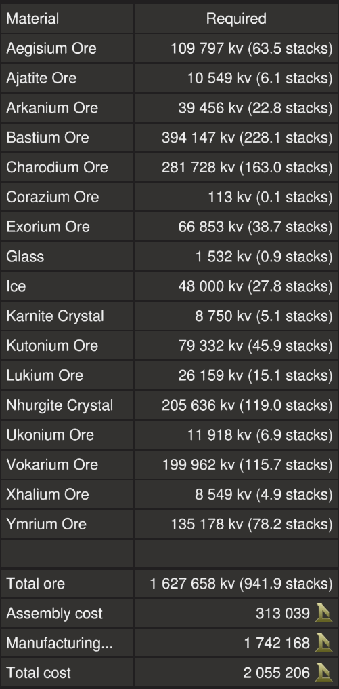

# Trebler X by EGOTech

The Trebler X is a premium version of the [Trebler](../) with [T3 generators, fuel chambers, enhancers and thrusters plus three extra mining lasers](#comparison).

The blueprint is available for [purchase](#purchase-blueprint).

[Starbase Ship Shop Page](https://sb-creators.org/makers/Egomaniac/ship/Trebler%20X)

More photos in the [`photos` folder](photos)

## Comparison

|   | Trebler | Trebler X |
|---|---|---|
| Thrusters | T2 | T3 |
| Top Speed (empty) | 125m/s | 135m/s |
| Spare Fuel Rods | 24 | 28 |
| Batteries | 290 | 302 |
| Heat Sinks | 28 | 26 |
| Generators | 36 x T2 | 42 x T3 |
| Fuel Chambers | 12 x T2 | 14 x T3 |
| Enhancers | 36 x T1 &  36 x T2 | 42 x T3 |
| Power Generation | 72,000eps | 94,500eps |
| Mining Lasers | 3 x 3 | 3 x 4 |
| Laser Convergence | Approximation | Precise |

## Build Cost

> TIP: You can craft your own crates, generators (T3), box and triangle thruster components (T3) and ship tools to reduce assembly cost.

## Purchase Blueprint

The blueprint is available for purchase on the EGOTech Discord server.

## Changelog

View changelog [here](CHANGELOG.md)

## Usage

Please refer to the manual for the [Trebler](../).
