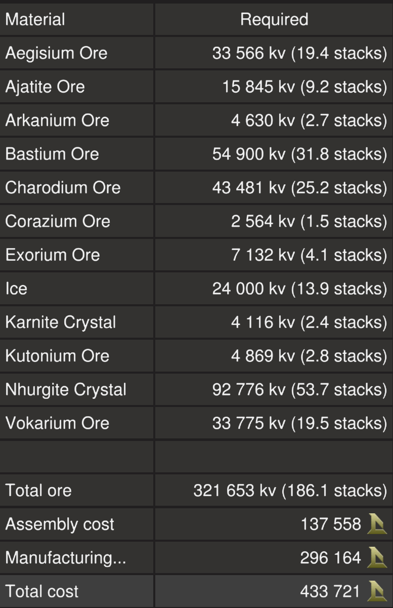
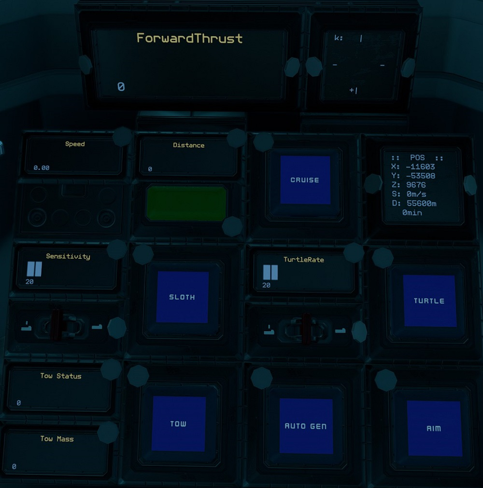
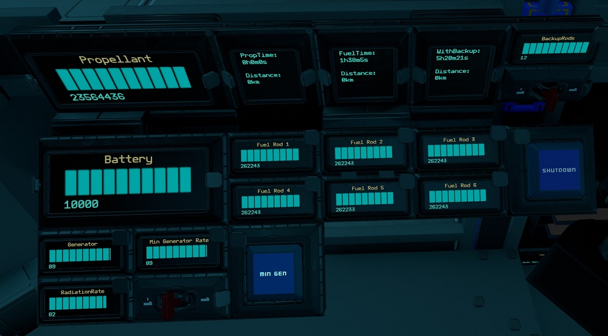
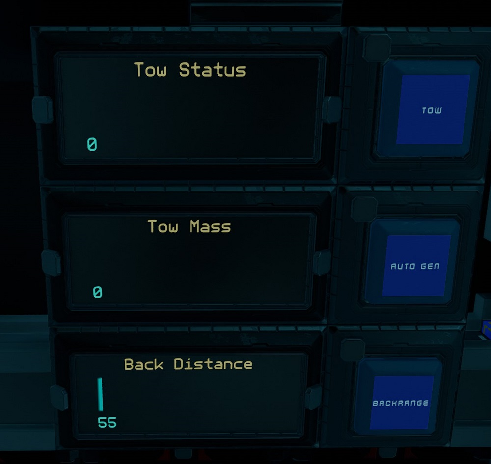

# Tugger by EGOTech

The Tugger is a small tug ship with enough power generation to tow a ship of up to 7,500,000kg at up to 50m/s. The pilot seat can be spun to face the back, looking out the back window for ease of locking on ships using the back facing tow beam.
The blueprint is provided for [free](#download-blueprint). All [feedback](#providing-feedback) is welcome and in game tips (in-game name Egomaniac) are appreciated. However support will be limited but I will try my best.

## Changelog

View changelog [here](CHANGELOG.md)

## Build Cost

>TIP: You can craft your own crates, generators (T2) and triangle thruster components (T2) to reduce assembly cost.

## Download Blueprint

The blueprint file is available in the `blueprints` folder [here](https://github.com/EGO-Tech/starbase-ships/raw/main/tugger/blueprints/tugger.fbe).

## Usage

To enter the ship, there is a button for `Canopy` on top of the ship. Button for `Canopy` are available in the pilot left side console and above the pilot seat.

### Flying the Ship

The left lever on the center console controls backwards thrust (braking) and the right lever controls forward thrust.

| Interface | Function |
|---|---|
| `ForwardThrust` | Current forward thrust, maximum of 10,000 units |
| `Speed` | Current speed in metres per second. |
| `Distance` | Activates forward rangefinder, with `Distance` showing distance to object. |
| `Cruise` | Activates cruise control, forward thrust will not reset to zero unless turned down. |
| `Aim` | Reduces the response time of key presses for pitch and yaw. |
| `Turtle` | Activates turtle mode which sets forward thrust to a maximum limit of `TurtleRate` of full thrust. |
| `Sloth` | (Right Console) Activates the low sensitvity mode of pitch and yaw by limiting thrust. Use the `Sensitivity` switch to set the maximum thrust rate of sloth mode.|
| Transponder `Toggle` & `Ping` | Transponder controls, `Toggle` turns on and off ship transponder while `Ping` will activate transponder for three seconds |
| `POS`, `k` & `Target` | See [Compass System](https://gitlab.com/Firestar99/yolol/-/tree/master/src/compass) for more information. `Target` shows current target destination. |
| `Tow Status`, `Tow Mass`, `Tow` & `Auto Gen` | Towing controls, see [Towing ships](#towing-ships). |
| `Timer` | See [Timer](#timer). |
| `Odometer` | See [Odometer](#odometer). |
| `SafeZone` | Whether current location is in the safe zone. |
| `StrengthFactor` | Current strength of ship. May fluctuate as ore crates are filled. Anything below 1.0 means ship is damaged. |
| `Canopy` | Open and closes the cockpit glass canopy. |
| `Chair` | Spins the pilot chair between forward facing and backwards facing. |

**NOTE:** For safety, firing full braking thrust will deactivate `Cruise`.

#### Managing Power

| Interface | Function |
|---|---|
| `Battery` | Shows current battery charge of the batteries, maximum of 10,000 units. |
| `Generator` | Current generator rate, maximum of 100%. |
| `Min Generator Limit` & `Min Gen` | Toggle and sets minimum generator rate. |
| `Fuel Rod 1` to `Fuel Rod 6` | Fuel remaining on fuel rods in individual fuel chambers, maximum of 300,000 units for each. |
| `Shutdown` | Turns off fuel chambers. |
| `HeatTransferRate` | Current heat transfer rate of the heat sinks, maximum of 100%. |
| `StoredHeat` | Current stored heat in the heat sinks, maximum of 15,000 units. |
| `Propellant` | Total propellant remaining in propellant tanks, maximum of 24,000,000 units. |
| `PropTime` | Time and distance remaining of propellant based on current usage. Distance is calculated from speed. |
| `FuelTime` | Time and distance remaining of fuel based on current usage. Distance is calculated from speed. |
| `WithBackup` | Same as FuelTime but takes into account backup rods available. Use the switch for `Backup Rods` to set the number of backup rods available. As standard there are 12 extra rods. |

By default the generator will only run and ramp up when the batteries need charging so there is minimum management needed. But you can set a minimum generate rate by setting the `Min Generator Limit` value using the switch for the minimum rate and turning on `Min Gen`.

`Shutdown` will turn off the fuel chambers.

#### Towing Ships

| Interface | Function |
|---|---|
| `Tow Status` | Status of tow beam, `0` is off, `1` is on and `2` is locked on. |
| `Tow Mass` | Mass of locked on ship, in kilograms. |
| `Tow` | Activates the tow beam. |
| `Auto Gen` | Activates `Min Gen` with `Min Generator Rate` according to `Tow Mass`. |
| `BackRange` & `Back Distance` | Activates the back facing rangefinders and displays the distance. |

The tow beam faces out the back of the ship so position the Tugger in front of, with the back facing the ship you wish to tow. Spin the `Chair` around to look out the back window and activate `Tow` to turn on the tow beam. Once the tow beam is locked on the ship, the `Tow Status` will be `2` and the mass of the locked ship will be shown as `Tow Mass` in kilograms.
Activate `Auto Gen` which will then turn on `Min Gen` with a `Min Generator Rate` based off the `Tow Mass`. Wait till the generators reach the targeted rate before flying off.

The Tugger has enough power generation to tow a ship of a mass of up to 7.5ktons or 7,500,000 kilograms. For large ships, it is recommended to turn on `Min Gen` to ramp up the generator before locking on and then activating `Auto Gen` once locked on to adjust the `Min Generator Rate` accordingly.

**NOTE:** Remember to turn off `Min Gen` after towing to save on fuel.

### Other Stuff

#### Timer

On the pilot left console there is a `Timer` panel which acts as a timer. It will run when the ship is active and show total time in years, weeks, days, hours, minutes and seconds. To reset the timer, use your universal tool (`U` key) and clear the value of the `Timer` field.

#### Odometer

On the pilot left console there is a `Odometer` panel which will keep track of the ship's estimated flight distance based on speed. To reset the trip odometer, use your universal tool (`U` key) and clear the value of the `Odometer` field.

## Providing Feedback

I can be found in-game as Egomaniac and on discord as @vinteo81 (vinteo#4211). Feel free to contact me and provide feedback or if you need help. Pull requests are also welcomed for scripts changes/fixes.

I would also love to see any modifications or improvements you have made, so feel free to share! I hope to learn from the community and may also incorporate your changes into future versions.

Of course in-game tips are greatly appreciated.

## Designed by EGOTech

